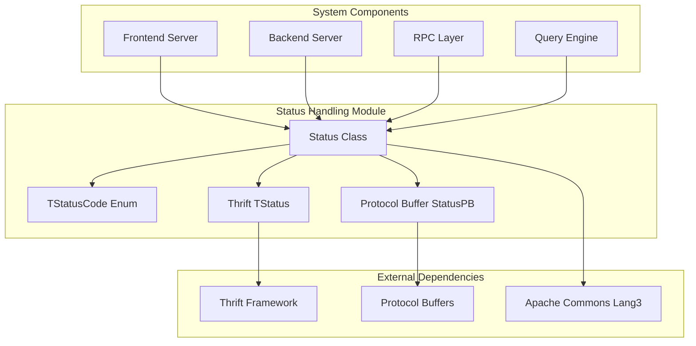
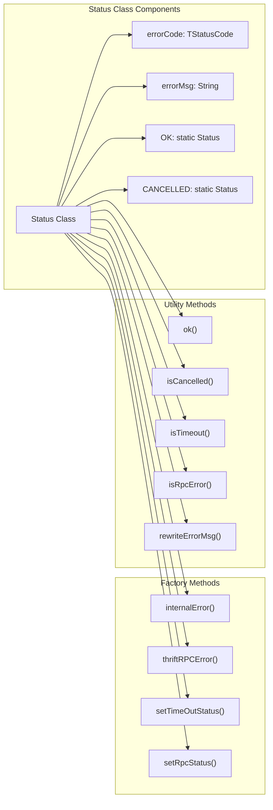
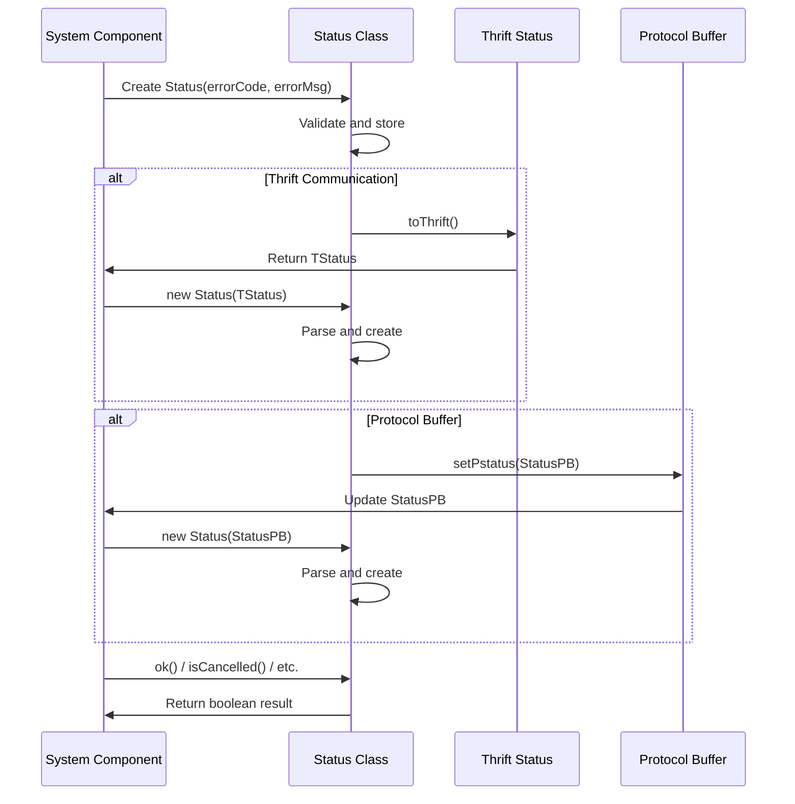
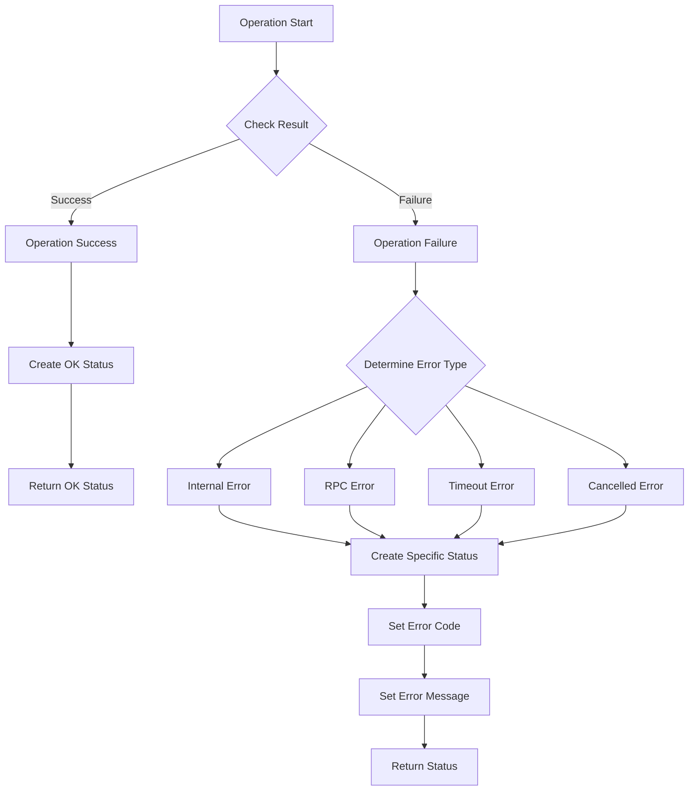

# Status Handling Module

## Introduction

The status_handling module provides a centralized error and status management system for StarRocks. It defines a standardized way to represent operation results, error conditions, and status codes across the entire system. The module serves as the foundation for error handling and status communication between different components of the StarRocks database system.

## Core Functionality

### Status Class

The `Status` class is the primary component of this module, providing a unified way to represent operation outcomes. It encapsulates:

- **Error codes**: Standardized error codes using `TStatusCode` enum
- **Error messages**: Human-readable error descriptions
- **Status checking**: Convenient methods to check specific error conditions
- **Status conversion**: Conversion between different status representations (Thrift, Protocol Buffers)

### Key Features

1. **Standardized Error Codes**: Uses `TStatusCode` enum to ensure consistent error representation
2. **Immutable Status Objects**: Pre-defined status objects like `OK` and `CANCELLED` for common cases
3. **Factory Methods**: Static factory methods for creating specific error types
4. **Multi-format Support**: Supports conversion to/from Thrift and Protocol Buffer formats
5. **Error Classification**: Helper methods to identify specific error types (timeout, RPC errors, etc.)

## Architecture



## Component Relationships



## Data Flow



## Process Flow



## Error Code Categories

The module supports various error code categories through `TStatusCode`:

1. **Success Codes**:
   - `OK`: Operation completed successfully

2. **Client Error Codes**:
   - `CANCELLED`: Operation was cancelled
   - `ANALYSIS_ERROR`: SQL analysis error
   - `NOT_IMPLEMENTED_ERROR`: Feature not implemented

3. **Runtime Error Codes**:
   - `RUNTIME_ERROR`: General runtime error
   - `INTERNAL_ERROR`: Internal system error
   - `MEM_LIMIT_EXCEEDED`: Memory limit exceeded
   - `TIMEOUT`: Operation timeout

4. **Network Error Codes**:
   - `THRIFT_RPC_ERROR`: Thrift RPC communication error
   - `REMOTE_FILE_NOT_FOUND`: Remote file not found

5. **Dictionary Error Codes**:
   - `GLOBAL_DICT_ERROR`: Global dictionary error
   - `GLOBAL_DICT_NOT_MATCH`: Global dictionary mismatch

## Integration Points

The status_handling module integrates with various system components:

### Frontend Server Integration
- Used by query execution components to report query status
- Integrated with transaction management for transaction state reporting
- Used in RPC communication between FE and BE nodes

### Backend Server Integration
- Used by storage engine operations to report I/O status
- Integrated with expression evaluation for runtime error reporting
- Used in task execution for status reporting

### Query Engine Integration
- Used by SQL parser and analyzer for syntax/semantic error reporting
- Integrated with optimizer for optimization failure reporting
- Used in execution pipeline for runtime status tracking

## Usage Patterns

### Basic Status Creation
```java
// Success status
Status success = Status.OK;

// Error status with custom message
Status error = new Status(TStatusCode.INTERNAL_ERROR, "Custom error message");

// Using factory methods
Status internalError = Status.internalError("Internal processing failed");
Status rpcError = Status.thriftRPCError("RPC communication failed");
```

### Status Checking
```java
Status status = someOperation();

if (status.ok()) {
    // Handle success
} else if (status.isCancelled()) {
    // Handle cancellation
} else if (status.isTimeout()) {
    // Handle timeout
} else if (status.isRpcError()) {
    // Handle RPC error
}
```

### Cross-Component Communication
```java
// Convert to Thrift for RPC
TStatus thriftStatus = status.toThrift();

// Create from Thrift
Status fromThrift = new Status(thriftStatus);

// Convert to Protocol Buffer
StatusPB pbStatus = new StatusPB();
status.setPstatus(pbStatus);
```

## Error Message Management

The module provides automatic error message rewriting through `rewriteErrorMsg()` method, which standardizes error messages based on error codes:

- `CANCELLED` → "Cancelled"
- `ANALYSIS_ERROR` → "Analysis_error"
- `NOT_IMPLEMENTED_ERROR` → "Not_implemented_error"
- `RUNTIME_ERROR` → "Runtime_error"
- `MEM_LIMIT_EXCEEDED` → "Mem_limit_error"
- `INTERNAL_ERROR` → "Internal_error"
- `THRIFT_RPC_ERROR` → "Thrift_rpc_error"
- `TIMEOUT` → "Timeout"
- Default → "Unknown_error"

## Thread Safety

The Status class is designed to be thread-safe for read operations. Status objects are immutable once created, ensuring safe sharing across threads. The static factory methods and predefined status objects are also thread-safe.

## Performance Considerations

- **Object Reuse**: Predefined status objects (`OK`, `CANCELLED`) avoid object creation overhead
- **Lazy Initialization**: Error messages are only created when needed
- **Efficient Comparisons**: Error code comparisons are fast enum comparisons
- **Minimal Memory Footprint**: Status objects only contain essential fields

## Dependencies

The status_handling module has minimal dependencies:

- **Thrift Framework**: For `TStatus` and `TStatusCode` definitions
- **Protocol Buffers**: For `StatusPB` support
- **Apache Commons Lang3**: For string utilities (`StringUtils`)

## Related Modules

The status_handling module is closely related to:

- [frontend_server.md](frontend_server.md): Uses Status for error reporting in FE operations
- [backend_server.md](backend_server.md): Uses Status for BE operation status reporting
- [query_execution.md](query_execution.md): Uses Status for query execution status
- [sql_parser_optimizer.md](sql_parser_optimizer.md): Uses Status for parsing and optimization errors
- [storage_engine.md](storage_engine.md): Uses Status for storage operation status

## Best Practices

1. **Use Predefined Status**: Use `Status.OK` and `Status.CANCELLED` for common cases
2. **Factory Methods**: Use factory methods for specific error types
3. **Check Status**: Always check status after operations that return Status
4. **Meaningful Messages**: Provide clear, actionable error messages
5. **Proper Error Classification**: Use appropriate error codes for different error types
6. **Status Propagation**: Propagate status up the call stack rather than throwing exceptions
7. **Avoid Status Creation in Hot Paths**: Reuse status objects when possible

## Future Enhancements

Potential enhancements to the status_handling module:

1. **Error Context**: Add support for error context and stack traces
2. **Error Categories**: Expand error code categories for better error classification
3. **Internationalization**: Support for localized error messages
4. **Error Recovery**: Add error recovery suggestions to status objects
5. **Metrics Integration**: Integration with system metrics for error tracking
6. **Structured Errors**: Support for structured error data (error codes, parameters, etc.)