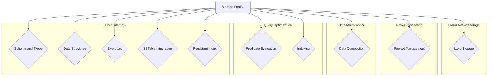

# Storage Engine

The Storage Engine module is a core component of the StarRocks database, responsible for managing the physical storage of data. It handles all aspects of data organization, including writing, reading, indexing, and compaction.

## Architecture

The Storage Engine is composed of several key sub-modules that work together to provide efficient and reliable data management.

### Sub-module Overview

*   **[Lake Storage](lake_storage.md):** Manages the cloud-native storage layer, including delta writers and compaction policies for the lakehouse architecture.
*   **[Rowset Management](rowset_management.md):** Handles the creation, writing, and reading of rowsets, which are the fundamental units of data storage.
*   **[Data Compaction](data_compaction.md):** Implements strategies for merging and optimizing data files to improve query performance and reduce storage footprint.
*   **[Predicate Evaluation](predicate_evaluation.md):** Processes and applies query predicates to filter data at the storage level, minimizing data scanned.
*   **[Indexing](indexing.md):** Manages various index structures, such as bloom filters and bitmap indexes, to accelerate data lookups.
*   **[Schema and Types](schema_and_types.md):** Defines and handles data types and schema transformations within the storage layer.
*   **[Data Structures](data_structures.md):** Provides the core data structures and helpers used throughout the storage engine, such as column builders and iterators.
*   **[Executors](executors.md):** Manages background tasks and execution pools for operations like flushing and replication.
*   **[SSTable Integration](sstable_integration.md):** Integrates with the SSTable file format for persistent data storage.
*   **[Persistent Index](persistent_index.md):** Manages the persistent primary key index for efficient data updates and lookups.
