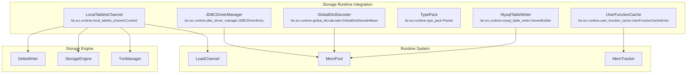
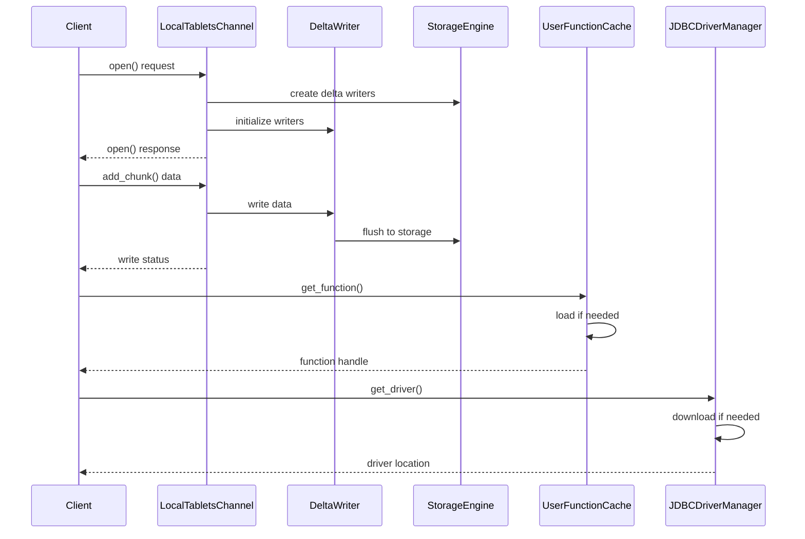
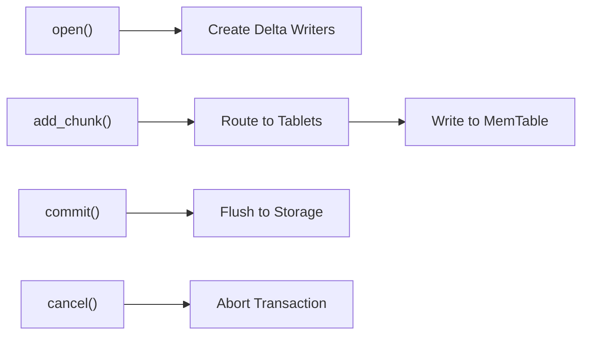
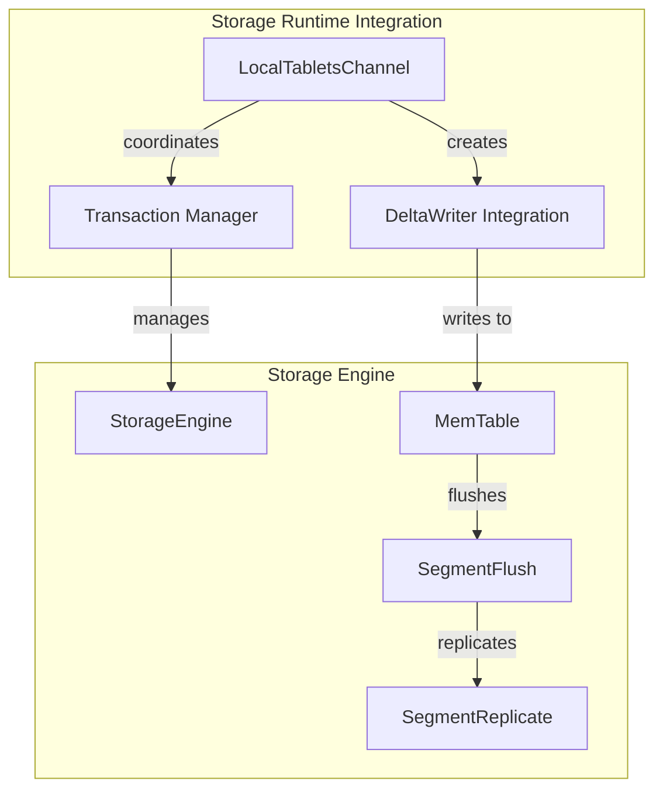

# Storage Runtime Integration Module

## Overview

The Storage Runtime Integration module serves as a critical bridge between StarRocks' storage engine and runtime execution components. This module manages the interaction between data loading operations, tablet management, and various runtime services including JDBC connectivity, user-defined functions, and global dictionary decoding.

## Purpose and Core Functionality

The module provides essential runtime services that enable:

- **Data Loading Integration**: Coordinates tablet-level data loading operations with the storage engine
- **Runtime Service Management**: Manages JDBC drivers, user functions, and global dictionary services
- **Type System Integration**: Handles data type conversion and packing for storage operations
- **Cross-System Communication**: Facilitates communication between storage and execution layers

## Architecture

### Component Relationships



### Data Flow Architecture



## Core Components

### 1. LocalTabletsChannel Context

The `LocalTabletsChannel` manages tablet-level data loading operations, providing a high-performance interface between the load channel and storage engine.

**Key Responsibilities:**
- **Tablet Writer Management**: Creates and manages delta writers for each tablet
- **Data Chunk Processing**: Handles incoming data chunks and routes them to appropriate tablets
- **Transaction Coordination**: Manages transaction lifecycle and commit operations
- **Replicated Storage**: Supports primary-secondary replication for high availability
- **Memory Management**: Integrates with memory tracking and pool allocation systems

**Core Operations:**



**Performance Features:**
- Sliding window protocol for packet sequence management
- Asynchronous write operations with callback mechanisms
- Memory pressure-based stale memtable flushing
- Comprehensive performance profiling and metrics collection

### 2. MySQL Table Writer ViewerBuilder

The `MysqlTableWriter` provides seamless integration with MySQL databases for data export operations.

**Key Features:**
- **Type-Aware Data Conversion**: Handles StarRocks to MySQL type mapping
- **Batch Insert Optimization**: Processes data in configurable chunk sizes
- **Connection Management**: Manages MySQL connections with proper resource cleanup
- **SQL Generation**: Dynamically builds INSERT statements with proper escaping

**Data Type Support:**
- Numeric types (TINYINT, SMALLINT, INT, BIGINT, FLOAT, DOUBLE)
- Decimal types with precision and scale handling
- Date and datetime types with proper formatting
- String types with MySQL escape sequences
- JSON and variant types with string serialization

### 3. User Function Cache Entry

The `UserFunctionCache` manages the lifecycle of user-defined functions (UDFs) with efficient caching and loading mechanisms.

**Cache Management:**
- **Library Sharding**: Distributes functions across 128 shards for scalability
- **Checksum Validation**: Ensures library integrity with SHA-256 verification
- **Lazy Loading**: Downloads and loads functions on-demand
- **Resource Cleanup**: Properly manages library handles and file cleanup

**Supported Function Types:**
- Java UDFs (`.jar` files)
- Python UDFs (`.py` files)
- Native functions with dynamic library loading

### 4. Type Pack Packer

The `TypePack` system provides efficient serialization for runtime data types.

**Serialization Features:**
- **Type-Specific Optimizations**: Custom packers for each logical type
- **Endian-Aware Encoding**: Little-endian encoding for cross-platform compatibility
- **Variable-Length Support**: Efficient handling of string and binary data
- **Numeric Optimization**: Direct memory copying for numeric types

**Supported Types:**
```cpp
// Numeric types with size optimization
TYPE_BOOLEAN, TYPE_TINYINT, TYPE_SMALLINT, TYPE_INT, TYPE_BIGINT
TYPE_FLOAT, TYPE_DOUBLE, TYPE_DECIMAL32, TYPE_DECIMAL64, TYPE_DECIMAL128

// String and binary types
TYPE_VARCHAR, TYPE_CHAR, TYPE_BINARY, TYPE_VARBINARY, TYPE_JSON

// Date and time types
TYPE_DATE, TYPE_DATETIME
```

### 5. Global Dictionary Decoder Base

The `GlobalDictDecoder` provides efficient string decoding using global dictionaries for compression.

**Decoding Capabilities:**
- **String Column Decoding**: Converts dictionary-encoded strings back to original values
- **Array Support**: Handles dictionary-encoded arrays with nested string elements
- **Null Handling**: Properly manages nullable columns with dictionary encoding
- **Performance Optimization**: Direct memory operations for efficient decoding

### 6. JDBC Driver Manager Entry

The `JDBCDriverManager` provides centralized management of JDBC drivers for external database connectivity.

**Driver Management:**
- **Automatic Download**: Downloads drivers from configured URLs with checksum verification
- **Version Management**: Handles multiple driver versions with timestamp-based selection
- **Resource Lifecycle**: Manages driver file lifecycle with proper cleanup
- **Connection Pooling**: Integrates with connection pooling for performance

## Integration Points

### Storage Engine Integration



### Runtime System Integration

The module integrates with various runtime components:

- **Memory Management**: Uses `MemTracker` and `MemPool` for resource accounting
- **Profile Collection**: Integrates with `RuntimeProfile` for performance monitoring
- **Configuration**: Uses `config` system for runtime parameter tuning
- **Metrics**: Reports to `StarRocksMetrics` for system monitoring

## Performance Characteristics

### Throughput Optimization

- **Parallel Processing**: Supports concurrent tablet operations
- **Batch Operations**: Processes data in chunks for efficiency
- **Asynchronous I/O**: Non-blocking operations with callback mechanisms
- **Memory Pooling**: Reuses memory allocations to reduce overhead

### Latency Minimization

- **Direct Path Operations**: Minimizes data copying between layers
- **Cache-Friendly Design**: Optimizes for CPU cache utilization
- **Lock-Free Operations**: Uses atomic operations where possible
- **Early Validation**: Validates data early to fail fast

## Error Handling and Recovery

### Transaction Safety

- **Atomic Operations**: Ensures all-or-nothing transaction semantics
- **Rollback Support**: Provides comprehensive rollback mechanisms
- **State Consistency**: Maintains consistent state across failures
- **Deadlock Prevention**: Uses proper locking hierarchies

### Resource Management

- **Memory Limits**: Enforces memory usage limits with graceful degradation
- **Timeout Handling**: Implements timeout mechanisms for long operations
- **Resource Cleanup**: Ensures proper cleanup of all resources
- **Error Propagation**: Properly propagates errors with context

## Configuration and Tuning

### Key Configuration Parameters

```cpp
// Memory management
config::max_queueing_memtable_per_tablet
config::stale_memtable_flush_time_sec
config::write_buffer_size

// Timeout settings
config::load_fp_tablets_channel_add_chunk_block_ms
config::load_diagnose_send_rpc_timeout_ms
config::load_replica_status_check_interval_ms

// Performance tuning
config::clear_udf_cache_when_start
```

### Monitoring and Metrics

The module provides comprehensive metrics through:

- **Tablet Writer Counts**: Active tablet writers monitoring
- **Memory Usage**: Memory consumption tracking
- **Operation Latencies**: Timing metrics for all operations
- **Error Rates**: Failure tracking and reporting

## Dependencies

### Internal Dependencies

- **Storage Engine**: Core storage operations and tablet management
- **Runtime System**: Memory management and execution environment
- **Type System**: Data type definitions and operations
- **Configuration**: Runtime parameter management

### External Dependencies

- **MySQL Client Library**: For MySQL table writer functionality
- **JDBC Drivers**: For external database connectivity
- **Protocol Buffers**: For RPC communication
- **BRPC**: For inter-service communication

## Future Enhancements

### Planned Improvements

1. **Enhanced Caching**: Improved caching strategies for better performance
2. **Adaptive Algorithms**: Dynamic tuning based on workload characteristics
3. **Extended Connectivity**: Support for additional external systems
4. **Advanced Monitoring**: Real-time performance analytics

### Scalability Considerations

- **Horizontal Scaling**: Design supports distributed deployment
- **Resource Partitioning**: Efficient resource allocation strategies
- **Load Balancing**: Intelligent load distribution mechanisms
- **Fault Tolerance**: Enhanced resilience to component failures

## References

- [Storage Engine Module](storage_engine.md) - Core storage operations
- [Runtime System Module](runtime_system.md) - Execution environment
- [Type System Module](type_system.md) - Data type management
- [Configuration Module](configuration.md) - Parameter management