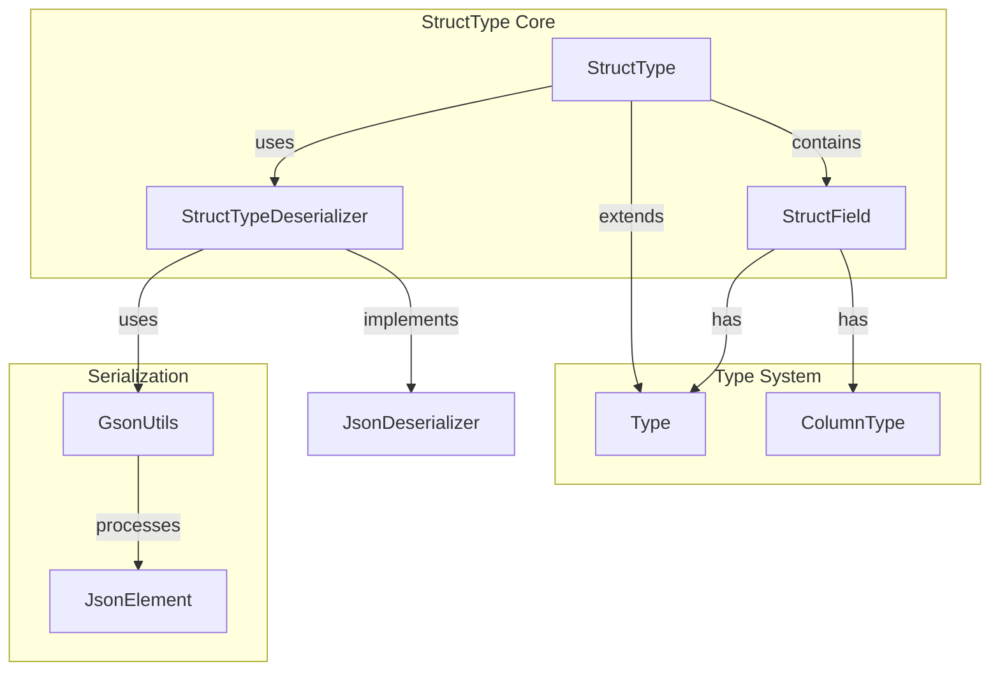
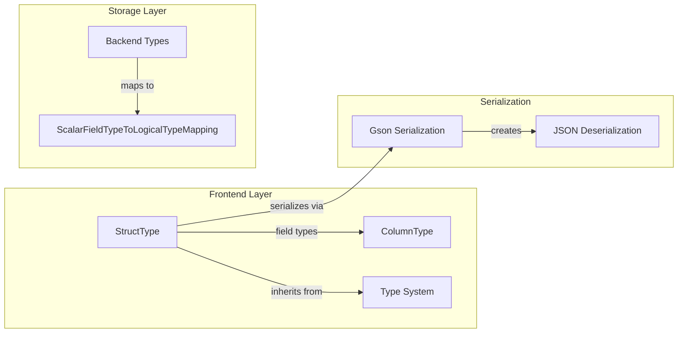
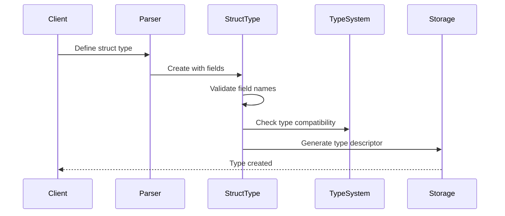
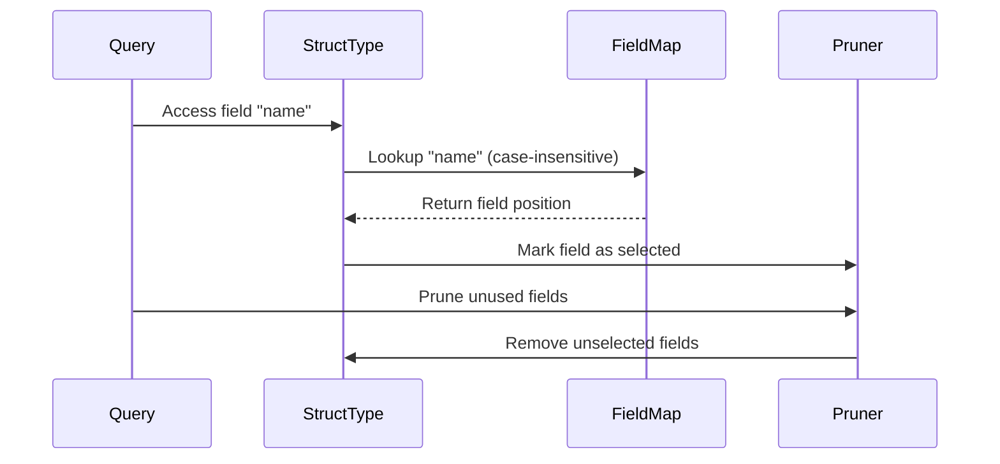
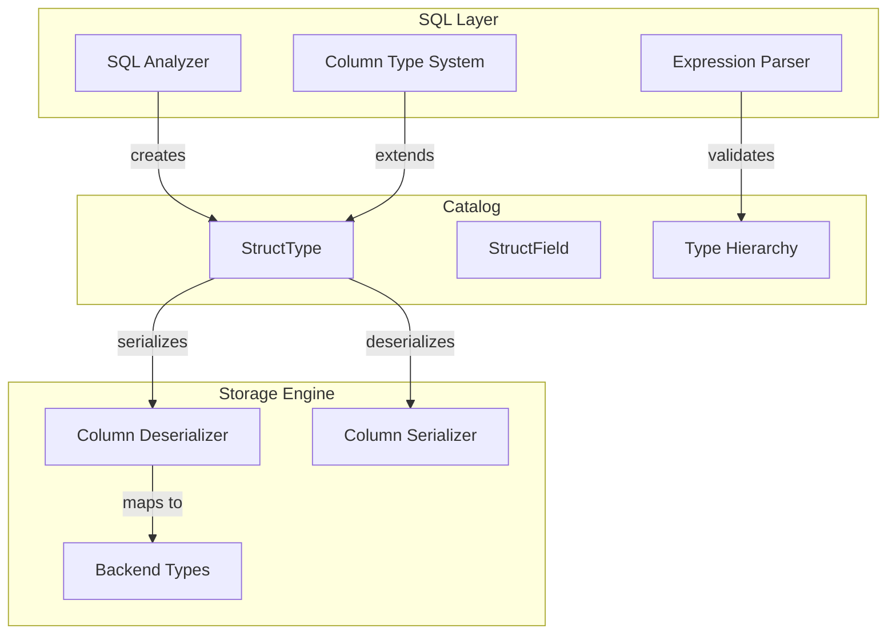
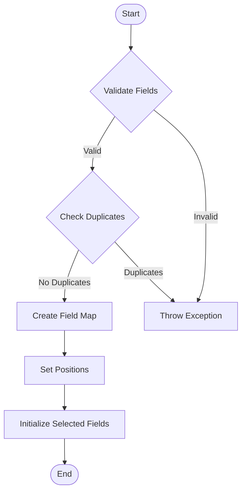
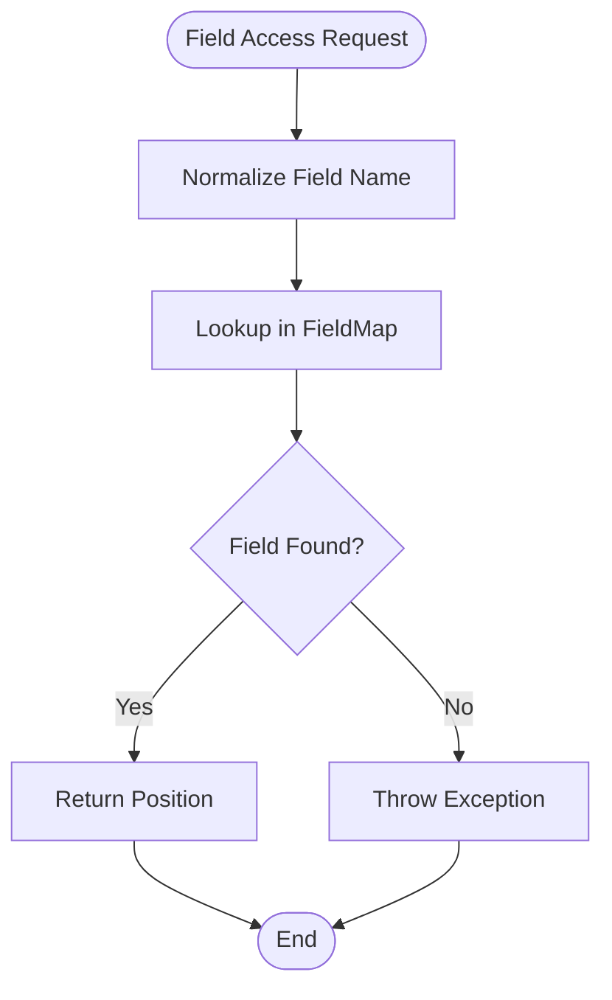

# StructType Module Documentation

## Overview

The `struct_type` module provides the core implementation for STRUCT types in StarRocks, a complex data type that represents structured data with named fields. This module enables the database to handle nested, hierarchical data structures commonly found in modern data formats like Parquet, ORC, and JSON.

## Purpose and Core Functionality

The StructType module serves as the foundation for:
- **Complex Type Support**: Enabling StarRocks to handle structured data with multiple named fields
- **Schema Evolution**: Supporting dynamic schema changes and field pruning for optimization
- **Type Compatibility**: Ensuring type safety and compatibility across different data sources
- **Serialization/Deserialization**: Handling JSON serialization for metadata persistence

## Architecture

### Core Components



### Component Relationships



## Data Flow

### Type Creation and Validation



### Field Access and Pruning



## Key Features

### 1. Field Management
- **Named Fields**: Support for named struct fields with case-insensitive lookup
- **Field Validation**: Duplicate field name detection and validation
- **Position Tracking**: Maintains field positions for efficient access
- **Field Pruning**: Optimizes storage by removing unused fields

### 2. Type Compatibility
- **Structural Matching**: Compares struct types based on field names and types
- **Full Compatibility**: Supports compatibility checking for schema evolution
- **Nested Support**: Handles complex nested structures with depth limits

### 3. Serialization Support
- **JSON Serialization**: Custom deserializer for Gson-based persistence
- **Thrift Integration**: Converts to Thrift type descriptors for BE communication
- **MySQL Compatibility**: Provides MySQL-compatible type strings

## Integration with System Components

### Frontend Integration



### Backend Type System Integration

The StructType module integrates with the backend type system through:
- **Type Mapping**: Maps to backend logical types via `ScalarFieldTypeToLogicalTypeMapping`
- **Serialization**: Converts to Thrift descriptors for BE processing
- **Field Access**: Provides field position information for columnar access

## Process Flows

### Struct Type Creation



### Field Access Pattern



## Dependencies

### Internal Dependencies
- **[type_system](type_system.md)**: Base Type class and type hierarchy
- **[column_management](column_management.md)**: Column type definitions and field management
- **[gson_utils](gson_utils.md)**: JSON serialization utilities

### External Dependencies
- **Thrift**: For backend communication type descriptors
- **Gson**: For JSON serialization and deserialization
- **Apache Commons**: For string utilities and validation

## Usage Examples

### Creating a Struct Type

```java
// Create struct fields
ArrayList<StructField> fields = new ArrayList<>();
fields.add(new StructField("id", Type.INT));
fields.add(new StructField("name", Type.VARCHAR));
fields.add(new StructField("address", Type.VARCHAR));

// Create struct type
StructType structType = new StructType(fields);
```

### Accessing Fields

```java
// Get field by name
StructField nameField = structType.getField("name");

// Check if field exists
boolean hasField = structType.containsField("email");

// Get field position
int position = structType.getFieldPos("id");
```

### Type Compatibility Check

```java
// Check if two struct types are compatible
boolean compatible = structType1.matchesType(structType2);

// Check full compatibility for schema evolution
boolean fullyCompatible = structType1.isFullyCompatible(structType2);
```

## Performance Considerations

### Memory Optimization
- **Field Pruning**: Automatically removes unused fields to reduce memory footprint
- **Lazy Initialization**: Selected fields array is initialized on demand
- **Case-Insensitive Lookup**: Uses lowercase field names for efficient HashMap access

### Serialization Efficiency
- **Custom Deserializer**: Optimized JSON deserialization for struct types
- **Thrift Conversion**: Efficient conversion to backend-compatible format
- **Field Position Caching**: Pre-computes field positions for fast access

## Error Handling

### Validation Errors
- **Duplicate Fields**: Throws `SemanticException` for duplicate field names
- **Invalid Fields**: Validates field types and names during construction
- **Access Errors**: Throws exceptions for non-existent field access

### Type Compatibility Errors
- **Structural Mismatch**: Returns false for incompatible struct types
- **Field Count Mismatch**: Handles different numbers of fields gracefully
- **Type Incompatibility**: Detects incompatible field types

## Future Enhancements

### Planned Features
- **Schema Evolution**: Enhanced support for backward/forward compatibility
- **Performance Optimization**: Improved field access patterns and caching
- **Extended Validation**: More comprehensive type validation rules

### Integration Improvements
- **Connector Support**: Enhanced integration with external data sources
- **Query Optimization**: Better predicate pushdown for struct fields
- **Storage Optimization**: Improved columnar storage for nested types

## Related Documentation

- [Type System](type_system.md) - Core type hierarchy and base classes
- [Column Management](column_management.md) - Column type definitions and utilities
- [Complex Types](complex_types.md) - Overview of complex type support
- [Backend Type System](be_type_system.md) - Backend type mapping and serialization