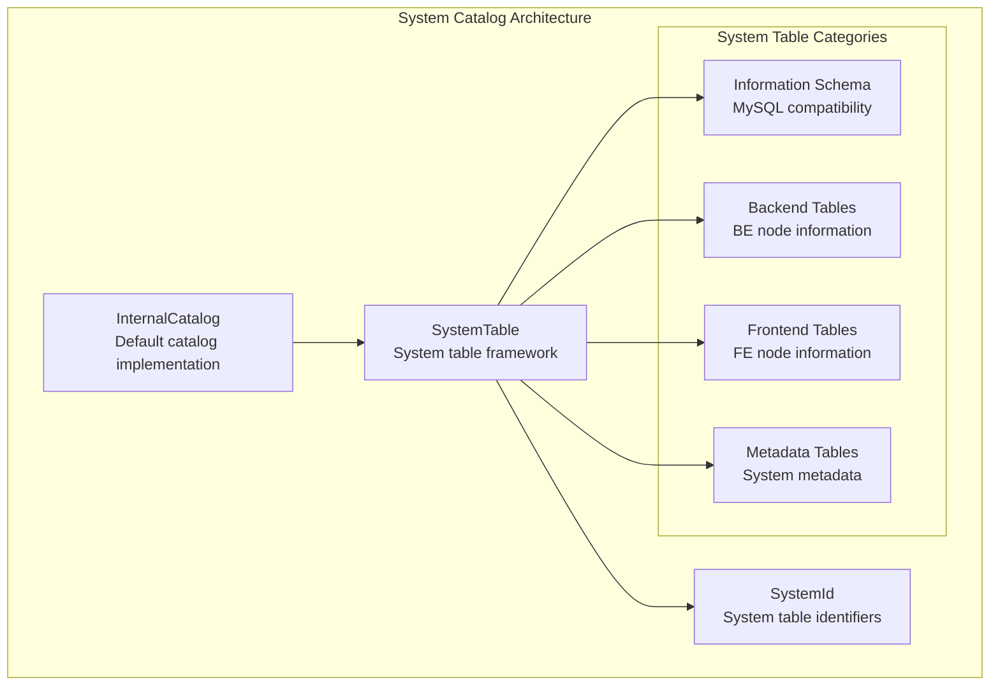
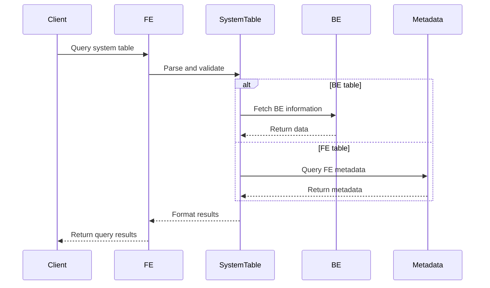

# System Catalog Module Documentation

## Overview

The System Catalog module serves as the central metadata management system for StarRocks, providing a unified interface for accessing and managing database system information. This module implements the information schema functionality, allowing users to query system metadata through standard SQL interfaces while maintaining compatibility with MySQL's information schema.

## Architecture



## Core Components

For detailed information about the core system catalog components, see [system_catalog_core.md](system_catalog_core.md).

### 1. InternalCatalog
- **Purpose**: Default internal catalog implementation for StarRocks
- **Location**: `fe.fe-core.src.main.java.com.starrocks.catalog.InternalCatalog.InternalCatalog`
- **Key Features**:
  - Provides default catalog name and ID constants
  - Handles catalog name resolution for table references
  - Serves as the primary catalog for system tables

### 2. SystemTable
- **Purpose**: Framework for creating and managing system tables
- **Location**: `fe.fe-core.src.main.java.com.starrocks.catalog.system.SystemTable.Builder`
- **Key Features**:
  - Builder pattern for constructing system table schemas
  - Support for various system table categories (BE, FE, Information Schema)
  - Type conversion utilities for different data formats
  - Query optimization support with predicate pushdown

### 3. SystemId
- **Purpose**: Centralized identifier management for all system tables
- **Location**: `fe.fe-core.src.main.java.com.starrocks.catalog.system.SystemId.SystemId`
- **Key Features**:
  - Predefined IDs for all system tables
  - Categorization of tables by functionality
  - ID range management to avoid conflicts

## System Table Categories

### Information Schema Tables
Provides MySQL-compatible information schema views:
- `TABLES`, `COLUMNS`, `SCHEMATA`
- `VIEWS`, `ROUTINES`, `TRIGGERS`
- `TABLE_CONSTRAINTS`, `KEY_COLUMN_USAGE`
- `CHARACTER_SETS`, `COLLATIONS`

### Backend (BE) Tables
Contains information about backend nodes:
- `BE_TABLETS`: Tablet distribution across BE nodes
- `BE_METRICS`: Performance metrics from BE nodes
- `BE_TXNS`: Transaction information
- `BE_CONFIGS`: Configuration settings
- `BE_COMPACTIONS`: Compaction status
- `BE_THREADS`: Thread information
- `BE_LOGS`: Log entries
- `BE_BVARS`: Built-in variables

### Frontend (FE) Tables
Contains frontend node information:
- `FE_SCHEDULES`: Scheduling information
- `FE_METRICS`: FE performance metrics
- `FE_LOCKS`: Lock information

### Metadata Management Tables
System metadata and operational data:
- `LOADS`, `LOAD_TRACKING_LOGS`: Load operation tracking
- `ROUTINE_LOAD_JOBS`, `STREAM_LOADS`: Load job management
- `TASKS`, `TASK_RUNS`: Task execution tracking
- `MATERIALIZED_VIEWS`: Materialized view metadata
- `PARTITIONS_META`: Partition information
- `TABLES_CONFIG`: Table configuration

## Data Flow



## Integration Points

### Related Modules
- **[catalog](catalog.md)**: Parent module containing table and column management
- **[frontend_server](frontend_server.md)**: Hosts the system catalog services
- **[query_execution](query_execution.md)**: Executes system table queries
- **[storage_engine](storage_engine.md)**: Provides backend data for system tables

### Dependencies
- Uses catalog framework for table management
- Integrates with FE server for metadata access
- Leverages BE nodes for runtime statistics
- Supports MySQL protocol compatibility

## Key Features

### 1. MySQL Compatibility
- Implements standard information schema tables
- Supports MySQL-specific system views
- Maintains compatibility with MySQL clients and tools

### 2. Extensible Architecture
- Builder pattern for easy table creation
- Plugin support for custom system tables
- Configurable table categories and access patterns

### 3. Performance Optimization
- Predicate pushdown for efficient querying
- Leader-follower query routing for consistency
- Caching mechanisms for frequently accessed metadata

### 4. Security and Access Control
- Privilege checking for sensitive system information
- Role-based access to different table categories
- Audit logging for system table access

## Usage Examples

### Querying System Information
```sql
-- List all tables in current database
SELECT * FROM information_schema.tables WHERE table_schema = 'mydb';

-- Check BE node status
SELECT * FROM information_schema.be_tablets;

-- View materialized view information
SELECT * FROM information_schema.materialized_views;
```

### System Administration
```sql
-- Monitor load operations
SELECT * FROM information_schema.loads;

-- Check task execution status
SELECT * FROM information_schema.task_runs;

-- View configuration settings
SELECT * FROM information_schema.be_configs;
```

## Configuration

The system catalog module operates with several key configuration parameters:
- System table ID ranges and allocation
- Query routing preferences (leader vs follower)
- Cache settings for metadata access
- Security and privilege enforcement levels

## Future Enhancements

Planned improvements to the system catalog module include:
- Additional system tables for new features
- Enhanced performance through better caching
- Extended MySQL compatibility
- Support for custom system table plugins