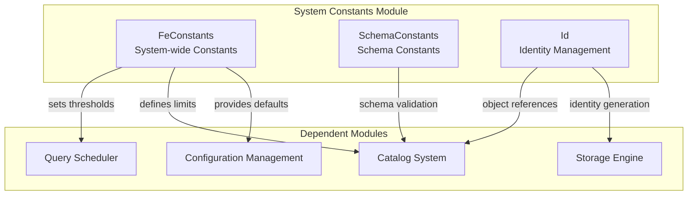
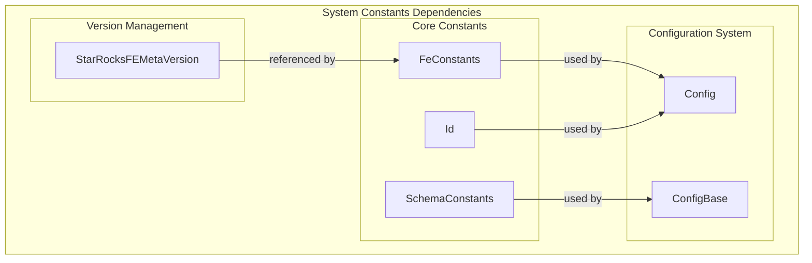

# System Constants Module Documentation

## Overview

The `system_constants` module serves as the central repository for system-wide constants, configuration parameters, and fundamental data structures used throughout the StarRocks system. This module provides the foundational building blocks that other modules depend on for consistent behavior, default values, and system-wide settings.

## Architecture



## Core Components

### 1. FeConstants - System-wide Constants

The `FeConstants` class contains comprehensive system-wide constants that define default values, limits, and configuration parameters for the entire StarRocks system.

**Key Responsibilities:**
- Database quota management (data and replica quotas)
- Bloom filter configuration (false positive probability, N-gram settings)
- Metadata version management
- Query execution limits and error messages
- Auto-distribution settings for tablet management
- Documentation URL references
- Testing and development flags

**Critical Constants:**
- `DEFAULT_DB_DATA_QUOTA_BYTES`: Maximum database data quota (Long.MAX_VALUE)
- `DEFAULT_BLOOM_FILTER_FPP`: Default Bloom filter false positive probability (0.05)
- `SHORTKEY_MAX_COLUMN_COUNT`: Maximum short key columns (3)
- `AUTO_DISTRIBUTION_UNIT`: Tablet size threshold (3GB)
- `STARROCKS_META_VERSION`: Current metadata version

For detailed information about FeConstants and related core components, see [System Constants Core](system_constants_core.md).

### 2. SchemaConstants - Schema Validation Constants

The `SchemaConstants` class provides fundamental constants for schema validation and metadata operations.

**Key Responsibilities:**
- Boolean value standardization ("YES"/"NO")
- Schema validation constants
- Metadata consistency checks

For detailed information about SchemaConstants, see [System Constants Core](system_constants_core.md).

### 3. Id - Generic Identity Management

The `Id` class provides a type-safe identity management system that prevents accidental comparison between different types of identifiers.

**Key Responsibilities:**
- Type-safe ID generation and management
- Prevention of cross-type ID comparisons
- Hash code generation for ID-based collections
- Invalid ID handling (-1 as invalid marker)

For detailed information about the Id system, see [System Constants Core](system_constants_core.md).

## Module Relationships



## Integration Points

### Configuration Management Integration
The system constants module integrates with the broader configuration management system through:
- Default value provision for configuration parameters
- Validation constants for configuration bounds
- System limits that configuration cannot exceed

### Catalog System Integration
The constants are extensively used in catalog operations:
- Database quota enforcement
- Table and partition size limits
- Metadata version compatibility checks
- Schema validation rules

### Query Execution Integration
Query execution components rely on system constants for:
- Resource allocation limits
- Timeout thresholds
- Error message standardization
- Result set size limitations

## Usage Patterns

### 1. Default Value Provision
```java
// Database creation with default quotas
db.setDataQuota(FeConstants.DEFAULT_DB_DATA_QUOTA_BYTES);
db.setReplicaQuota(FeConstants.DEFAULT_DB_REPLICA_QUOTA_SIZE);
```

### 2. Validation and Limits
```java
// Bloom filter configuration
double fpp = FeConstants.DEFAULT_BLOOM_FILTER_FPP;
int gramNum = FeConstants.DEFAULT_GRAM_NUM;
```

### 3. Type-Safe Identity Management
```java
// Using Id for type-safe identity
public class TableId extends Id<TableId> {
    public TableId(int id) {
        super(id);
    }
}
```

## Configuration Impact

The constants defined in this module have system-wide impact:

### Performance Implications
- `AUTO_DISTRIBUTION_UNIT` directly affects tablet distribution and query performance
- Bloom filter constants impact memory usage and query accuracy
- Short key settings influence indexing efficiency

### Storage Implications
- Database quotas control storage allocation
- Replica quotas manage data redundancy
- Partition name length limits affect metadata storage

### Compatibility Considerations
- Metadata version constants ensure backward compatibility
- Testing flags allow for development flexibility
- Error message constants maintain consistent user experience

## Best Practices

### 1. Constant Usage
- Always use defined constants instead of magic numbers
- Reference constants through their defining class (e.g., `FeConstants.DEFAULT_BLOOM_FILTER_FPP`)
- Consider the impact before modifying constant values

### 2. Identity Management
- Extend the `Id` class for new identifier types
- Never compare IDs of different types
- Use the provided methods for ID operations

### 3. Schema Validation
- Use `SchemaConstants` for boolean value standardization
- Maintain consistency with schema validation patterns
- Document any new schema-related constants

## Related Documentation

For more information about related modules, see:
- [System Constants Core](system_constants_core.md) - Detailed documentation of FeConstants, SchemaConstants, and Id components
- [Version Management](version_management.md) - Metadata version management and compatibility
- [Status Handling](status_handling.md) - System status and error handling mechanisms
- [Configuration Management](common_config.md) - Detailed configuration system documentation
- [Catalog System](catalog.md) - Catalog operations and metadata management
- [Query Execution](query_execution.md) - Query processing and execution details
- [Storage Engine](storage_engine.md) - Storage layer implementation and constants usage

## Future Considerations

The system constants module is designed to be extensible. When adding new constants:
- Consider the system-wide impact of new constants
- Document the purpose and usage of new constants
- Evaluate if constants should be configurable rather than fixed
- Maintain backward compatibility when modifying existing constants