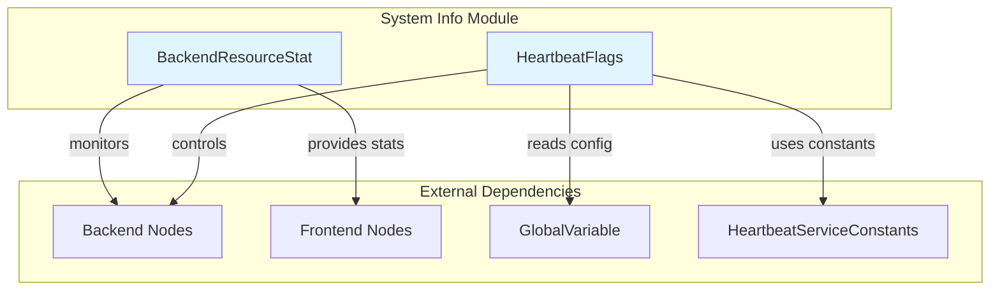

# System Information Module Documentation

## Overview

The `system_info` module is a critical component of the StarRocks database system that provides comprehensive system resource management and heartbeat coordination functionality. This module serves as the central hub for monitoring backend resources, managing system health indicators, and facilitating communication between Frontend (FE) and Backend (BE) components through heartbeat mechanisms.

## Architecture



## Core Functionality

### Backend Resource Statistics Management

The module's primary responsibility is to maintain real-time statistics about backend node resources, including:

- **CPU Core Tracking**: Monitors the number of hardware cores available across all backend nodes
- **Memory Limit Management**: Tracks memory limits for each backend node
- **Resource Averaging**: Computes average values for resource planning and optimization
- **Dynamic Resource Updates**: Handles backend node additions, removals, and configuration changes

### Heartbeat Coordination

The heartbeat system enables FE-to-BE communication for system behavior control:

- **Control Flag Management**: Manages 64-bit control flags for BE behavior control
- **Rowset Type Configuration**: Controls default rowset type (alpha/beta) across the cluster
- **System Synchronization**: Ensures consistent system behavior across all nodes

## Sub-modules

### Backend Resource Statistics

The [Backend Resource Statistics](backend_resource_stat.md) sub-module manages comprehensive backend resource tracking with thread-safe operations:

- **Resource Caching**: Maintains concurrent maps of CPU cores and memory limits per backend
- **Statistical Computations**: Calculates average and minimum resource values
- **Degree of Parallelism**: Provides DOP calculations for query optimization
- **Sink Optimization**: Computes optimal parallelism for data loading operations

### Heartbeat Flags

The [Heartbeat Flags](heartbeat_flags.md) sub-module handles FE-BE communication through heartbeat messages:

- **Flag Management**: Controls BE behaviors through bit-based flags
- **Configuration Integration**: Reads system configuration for heartbeat settings
- **Rowset Type Control**: Manages default rowset type configuration

## Key Features

### Thread Safety
All operations in the system_info module are thread-safe, utilizing:
- ConcurrentHashMap for resource storage
- Atomic variables for cached values
- ReentrantLock for critical sections
- CloseableLock for resource management

### Performance Optimization
- **Cached Computations**: Maintains cached averages to avoid repeated calculations
- **Lazy Evaluation**: Computes statistics only when needed
- **Efficient Updates**: Minimal overhead during backend state changes

### System Integration
The module integrates with various StarRocks components:
- **Query Engine**: Provides resource statistics for query planning
- **Load Balancing**: Supplies backend resource data for optimal task distribution
- **System Monitoring**: Offers real-time resource visibility
- **Configuration Management**: Synchronizes system-wide settings

## Usage Patterns

### Resource Monitoring
```
BackendResourceStat.getInstance().getAvgNumHardwareCoresOfBe()
BackendResourceStat.getInstance().getAvgMemLimitBytes()
```

### Heartbeat Configuration
```
HeartbeatFlags.getHeartbeatFlags()
```

### Dynamic Resource Updates
```
BackendResourceStat.getInstance().setNumHardwareCoresOfBe(beId, cores)
BackendResourceStat.getInstance().setMemLimitBytesOfBe(beId, memory)
```

## Dependencies

The system_info module depends on:
- [GlobalVariable](global_variable.md) - System configuration management
- [HeartbeatServiceConstants](heartbeat_service_constants.md) - Heartbeat protocol constants
- Backend node management systems
- Frontend coordination services

## Related Documentation

- [Backend Resource Statistics](backend_resource_stat.md) - Detailed resource management documentation
- [Heartbeat Flags](heartbeat_flags.md) - Heartbeat coordination system documentation
- [Storage Engine](storage_engine.md) - Related storage management systems
- [Frontend Server](frontend_server.md) - FE coordination and management