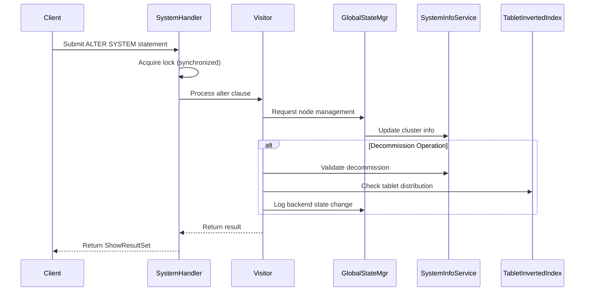
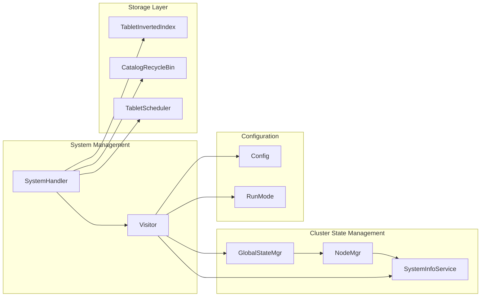
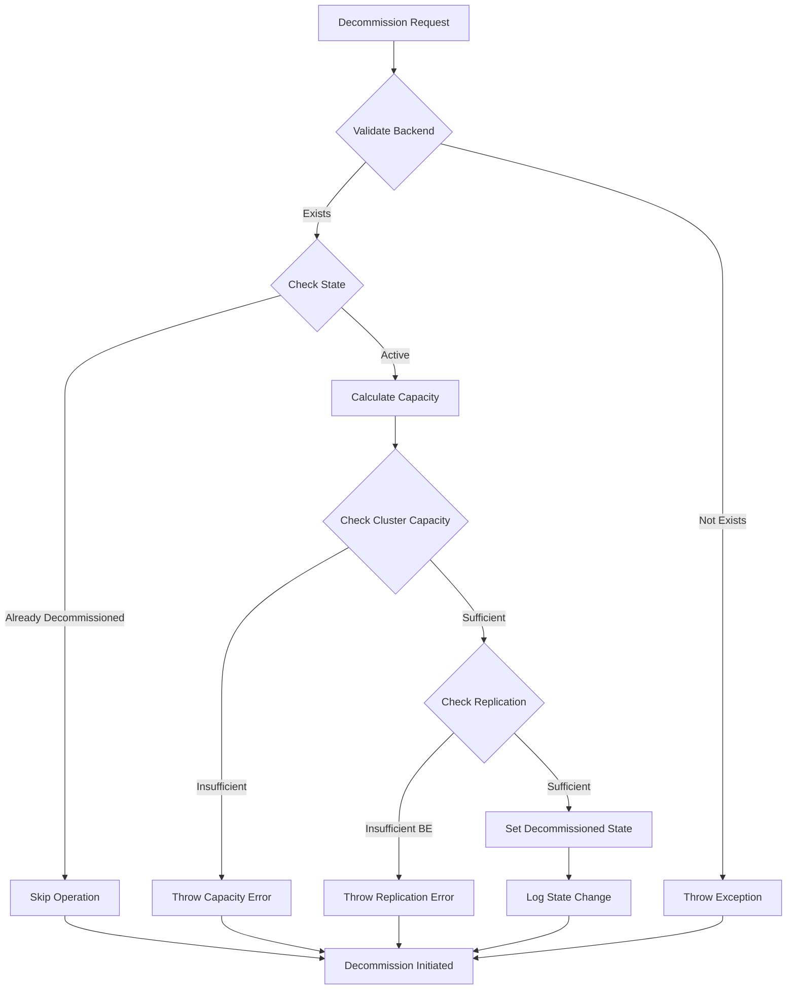
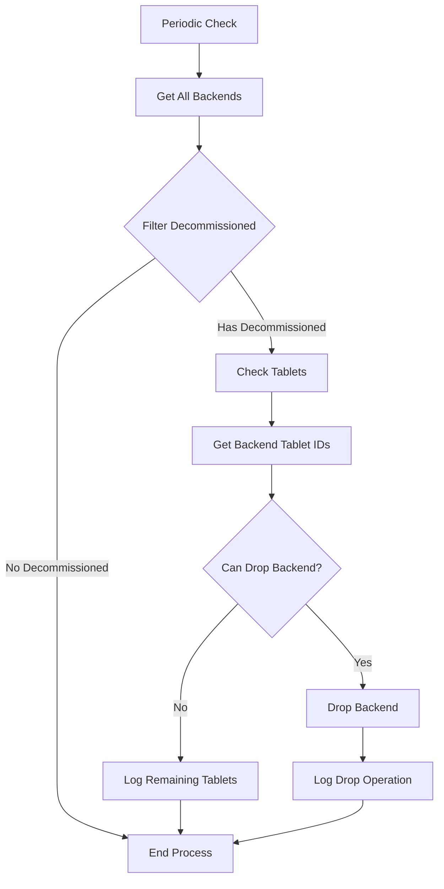
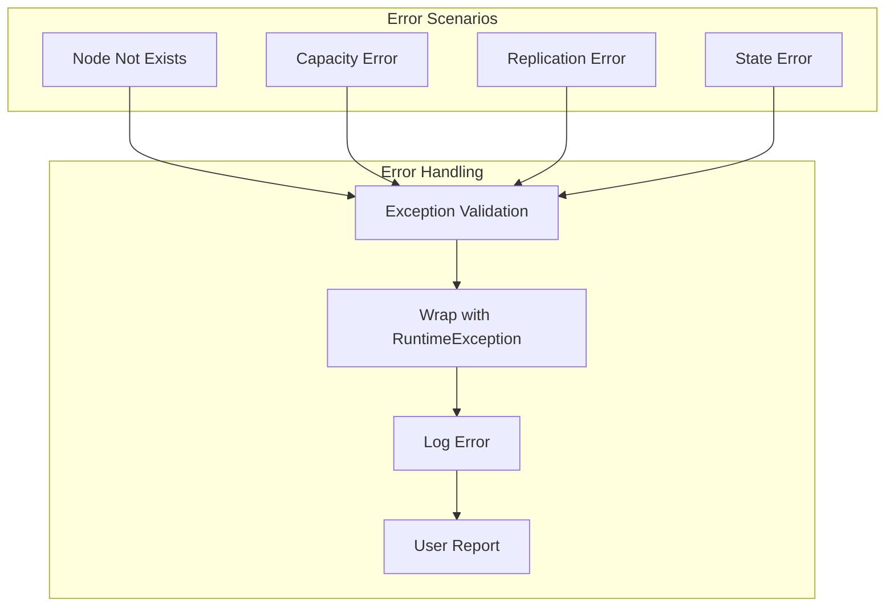

# System Management Module Documentation

## Introduction

The system_management module is a critical component of StarRocks that handles cluster-level operations and system administration tasks. It provides centralized management for backend nodes, frontend nodes, brokers, and compute nodes, ensuring the cluster's health, scalability, and operational efficiency.

This module serves as the primary interface for cluster administrators to perform essential operations such as adding/removing nodes, managing node lifecycle, handling decommissioning processes, and maintaining overall cluster stability.

## Architecture Overview

```mermaid
graph TB
    subgraph "System Management Module"
        SH[SystemHandler]
        V[Visitor Pattern]
        
        SH --> V
        
        V --> FE[Frontend Operations]
        V --> BE[Backend Operations]
        V --> BR[Broker Operations]
        V --> CN[Compute Node Operations]
        
        FE --> AFF[Add Follower]
        FE --> DFF[Drop Follower]
        FE --> AOF[Add Observer]
        FE --> DOF[Drop Observer]
        FE --> MFH[Modify Frontend Host]
        
        BE --> ABE[Add Backend]
        BE --> DBE[Drop Backend]
        BE --> MBE[Modify Backend]
        BE --> DCB[Decommission Backend]
        
        BR --> ABR[Add Broker]
        BR --> DBR[Drop Broker]
        BR --> MBR[Modify Broker]
        
        CN --> ACN[Add Compute Node]
        CN --> DCN[Drop Compute Node]
    end
    
    subgraph "External Dependencies"
        GSM[GlobalStateMgr]
        SMS[SystemInfoService]
        BM[BrokerMgr]
        TI[TabletInvertedIndex]
        CR[CatalogRecycleBin]
    end
    
    SH --> GSM
    V --> SMS
    V --> BM
    SH --> TI
    SH --> CR
```

## Core Components

### SystemHandler
The main entry point for all system-level operations. It extends `AlterHandler` and provides synchronized processing of system alteration statements.

**Key Responsibilities:**
- Process system-level ALTER statements
- Manage node lifecycle operations
- Handle decommissioning workflows
- Coordinate with other system components

### Visitor Pattern Implementation
The module implements the Visitor pattern through the `SystemHandler.Visitor` class to handle different types of system operations in a clean, extensible manner.

**Supported Operations:**
- Frontend node management (add/drop followers and observers)
- Backend node management (add/drop/modify/decommission)
- Broker management (add/drop/modify)
- Compute node management (add/drop)
- System maintenance (create image, clean tablet scheduler queue)

## Data Flow Architecture

## Component Interactions

## Key Processes

### Backend Decommissioning Process

### Post-Decommission Cleanup

## Dependencies

### Internal Dependencies
- **GlobalStateMgr**: Central state management for the entire system
- **SystemInfoService**: Manages cluster node information and topology
- **TabletInvertedIndex**: Tracks tablet distribution across backends
- **CatalogRecycleBin**: Manages recycled metadata for safe deletion
- **NodeMgr**: Handles frontend node operations
- **BrokerMgr**: Manages broker configurations

### Configuration Dependencies
- **Config**: System-wide configuration parameters
- **RunMode**: Determines cluster operation mode (shared-nothing vs shared-data)

## Integration Points

### Frontend Server Integration
The system_management module integrates with the [frontend_server](frontend_server.md) through:
- Node management operations (add/drop frontend nodes)
- State coordination via GlobalStateMgr
- Configuration management through Config components

### Storage Engine Integration
Integration with [storage_engine](storage_engine.md) includes:
- Backend capacity validation
- Tablet distribution analysis
- Decommissioning coordination with tablet migration

### Query Execution Integration
Coordination with [query_execution](query_execution.md) through:
- Resource availability checks
- Node state validation for query planning

## Error Handling

The module implements comprehensive error handling for various scenarios:

## Security Considerations

- All operations require appropriate privileges
- Node operations are logged for audit purposes
- State changes are persisted through edit logs
- Decommissioning includes validation to prevent data loss

## Performance Characteristics

- **Synchronized Processing**: Single-threaded processing of system operations to prevent conflicts
- **Periodic Cleanup**: Background cleanup of decommissioned nodes every 10 minutes
- **Capacity Validation**: Comprehensive checks before allowing decommissioning operations
- **Lazy Evaluation**: Post-decommission checks only when necessary

## Monitoring and Observability

The module provides extensive logging for:
- Node state changes
- Decommissioning progress
- Error conditions and their causes
- Capacity and replication validation results

## Future Enhancements

Potential areas for improvement include:
- Asynchronous processing for non-critical operations
- Enhanced monitoring dashboards for system health
- Predictive capacity planning
- Automated scaling recommendations

## Related Documentation

- [Frontend Server](frontend_server.md) - For frontend node management
- [Storage Engine](storage_engine.md) - For backend and storage management
- [Query Execution](query_execution.md) - For resource coordination
- [Configuration Management](configuration_management.md) - For system configuration