# System Utilities Module Documentation

## Overview

The `system_utilities` module provides essential low-level system services and utilities for the StarRocks database system. This module serves as the foundation layer that supports core database operations through compression, memory management, system information gathering, and utility functions.

## Architecture

```mermaid
graph TB
    subgraph "System Utilities Module"
        COMPRESSION[Compression Subsystem]
        CORE_LOCAL[Core Local Storage]
        CPU_INFO[CPU Information]
        JSON_CONV[JSON Conversion]
        MEM_INFO[Memory Information]
        TIME[Time Utilities]
        NETWORK[Network Utilities]
        SLICE[Slice Management]
        STACK[Stack Tracing]
        STATIC_ASSERTS[Static Assertions]
        SYSTEM_METRICS[System Metrics]
        THREAD[Thread Management]
        THREADPOOL[Thread Pool]
        THRIFT_RPC[Thrift RPC Helper]
        TRACE[Execution Tracing]
    end

    subgraph "External Dependencies"
        KERNEL[Linux Kernel]
        LIBC[glibc]
        COMP_LIBS[Compression Libraries]
        SIMD[simdjson]
        THRIFT[Apache Thrift]
    end

    COMPRESSION --> COMP_LIBS
    CPU_INFO --> KERNEL
    MEM_INFO --> KERNEL
    NETWORK --> KERNEL
    SYSTEM_METRICS --> KERNEL
    THREAD --> LIBC
    JSON_CONV --> SIMD
    THRIFT_RPC --> THRIFT

    style COMPRESSION fill:#e1f5fe
    style CORE_LOCAL fill:#e1f5fe
    style CPU_INFO fill:#e1f5fe
    style SYSTEM_METRICS fill:#e1f5fe
    style THREAD fill:#e1f5fe
    style THREADPOOL fill:#e1f5fe
```

## Core Functionality

### 1. Compression Subsystem
Provides high-performance data compression and decompression services supporting multiple algorithms:
- **Block Compression**: LZ4, Snappy, Zlib, Gzip, ZSTD, LZO
- **Stream Compression**: Gzip, Bzip2, LZ4 Frame, ZSTD, Snappy, LZO
- **Hadoop-compatible formats**: LZ4 Hadoop format support

**Key Components:**
- `Lz4fBlockCompression`: Frame-based LZ4 compression with streaming support
- `ZstandardStreamCompression`: High-ratio ZSTD compression
- `BlockCompressionCodec`: Unified interface for all compression algorithms

### 2. System Information and Metrics
Comprehensive system monitoring and information gathering:
- **CPU Information**: Core detection, NUMA topology, cache hierarchy, hardware capabilities
- **Memory Information**: Physical memory detection, container-aware memory limits
- **System Metrics**: Real-time CPU, disk, network, and memory usage tracking
- **File Descriptor Monitoring**: System-wide and process-level FD usage

### 3. Threading and Concurrency
Advanced threading infrastructure:
- **Thread Management**: Lifecycle management, naming, categorization
- **Thread Pool**: Dynamic thread pool with configurable sizing and CPU affinity
- **Core Local Storage**: Per-CPU data structures for lock-free operations

### 4. Data Processing Utilities
- **JSON Conversion**: SIMD-accelerated JSON parsing and conversion (`SimdJsonConverter`)
- **Slice Management**: Efficient string/binary data handling with zero-copy operations
- **Time Utilities**: High-precision monotonic timing and time conversion functions

### 5. Network and Communication
- **Network Utilities**: IPv4/IPv6 address handling, hostname resolution
- **Thrift RPC Helper**: Type-safe RPC communication framework

### 6. Debugging and Profiling
- **Stack Tracing**: Signal-based stack trace collection for all threads
- **Execution Tracing**: Detailed execution flow tracking with hierarchical traces
- **Static Assertions**: Compile-time validation of data structure layouts

## Sub-modules

### [Compression](compression.md)
Complete compression framework supporting multiple algorithms and formats for both block and stream processing.

### [System Information](system_information.md)
Hardware detection, system metrics collection, and performance monitoring capabilities.

### [Threading Infrastructure](threading_infrastructure.md)
Thread management, thread pools, and concurrency utilities with CPU affinity support.

### [Data Processing](data_processing.md)
JSON processing, slice management, and data conversion utilities.

### [Network and Communication](network_communication.md)
Network utilities, address handling, and RPC communication helpers.

### [Debugging and Profiling](debugging_profiling.md)
Stack tracing, execution tracing, and development utilities.

## Integration Points

### Storage Engine Integration
The system utilities module provides critical services to the storage engine:
- Compression for data storage and network transmission
- Memory management for buffer pools and caches
- System metrics for performance monitoring
- Thread pools for background operations

### Query Engine Integration
Query execution benefits from:
- High-performance compression for intermediate results
- Thread pools for parallel query execution
- System metrics for resource management
- Time utilities for performance measurement

### Frontend Integration
The FE server utilizes:
- Thrift RPC helpers for inter-service communication
- System metrics for cluster monitoring
- Network utilities for service discovery

## Performance Characteristics

### Compression Performance
- **LZ4**: ~500 MB/s compression, ~2000 MB/s decompression
- **ZSTD**: Configurable compression levels (1-22), optimal speed/ratio trade-off
- **Snappy**: ~250 MB/s compression, ~500 MB/s decompression
- **Gzip**: Standard compression with good ratio

### Memory Efficiency
- Zero-copy operations where possible
- Memory-mapped file support
- Container-aware memory limits
- NUMA-aware allocation

### Threading Scalability
- Lock-free data structures for core-local storage
- Dynamic thread pool sizing
- CPU affinity support for NUMA systems
- Work-stealing capabilities

## Configuration and Tuning

### Compression Settings
- Algorithm selection based on data characteristics
- Compression level tuning for ZSTD
- Buffer size optimization for streaming
- Hardware acceleration when available

### Thread Pool Configuration
- Minimum/maximum thread limits
- Idle timeout settings
- CPU affinity masks
- Queue size limits

### System Metrics
- Configurable metric collection intervals
- Selective metric enabling/disabling
- Custom metric aggregation
- Integration with external monitoring systems

## Error Handling and Reliability

### Compression Error Handling
- Graceful fallback between compression algorithms
- Corruption detection and recovery
- Memory allocation failure handling
- Streaming error propagation

### System Information Reliability
- Fallback mechanisms for missing system files
- Container environment detection
- Permission-aware operations
- Graceful degradation on unsupported systems

### Threading Safety
- Comprehensive locking strategies
- Deadlock prevention mechanisms
- Thread-local storage management
- Resource cleanup on thread termination

## Future Enhancements

### Planned Improvements
- Additional compression algorithm support (Brotli, LZMA)
- Enhanced NUMA awareness
- GPU acceleration for compression
- Advanced profiling and tracing capabilities
- Integration with cloud-native monitoring

### Performance Optimizations
- SIMD optimization for compression algorithms
- Lock-free data structure improvements
- Memory allocation optimizations
- Cache-aware algorithms

## Related Documentation
- [Storage Engine Architecture](../storage_engine.md)
- [Query Execution Framework](../query_execution.md)
- [Performance Tuning Guide](../performance_tuning.md)
- [Monitoring and Metrics](../monitoring.md)