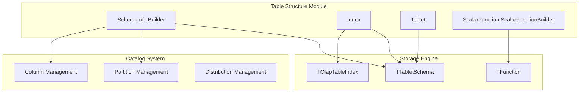
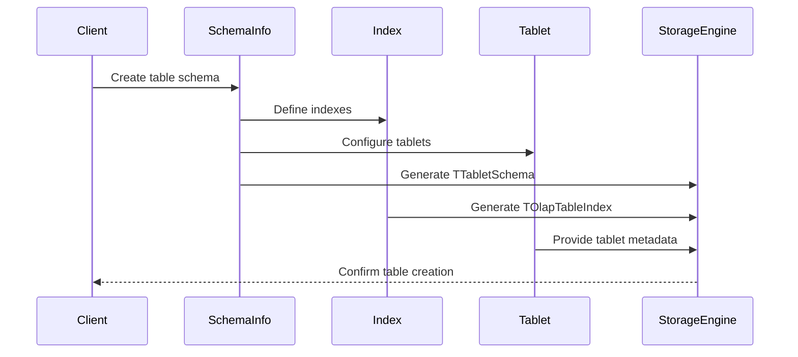

# Table Structure Module Documentation

## Overview

The `table_structure` module is a core component of the StarRocks catalog system that manages the structural definition and metadata of database tables. It provides the foundational abstractions for defining table schemas, managing indexes, handling tablets (data partitioning units), and supporting scalar functions within the database system.

This module serves as the bridge between logical table definitions and their physical storage representation, enabling efficient data organization, retrieval, and manipulation across the distributed StarRocks architecture.

## Architecture



## Core Components

### 1. SchemaInfo.Builder
The `SchemaInfo.Builder` is the primary component for constructing table schema definitions. It encapsulates all metadata required to define a table's structure including columns, indexes, storage properties, and optimization settings.

**Key Responsibilities:**
- Table schema construction and validation
- Column management and ordering
- Index configuration
- Storage type specification
- Bloom filter optimization
- Sort key definition

**Integration Points:**
- Works with [column_management](column_management.md) for column definitions
- Coordinates with [partition_management](partition_management.md) for partitioning schemes
- Interfaces with storage engine via `TTabletSchema`

**Detailed Documentation:** [schema_info.md](schema_info.md)

### 2. Index
The `Index` component manages table indexes including their types, columns, and properties. It supports various index types optimized for different query patterns and data characteristics.

**Key Responsibilities:**
- Index metadata management
- Column-to-index mapping
- Index type specification (BTREE, BITMAP, etc.)
- Properties and configuration handling
- SQL generation for index definitions

**Integration Points:**
- Collaborates with [column_management](column_management.md) for indexed columns
- Converts to `TOlapTableIndex` for storage engine communication
- Supports multiple index types through `IndexDef.IndexType`

**Detailed Documentation:** [index_management.md](index_management.md)

### 3. Tablet
The `Tablet` component represents the abstract base for tablet metadata, which are the fundamental units of data partitioning and distribution in StarRocks.

**Key Responsibilities:**
- Tablet identification and metadata
- Data size and row count management
- Backend distribution tracking
- Replica management coordination
- Queryable replica selection

**Integration Points:**
- Works with storage engine for physical data management
- Coordinates with [partition_management](partition_management.md) for partitioning
- Interfaces with compute resources for distributed processing

**Detailed Documentation:** [tablet_management.md](tablet_management.md)

### 4. ScalarFunction.ScalarFunctionBuilder
The `ScalarFunction.ScalarFunctionBuilder` provides a builder pattern for creating scalar function definitions, supporting both built-in and user-defined functions.

**Key Responsibilities:**
- Scalar function construction
- Function signature management
- UDF (User Defined Function) support
- Function isolation and security
- Binary type specification (BUILTIN, NATIVE, etc.)

**Integration Points:**
- Converts to `TFunction` for execution engine
- Supports UDF loading and management
- Integrates with function resolution system

**Detailed Documentation:** [scalar_functions.md](scalar_functions.md)

## Data Flow



## Key Features

### Schema Flexibility
- Support for complex data types through [complex_types](complex_types.md)
- Dynamic schema evolution capabilities
- Version management for schema changes

### Index Optimization
- Multiple index types for different access patterns
- Bloom filter integration for enhanced query performance
- Configurable false positive probabilities

### Distributed Architecture
- Tablet-based partitioning for horizontal scaling
- Replica management for high availability
- Compute resource awareness for query optimization

### Function Support
- Built-in scalar functions
- User-defined function framework
- Security isolation for UDFs

## Dependencies

The table_structure module integrates with several other catalog modules:

- **[column_management](column_management.md)**: For column definitions and type management
- **[partition_management](partition_management.md)**: For table partitioning schemes
- **[distribution_management](distribution_management.md)**: For data distribution strategies
- **[complex_types](complex_types.md)**: For advanced data type support

## Usage Examples

### Creating a Table Schema
```java
SchemaInfo schema = SchemaInfo.newBuilder()
    .setId(tableId)
    .setKeysType(KeysType.AGG_KEYS)
    .setShortKeyColumnCount((short) 3)
    .setStorageType(TStorageType.COLUMN)
    .addColumns(columns)
    .setIndexes(indexes)
    .setBloomFilterColumnNames(bfColumns)
    .setBloomFilterFpp(0.01)
    .build();
```

### Defining an Index
```java
Index index = new Index(
    "idx_user_id",
    Arrays.asList(columnId),
    IndexDef.IndexType.BITMAP,
    "Bitmap index for user_id column"
);
```

### Creating a Scalar Function
```java
ScalarFunction function = ScalarFunction.ScalarFunctionBuilder
    .createUdfBuilder(TFunctionBinaryType.NATIVE)
    .name(new FunctionName("my_udf"))
    .argsType(new Type[]{Type.INT})
    .retType(Type.STRING)
    .objectFile("/path/to/udf.so")
    .symbolName("my_udf_impl")
    .build();
```

## Performance Considerations

- **Schema Hash**: Automatic schema hashing for efficient change detection
- **Short Key Optimization**: Configurable short key columns for prefix indexing
- **Bloom Filters**: Configurable false positive rates for memory efficiency
- **Tablet Sizing**: Optimal tablet size selection for load balancing

## Future Enhancements

- Enhanced schema evolution capabilities
- Advanced index types (e.g., LSM trees, learned indexes)
- Improved UDF security and isolation
- Dynamic tablet rebalancing algorithms