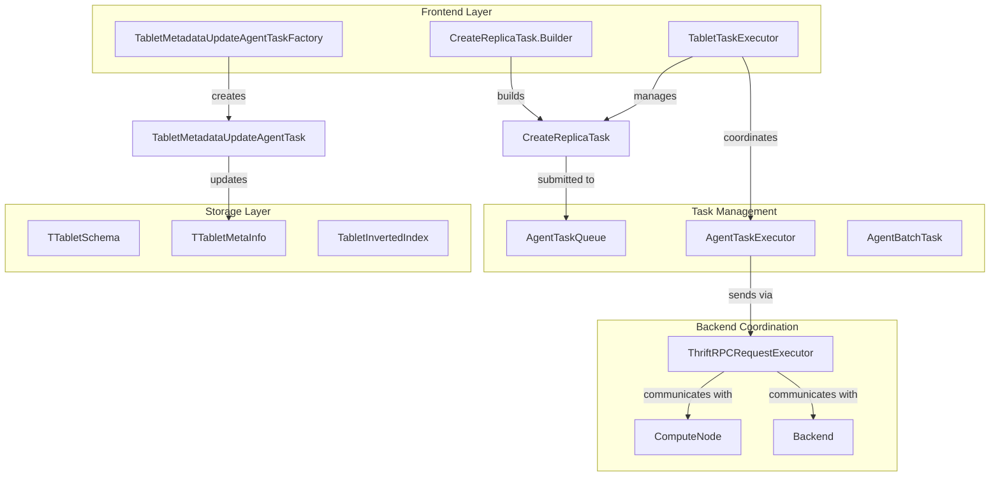
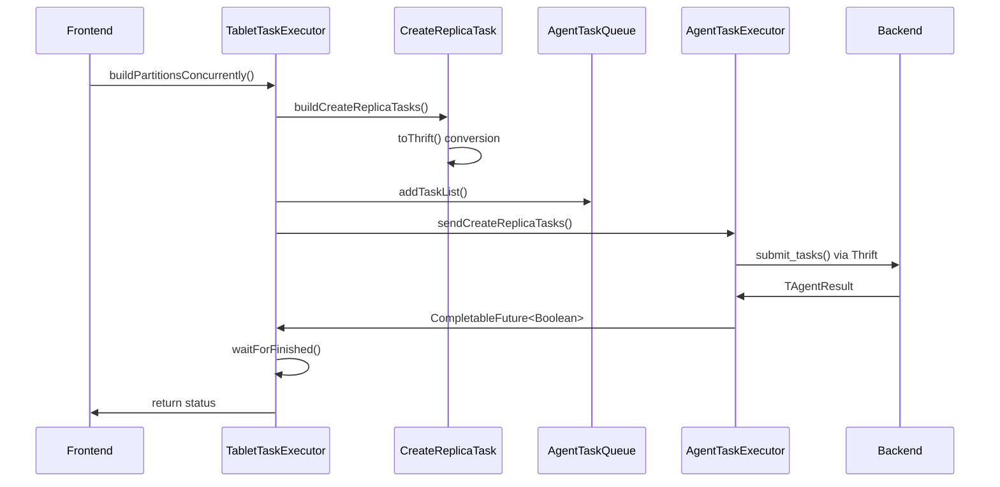
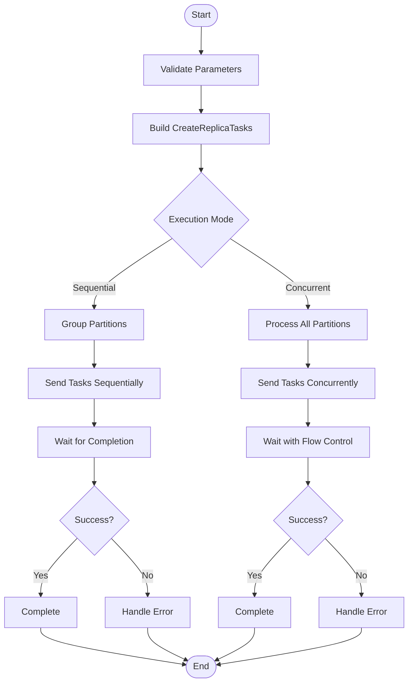
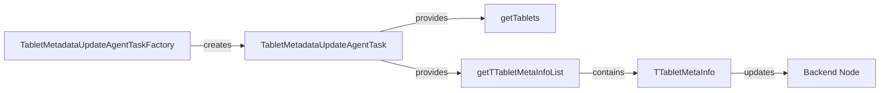

# Tablet Operations Module

## Overview

The tablet_operations module is a critical component of StarRocks' storage engine that manages the lifecycle and metadata of tablets - the fundamental storage units in the system. This module orchestrates tablet creation, metadata updates, and coordination between frontend and backend nodes for tablet-related operations.

## Purpose and Core Functionality

The tablet_operations module serves as the central coordination point for:

- **Tablet Creation**: Orchestrating the creation of new tablet replicas across backend nodes
- **Metadata Management**: Updating tablet metadata properties and configurations
- **Task Coordination**: Managing asynchronous task execution and synchronization
- **Partition Building**: Supporting both sequential and concurrent partition construction
- **Schema Updates**: Handling tablet schema changes and file management

## Architecture

### Component Relationships

### Data Flow Architecture

## Core Components

### CreateReplicaTask.Builder

The `CreateReplicaTask.Builder` is a sophisticated builder pattern implementation that constructs tablet creation tasks with comprehensive configuration options:

**Key Features:**
- Fluent API for task configuration
- Validation of required parameters
- Support for advanced features like persistent indexes, binlog configuration, and flat JSON
- Recovery source tracking for error handling
- Timeout and optimization settings

**Configuration Options:**
- Storage medium and compression settings
- Tablet type (disk-based vs lake storage)
- Persistent index configuration
- Binlog and flat JSON configurations
- Base tablet references for disk placement optimization
- Compaction strategies

### TabletTaskExecutor

The `TabletTaskExecutor` provides two primary execution strategies for tablet operations:

#### Sequential Execution
- Processes partitions one group at a time
- Bundles tasks in batches of ~200 for efficiency
- Suitable for smaller deployments or when resource contention is a concern
- Provides predictable resource usage patterns

#### Concurrent Execution
- Processes multiple partitions simultaneously
- Implements flow control to prevent backend overload
- Limits concurrent tasks to 200 per backend node
- Optimized for large-scale deployments
- Includes sophisticated timeout and error handling

**Key Capabilities:**
- Automatic task timeout calculation based on replica count
- Leader transfer detection for cluster stability
- Comprehensive error reporting with actionable user messages
- Task distribution optimization across available backends

### TabletMetadataUpdateAgentTaskFactory

This factory creates specialized tasks for updating tablet metadata properties:

**Supported Update Types:**
- **Partition ID Updates**: Migrate tablets between partitions
- **Memory Settings**: Configure in-memory storage preferences
- **Persistent Index**: Enable/disable and configure persistent indexing
- **File Bundling**: Optimize metadata file organization
- **Compaction Strategy**: Adjust compaction behavior (DEFAULT/REAL_TIME)
- **Binlog Configuration**: Update change data capture settings
- **Primary Index Cache**: Configure cache expiration times
- **Schema Updates**: Apply schema changes with optional file creation

## Task Execution Flow

### Tablet Creation Process

### Metadata Update Process

## Integration with Other Modules

### Storage Engine Integration
The tablet_operations module integrates closely with:
- **[storage_engine](storage_engine.md)**: Provides the underlying storage abstractions and tablet management
- **[query_execution](query_execution.md)**: Coordinates tablet operations with query processing
- **[frontend_server](frontend_server.md)**: Manages metadata persistence and cluster coordination

### Task Management Integration
- **AgentTaskQueue**: Manages task lifecycle and persistence
- **AgentTaskExecutor**: Handles asynchronous task execution
- **ThriftRPCRequestExecutor**: Manages communication with backend nodes

## Error Handling and Recovery

### Timeout Management
The module implements sophisticated timeout handling:
- Dynamic timeout calculation based on replica count and backend availability
- Configurable timeouts via `tablet_create_timeout_second`
- Graceful degradation with detailed error messages for users
- Automatic cleanup of failed tasks

### Recovery Mechanisms
- **RecoverySource Tracking**: Identifies whether tasks originate from scheduler or report processing
- **Leader Transfer Detection**: Handles cluster leadership changes during operations
- **Task Cancellation**: Proper cleanup of in-flight tasks on failure
- **Error Propagation**: Comprehensive error reporting with backend-specific details

## Performance Optimizations

### Task Batching
- Groups tasks to minimize RPC overhead
- Configurable batch sizes (default ~200 tasks per batch)
- Backend-aware distribution to balance load

### Flow Control
- Prevents backend overload in concurrent execution mode
- Limits concurrent tasks per backend (200 maximum)
- Adaptive waiting based on task completion rates

### Resource Management
- Efficient memory usage through streaming task creation
- Connection pooling for RPC communications
- Timeout-based resource cleanup

## Configuration and Tuning

### Key Configuration Parameters
- `tablet_create_timeout_second`: Base timeout for tablet creation
- `max_create_table_timeout_second`: Maximum timeout per index
- `max_agent_tasks_send_per_be`: Task submission rate limiting

### Optimization Strategies
- **Tablet Creation Optimization**: Reduces redundant schema file creation
- **Base Tablet References**: Optimizes disk placement for new replicas
- **Compression Configuration**: Per-table compression settings

## Monitoring and Observability

### Logging and Metrics
- Comprehensive logging at DEBUG level for task lifecycle
- Performance metrics for execution timing
- Error categorization and reporting
- Backend-specific status tracking

### Health Monitoring
- Task queue depth monitoring
- Backend availability tracking
- Timeout and failure rate statistics
- Resource utilization metrics

This module provides the foundational infrastructure for StarRocks' distributed storage layer, ensuring reliable and efficient tablet management across the entire cluster.