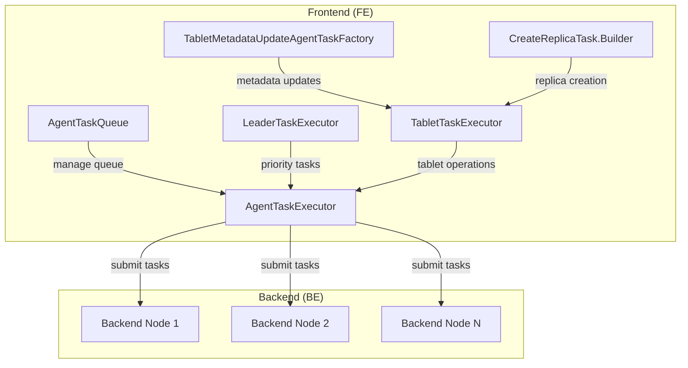
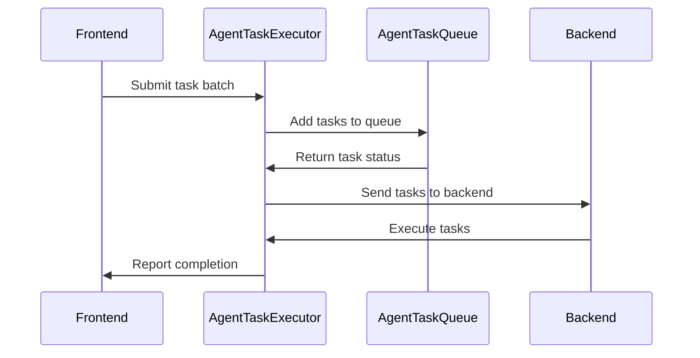

# Task Execution Module Documentation

## Overview

The task_execution module is a core component of StarRocks that manages the execution of various system tasks across the distributed cluster. It provides a robust framework for coordinating task submission, execution, and monitoring between the Frontend (FE) and Backend (BE) nodes.

## Purpose

The primary purpose of this module is to:
- Manage task lifecycle from submission to completion
- Coordinate distributed task execution across cluster nodes
- Provide reliable task queuing and scheduling mechanisms
- Handle task failures and retries
- Support various task types including tablet creation, metadata updates, and load operations

## Architecture

## Core Components

### 1. Task Execution Framework

For detailed information about the core task execution components, see [task_execution_core.md](task_execution_core.md).

#### AgentTaskExecutor
The central task execution engine that manages thread pools and task submission to backend nodes. It provides:
- Thread pool management for task execution
- Task submission interface
- Configurable thread pool sizing

#### AgentTaskQueue
A sophisticated task queue management system that:
- Maintains task queues organized by backend ID and task type
- Provides task lifecycle management (add, remove, query)
- Supports batch operations for efficiency
- Handles task deduplication and conflict resolution

#### LeaderTaskExecutor
Specialized executor for leader-specific tasks with:
- Priority-based task scheduling
- Task timeout and cleanup mechanisms
- Running task tracking and management

### 2. Task Types and Management

For detailed information about tablet operations and management, see [tablet_operations.md](tablet_operations.md).

#### CreateReplicaTask.Builder
Builder pattern implementation for creating tablet replica tasks with:
- Comprehensive configuration options
- Support for various storage types (disk, lake)
- Schema and metadata configuration
- Recovery and optimization settings

#### TabletTaskExecutor
Specialized executor for tablet-related operations:
- Sequential and concurrent partition building
- Tablet creation optimization
- Timeout and error handling
- Resource management and throttling

#### TabletMetadataUpdateAgentTaskFactory
Factory for creating metadata update tasks:
- Generic property update tasks
- Schema update operations
- Configuration synchronization
- Batch processing capabilities

### 3. Load Operations

For detailed information about load and ETL operations, see [load_operations.md](load_operations.md).

The task execution module supports various load operations through specialized task types that handle data ingestion and processing workflows.

### 4. Task Coordination

The module implements sophisticated coordination mechanisms:
- **Batch Processing**: Groups related tasks for efficient execution
- **Load Balancing**: Distributes tasks across available backends
- **Fault Tolerance**: Handles node failures and task retries
- **Progress Tracking**: Monitors task completion status
- **Resource Management**: Controls concurrent task limits

## Data Flow

## Key Features

### 1. Scalability
- Configurable thread pools for different task types
- Efficient batch processing to reduce overhead
- Load balancing across backend nodes
- Resource-aware task scheduling

### 2. Reliability
- Task persistence and recovery
- Timeout handling and cleanup
- Failure detection and retry mechanisms
- Graceful degradation under load

### 3. Performance
- Optimized task batching and submission
- Concurrent execution where possible
- Minimal lock contention
- Efficient data structures for task management

### 4. Flexibility
- Support for multiple task types
- Configurable execution parameters
- Plugin architecture for custom tasks
- Dynamic resource allocation

## Integration Points

The task_execution module integrates with several other StarRocks modules:

- **[storage_engine.md](storage_engine.md)**: Coordinates with storage operations for tablet management
- **[query_execution.md](query_execution.md)**: Supports query-related background tasks
- **[frontend_server.md](frontend_server.md)**: Integrates with FE lifecycle management
- **[backend_server.md](backend_server.md)**: Manages BE task execution and coordination

## Configuration

Key configuration parameters:
- `max_agent_task_threads_num`: Maximum threads for agent task execution
- `tablet_create_timeout_second`: Timeout for tablet creation tasks
- `max_create_table_timeout_second`: Maximum timeout for table creation
- `max_agent_tasks_send_per_be`: Maximum tasks sent per backend

## Error Handling

The module implements comprehensive error handling:
- Task-level error tracking and reporting
- Backend failure detection and recovery
- Timeout management with configurable limits
- Graceful handling of resource exhaustion
- Detailed logging for debugging and monitoring

## Monitoring and Observability

The task_execution module provides:
- Task queue metrics and statistics
- Execution time tracking
- Success/failure rates
- Resource utilization monitoring
- Integration with StarRocks metrics system

This documentation provides a comprehensive overview of the task_execution module. For detailed information about specific sub-modules, refer to their individual documentation files.