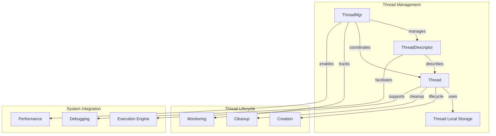

# Thread Management Sub-module

## Overview

The Thread Management sub-module provides sophisticated thread lifecycle management, monitoring, and debugging capabilities. It offers a comprehensive threading framework that includes thread naming, categorization, monitoring, and advanced debugging features essential for high-performance concurrent applications.

## Core Components

### ThreadDescriptor Class

The `ThreadDescriptor` class encapsulates thread metadata and monitoring information:

```cpp
class ThreadDescriptor {
public:
    ThreadDescriptor(std::string category, std::string name, int64_t thread_id, Thread* thread);
    
    const std::string& name() const { return _name; }
    const std::string& category() const { return _category; }
    int64_t thread_id() const { return _thread_id; }
    Thread* thread() const { return _thread; }
    
private:
    std::string _name;
    std::string _category;
    int64_t _thread_id;
    Thread* _thread{nullptr};
};
```

## Architecture



## Key Features

### 1. Thread Naming and Categorization
- Descriptive thread names for debugging
- Category-based thread organization
- System-wide thread identification
- Thread name length optimization (16 bytes for pthread compatibility)

### 2. Thread Lifecycle Management
- Automatic thread registration and deregistration
- Thread-local storage management
- Safe thread cleanup and resource management
- Reference counting for thread safety

### 3. Thread Monitoring and Debugging
- Real-time thread information collection
- Thread state tracking and reporting
- Performance metrics collection
- Integration with system monitoring

### 4. Advanced Threading Features
- Thread affinity support
- CPU core binding capabilities
- Thread priority management
- Custom thread attributes

## Implementation Details

### Thread Registration Process

```cpp
void ThreadMgr::add_thread(const pthread_t& pthread_id, const std::string& name, 
                          const std::string& category, int64_t tid) {
    std::lock_guard<std::mutex> l(_lock);
    _thread_categories[category][pthread_id] = 
        ThreadDescriptor(category, name, tid, Thread::current_thread());
    _threads_running_metric++;
    _threads_started_metric++;
}
```

### Thread-Local Storage

```cpp
__thread Thread* Thread::_tls = nullptr;

Thread* Thread::current_thread() {
    return _tls;
}
```

### Thread Naming Implementation

```cpp
void Thread::set_thread_name(pthread_t t, const std::string& name) {
    // pthread_setname_np is restricted to 16 bytes including null terminator
    if (name.length() < 16) {
        pthread_setname_np(t, name.data());
    } else {
        std::string truncated = name.substr(0, 15);
        truncated[15] = '\0';
        pthread_setname_np(t, truncated.data());
    }
}
```

## Usage Patterns

### Thread Creation and Management
```cpp
// Example: Creating a named and categorized thread
scoped_refptr<Thread> worker_thread;
Status status = Thread::start_thread("worker", "data_processor", 
    []() { process_data(); }, 0, &worker_thread);

if (status.ok()) {
    LOG(INFO) << "Started worker thread: " << worker_thread->name();
}
```

### Thread Information Collection
```cpp
// Example: Collecting thread information for monitoring
std::vector<BeThreadInfo> thread_infos;
Thread::get_thread_infos(thread_infos);

for (const auto& info : thread_infos) {
    LOG(INFO) << "Thread: " << info.name 
              << " Category: " << info.group
              << " TID: " << info.tid
              << " Idle: " << info.idle;
}
```

### Thread Monitoring and Debugging
```cpp
// Example: Thread state monitoring
Thread* current = Thread::current_thread();
if (current) {
    LOG(INFO) << "Current thread: " << current->to_string();
    LOG(INFO) << "Thread category: " << current->category();
    LOG(INFO) << "Finished tasks: " << current->finished_tasks();
}
```

## Performance Characteristics

- **Thread Creation**: O(1) with system call overhead
- **Thread Lookup**: O(log n) for category-based lookup
- **Memory Overhead**: Minimal per-thread metadata
- **Scalability**: Efficient for hundreds of threads
- **Thread-Local Access**: O(1) with no locking

## Thread Safety

### Synchronization Strategy
- Mutex protection for thread registry operations
- Lock-free thread-local storage access
- Atomic operations for counters and metrics
- RAII-based lock management

### Concurrent Access Patterns
```cpp
// Thread-safe thread information collection
void ThreadMgr::get_thread_infos(std::vector<BeThreadInfo>& infos) {
    std::lock_guard<std::mutex> l(_lock);
    for (const auto& category : _thread_categories) {
        for (const auto& thread : category.second) {
            BeThreadInfo& info = infos.emplace_back();
            info.group = thread.second.category();
            info.name = thread.second.name();
            info.pthread_id = thread.first;
            info.tid = thread.second.thread_id();
            info.idle = thread.second.thread()->idle();
            info.finished_tasks = thread.second.thread()->finished_tasks();
        }
    }
}
```

## Advanced Features

### Thread Affinity Support
```cpp
// Example: CPU affinity for performance optimization
ThreadPoolBuilder builder("cpu_bound_workers");
builder.set_cpuids(CpuUtil::get_cpuids());
builder.set_borrowed_cpuids(CpuUtil::get_borrowed_cpuids());
```

### Thread Monitoring Metrics
- Total threads started metric
- Currently running threads metric
- Per-category thread counts
- Thread lifecycle duration tracking

### Thread Debugging Capabilities
- Thread name display in debuggers
- Category-based thread filtering
- Thread state inspection
- Performance counter integration

## Error Handling

### Thread Creation Failures
```cpp
Status Thread::start_thread(const std::string& category, const std::string& name,
                           const ThreadFunctor& functor, uint64_t flags,
                           scoped_refptr<Thread>* holder) {
    int ret = pthread_create(&t->_thread, nullptr, &Thread::supervise_thread, t.get());
    if (ret) {
        return Status::RuntimeError(fmt::format("Could not create thread: {}", strerror(ret)));
    }
    // ... success path
}
```

### Resource Cleanup
- Automatic thread cleanup on destruction
- Proper resource deallocation
- Safe thread termination
- Cleanup callback registration

## Integration with System Monitoring

### Thread Information Export
The thread management system integrates with system monitoring through:
- Thread information collection APIs
- Performance metric integration
- Thread state reporting
- Resource usage tracking

### Debug Information
- Thread name display in system tools
- Category-based thread organization
- Thread relationship tracking
- Historical thread information

## Platform Compatibility

### Cross-Platform Support
- POSIX thread (pthread) compatibility
- Windows thread support where applicable
- Consistent API across platforms
- Platform-specific optimizations

### System Integration
- System thread ID mapping
- Native thread naming support
- Platform-specific thread attributes
- OS-level thread monitoring

## Integration Points

The Thread Management sub-module integrates with:
- [Thread Pool](threadpool.md) for worker thread management
- [System Metrics](system_metrics.md) for performance monitoring
- [Stack Utilities](stack_util.md) for debugging support
- Execution engine for task scheduling

This sub-module provides the comprehensive thread management infrastructure necessary for reliable, high-performance concurrent operations throughout the StarRocks system.