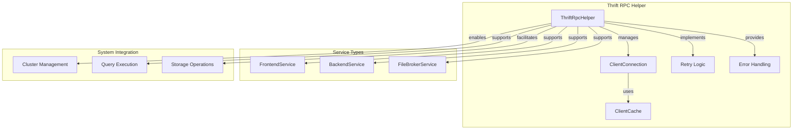

# Thrift RPC Helper Sub-module

## Overview

The Thrift RPC Helper sub-module provides a comprehensive wrapper around Apache Thrift RPC communications, offering connection management, retry logic, and error handling for distributed system communication. It serves as the foundation for inter-service communication in the StarRocks cluster architecture.

## Core Components

### ThriftMsgTypeTraits Template

The `ThriftMsgTypeTraits` template provides type-specific RPC configuration:

```cpp
template <typename T>
struct ThriftMsgTypeTraits {};

template <>
struct ThriftMsgTypeTraits<FrontendServiceClient> {
    constexpr static const char* rpc_name = "FE RPC";
};

template <>
struct ThriftMsgTypeTraits<BackendServiceClient> {
    constexpr static const char* rpc_name = "BE/CN RPC";
};

template <>
struct ThriftMsgTypeTraits<TFileBrokerServiceClient> {
    constexpr static const char* rpc_name = "Broker RPC";
};
```

## Architecture



## Key Features

### 1. Multi-Service Support
- Frontend Service (FE) RPC communication
- Backend Service (BE/CN) RPC communication
- File Broker Service RPC communication
- Extensible architecture for additional services

### 2. Connection Management
- Automatic connection pooling and reuse
- Connection timeout configuration
- Connection health monitoring
- Automatic connection recovery

### 3. Retry Logic and Error Handling
- Configurable retry attempts
- Exponential backoff strategy
- Service-specific error handling
- Comprehensive error reporting

### 4. Performance Optimization
- Connection pooling to reduce overhead
- Asynchronous operation support where applicable
- Efficient serialization/deserialization
- Network timeout optimization

## Implementation Details

### RPC Implementation Template

```cpp
template <typename T>
Status ThriftRpcHelper::rpc_impl(const std::function<void(ClientConnection<T>&)>& callback,
                                ClientConnection<T>& client, const TNetworkAddress& address) noexcept {
    std::stringstream ss;
    try {
        callback(client);
        return Status::OK();
    } catch (apache::thrift::TException& e) {
        ss << ThriftMsgTypeTraits<T>::rpc_name << " failure, address=" << address 
           << ", reason=" << e.what();
    }
    return Status::ThriftRpcError(ss.str());
}
```

### Retry Logic Implementation

```cpp
template <typename T>
Status ThriftRpcHelper::rpc(const std::string& ip, const int32_t port,
                           std::function<void(ClientConnection<T>&)> callback,
                           int timeout_ms, int retry_times) {
    TNetworkAddress address = make_network_address(ip, port);
    Status status;
    ClientConnection<T> client(_s_exec_env->get_client_cache<T>(), address, timeout_ms, &status);
    
    if (!status.ok()) {
        _s_exec_env->get_client_cache<T>()->close_connections(address);
        return status;
    }
    
    int i = 0;
    do {
        status = rpc_impl(callback, client, address);
        if (status.ok()) {
            return Status::OK();
        }
        LOG(WARNING) << "rpc failed: " << status << ", retry times: " << i << "/" << retry_times
                     << ", address=" << address << ", timeout_ms=" << timeout_ms;
        SleepFor(MonoDelta::FromMilliseconds(config::thrift_client_retry_interval_ms));
        auto st = client.reopen(timeout_ms);
        if (!st.ok()) {
            break;
        }
    } while (i++ < retry_times);
    
    return status;
}
```

## Usage Patterns

### Frontend Service Communication
```cpp
// Example: Frontend service RPC call
Status status = ThriftRpcHelper::rpc<FrontendServiceClient>(
    fe_host, fe_port,
    [&request](FrontendServiceClient& client) {
        client.submit_query(request);
    },
    timeout_ms, retry_times);

if (!status.ok()) {
    LOG(ERROR) << "Frontend RPC failed: " << status.message();
}
```

### Backend Service Communication
```cpp
// Example: Backend service RPC call
Status status = ThriftRpcHelper::rpc<BackendServiceClient>(
    be_host, be_port,
    [&request](BackendServiceClient& client) {
        client.exec_plan_fragment(request);
    },
    timeout_ms, retry_times);
```

### File Broker Service Communication
```cpp
// Example: File broker service RPC call
Status status = ThriftRpcHelper::rpc<TFileBrokerServiceClient>(
    broker_host, broker_port,
    [&request](TFileBrokerServiceClient& client) {
        client.open_reader(request);
    },
    timeout_ms, retry_times);
```

## Performance Characteristics

- **Connection Establishment**: O(1) with network overhead
- **RPC Call Overhead**: Minimal serialization/deserialization cost
- **Retry Logic**: O(n) where n is retry count
- **Connection Pooling**: Reduces connection establishment overhead
- **Timeout Handling**: Configurable per-service timeout

## Error Handling

### Exception Handling
```cpp
try {
    callback(client);
    return Status::OK();
} catch (apache::thrift::TException& e) {
    ss << ThriftMsgTypeTraits<T>::rpc_name << " failure, address=" << address 
       << ", reason=" << e.what();
    return Status::ThriftRpcError(ss.str());
}
```

### Connection Failure Recovery
```cpp
if (!status.ok()) {
    _s_exec_env->get_client_cache<T>()->close_connections(address);
    LOG(WARNING) << "Connect " << ThriftMsgTypeTraits<T>::rpc_name 
                 << " failed, address=" << address << ", status=" << status.message();
    return status;
}
```

## Configuration

### Timeout Configuration
- Service-specific timeout settings
- Configurable retry intervals
- Connection timeout parameters
- Request timeout management

### Retry Configuration
```cpp
// Configurable retry parameters
int timeout_ms = config::thrift_rpc_timeout_ms;
int retry_times = config::thrift_rpc_retry_times;
int retry_interval_ms = config::thrift_client_retry_interval_ms;
```

## Thread Safety

### Concurrent RPC Calls
- Thread-safe client connection management
- Lock-free connection pooling where possible
- Safe concurrent access to client cache
- Atomic connection state management

### Connection Pool Safety
```cpp
// ClientConnection provides thread-safe access
ClientConnection<T> client(_s_exec_env->get_client_cache<T>(), 
                          address, timeout_ms, &status);
```

## Service-Specific Features

### Frontend Service
- Query submission and coordination
- Metadata operations
- Cluster management
- User authentication

### Backend Service
- Plan fragment execution
- Data scanning operations
- Result transmission
- Status reporting

### File Broker Service
- File system operations
- Data import/export coordination
- File metadata management
- Access control

## Monitoring and Debugging

### RPC Metrics
- Request/response timing
- Error rate monitoring
- Connection pool statistics
- Service availability tracking

### Logging and Tracing
- Comprehensive RPC logging
- Error context preservation
- Request/response tracing
- Performance metrics collection

## Platform Compatibility

### Cross-Platform Support
- Apache Thrift cross-platform compatibility
- Consistent API across platforms
- Platform-specific optimizations
- Network stack abstraction

### Protocol Compatibility
- Thrift protocol version handling
- Backward compatibility support
- Service version negotiation
- Protocol upgrade mechanisms

## Integration Points

The Thrift RPC Helper sub-module integrates with:
- [Network Utilities](network_util.md) for address resolution
- System configuration for timeout and retry settings
- Client cache management for connection pooling
- Service discovery for cluster communication

This sub-module provides the robust, scalable RPC communication foundation necessary for distributed system coordination throughout the StarRocks cluster architecture.