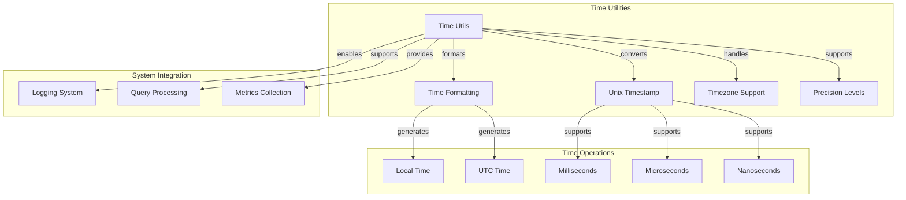

# Time Utilities Sub-module

## Overview

The Time Utilities sub-module provides comprehensive time handling and formatting capabilities for the StarRocks system. It offers Unix timestamp conversion, time formatting, and timezone-aware operations that are essential for logging, data processing, and system coordination.

## Core Components

### tm Structure Integration

The sub-module integrates with standard `tm` structures for calendar time representation:

```cpp
struct tm {
    int tm_sec;    // seconds after the minute [0-60]
    int tm_min;    // minutes after the hour [0-59]
    int tm_hour;   // hours since midnight [0-23]
    int tm_mday;   // day of the month [1-31]
    int tm_mon;    // months since January [0-11]
    int tm_year;   // years since 1900
    int tm_wday;   // days since Sunday [0-6]
    int tm_yday;   // days since January 1 [0-365]
    int tm_isdst;  // Daylight Saving Time flag
};
```

## Architecture



## Key Features

### 1. Unix Timestamp Conversion
- Support for seconds, milliseconds, and microseconds precision
- Bidirectional conversion between Unix timestamps and human-readable strings
- Cross-platform compatibility
- Efficient conversion algorithms

### 2. Timezone Support
- Local timezone formatting
- UTC timezone formatting
- Automatic timezone detection
- Consistent timezone handling across platforms

### 3. Multiple Precision Levels
- Second precision for general use
- Millisecond precision for performance timing
- Microsecond precision for high-resolution timing
- Nanosecond precision where supported

### 4. Cross-Platform Compatibility
- POSIX-compliant time operations
- Windows compatibility layer
- Consistent API across platforms
- Graceful fallbacks for unsupported features

## Implementation Details

### Time Conversion Pipeline

```cpp
// Unix timestamp to string conversion pipeline
std::string ToStringFromUnix(int64_t s, TimePrecision p) {
    // 1. Convert Unix timestamp to time_point
    chrono::system_clock::time_point t = TimepointFromUnix(s);
    
    // 2. Format time_point to string
    return ToString(t, p, false);  // false = local time
}
```

### Time Formatting Implementation

```cpp
static string ToString(const chrono::system_clock::time_point& t, TimePrecision p, bool utc) {
    std::stringstream ss;
    ss << TimepointToString(t, utc);     // Date and time
    ss << FormatSubSecond(t, p);         // Sub-second precision
    return ss.str();
}
```

### Sub-Second Formatting

```cpp
static string FormatSubSecond(const chrono::system_clock::time_point& t, TimePrecision p) {
    auto frac = t.time_since_epoch();
    if (p == TimePrecision::Millisecond) {
        auto subsec = chrono::duration_cast<chrono::milliseconds>(frac) % MILLIS_PER_SEC;
        return "." + std::to_string(std::abs(subsec.count()));
    } else if (p == TimePrecision::Microsecond) {
        auto subsec = chrono::duration_cast<chrono::microseconds>(frac) % MICROS_PER_SEC;
        return "." + std::to_string(std::abs(subsec.count()));
    }
    // ... handle other precision levels
}
```

## Usage Patterns

### Logging Timestamp Generation
```cpp
// Example: Generate timestamp for log entries
int64_t current_time = GetCurrentTimeSeconds();
std::string log_timestamp = ToStringFromUnix(current_time, TimePrecision::Second);
LOG(INFO) << "[" << log_timestamp << "] Operation completed";
```

### Performance Timing with Milliseconds
```cpp
// Example: High-precision timing for performance measurement
int64_t start_ms = GetCurrentTimeMillis();
perform_operation();
int64_t end_ms = GetCurrentTimeMillis();

std::string start_str = ToStringFromUnixMillis(start_ms, TimePrecision::Millisecond);
std::string end_str = ToStringFromUnixMillis(end_ms, TimePrecision::Millisecond);
LOG(INFO) << "Operation started: " << start_str << ", ended: " << end_str;
```

### UTC Time Formatting
```cpp
// Example: UTC time formatting for distributed systems
int64_t unix_timestamp = GetCurrentTimeSeconds();
std::string utc_time = ToUtcStringFromUnix(unix_timestamp, TimePrecision::Second);
std::string local_time = ToStringFromUnix(unix_timestamp, TimePrecision::Second);

LOG(INFO) << "UTC time: " << utc_time << ", Local time: " << local_time;
```

### Microsecond Precision for High-Resolution Timing
```cpp
// Example: Microsecond precision for detailed timing
int64_t start_us = GetCurrentTimeMicros();
critical_operation();
int64_t end_us = GetCurrentTimeMicros();

std::string timestamp = ToStringFromUnixMicros(start_us, TimePrecision::Microsecond);
LOG(INFO) << "Operation started at: " << timestamp 
          << ", duration: " << (end_us - start_us) << " microseconds";
```

## Performance Characteristics

- **Conversion Speed**: O(1) for basic operations
- **Memory Usage**: Minimal stack allocation
- **String Formatting**: Efficient stream-based operations
- **Timezone Conversion**: Platform-optimized system calls
- **Precision Scaling**: Automatic precision adjustment

## Timezone Handling

### Local Time Conversion
```cpp
static string TimepointToString(const chrono::system_clock::time_point& t, bool utc) {
    char buf[256];
    struct tm tmp;
    auto input_time = chrono::system_clock::to_time_t(t);
    
    if (utc) {
        strftime(buf, sizeof(buf), "%F %T", gmtime_r(&input_time, &tmp));
    } else {
        strftime(buf, sizeof(buf), "%F %T", localtime_r(&input_time, &tmp));
    }
    return string(buf);
}
```

### Timezone Detection
- Automatic local timezone detection
- UTC conversion support
- Daylight Saving Time handling
- Cross-platform timezone consistency

## Error Handling

### Invalid Timestamp Handling
- Graceful handling of out-of-range timestamps
- Safe conversion of negative timestamps
- Proper handling of pre-epoch times
- Overflow protection for large timestamps

### Platform-Specific Error Handling
```cpp
// Handle negative timestamps correctly
auto subsec = chrono::duration_cast<chrono::microseconds>(frac) % MICROS_PER_SEC;
ss << "." << std::setfill('0') << std::setw(6) << std::abs(subsec.count());
```

## Thread Safety

### Concurrent Time Operations
- All time conversion functions are thread-safe
- No shared mutable state
- Reentrant system calls
- Safe for concurrent access

### Time Formatting Safety
```cpp
// Thread-safe time formatting using local buffers
char buf[256];
struct tm tmp;
auto input_time = chrono::system_clock::to_time_t(t);
strftime(buf, sizeof(buf), "%F %T", localtime_r(&input_time, &tmp));
```

## Platform Compatibility

### Cross-Platform Support
- POSIX-compliant time operations
- Windows compatibility layer
- Consistent API across platforms
- Platform-specific optimizations

### System Dependencies
- Standard C++ chrono library
- POSIX time functions (strftime, localtime_r, gmtime_r)
- System clock access
- Timezone database access

## Integration with Other Modules

### Logging System Integration
```cpp
// Example: Integration with logging system
LOG(INFO) << "Operation completed at " 
          << ToStringFromUnix(GetCurrentTimeSeconds(), TimePrecision::Second);
```

### Metrics Collection
```cpp
// Example: Timestamp for metrics collection
int64_t timestamp_ms = GetCurrentTimeMillis();
std::string metric_timestamp = ToStringFromUnixMillis(timestamp_ms, TimePrecision::Millisecond);
metrics->record_timestamp(metric_timestamp);
```

### Query Processing
```cpp
// Example: Query execution timestamp
int64_t query_start_us = GetCurrentTimeMicros();
execute_query();
int64_t query_end_us = GetCurrentTimeMicros();

std::string start_time = ToStringFromUnixMicros(query_start_us, TimePrecision::Microsecond);
std::string end_time = ToStringFromUnixMicros(query_end_us, TimePrecision::Microsecond);
query_profile->set_timestamps(start_time, end_time);
```

## Configuration and Customization

### Time Format Configuration
- Configurable time format strings
- Customizable precision levels
- Localized time formatting support
- Application-specific time formats

### Performance Tuning
- Optimized string formatting
- Efficient memory allocation
- Minimal system call overhead
- Cache-friendly operations

## Integration Points

The Time Utilities sub-module integrates with:
- [Monotonic Time](monotime.md) for timing operations
- Logging system for timestamp generation
- Metrics collection for performance monitoring
- Query processing for execution timing

This sub-module provides the essential time handling and formatting capabilities that enable accurate timestamping, performance measurement, and temporal data processing throughout the StarRocks system.