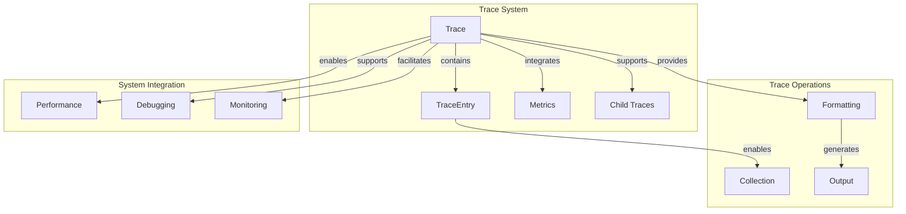

# Trace System Sub-module

## Overview

The Trace System sub-module provides comprehensive execution tracing and profiling capabilities for the StarRocks system. It offers hierarchical trace collection, performance metrics integration, and detailed execution analysis that are essential for performance optimization and debugging.

## Core Components

### TraceEntry Structure

The `TraceEntry` structure forms the foundation of the tracing system:

```cpp
struct TraceEntry {
    MicrosecondsInt64 timestamp_micros;
    const char* file_path;
    int line_number;
    uint32_t message_len;
    TraceEntry* next;
    uint32_t level = 0;
    
    char* message() { 
        return reinterpret_cast<char*>(this) + sizeof(*this); 
    }
};
```

## Architecture



## Key Features

### 1. Hierarchical Trace Collection
- Nested trace support for complex operations
- Parent-child trace relationships
- Trace level filtering and management
- Contextual trace information

### 2. High-Resolution Timing
- Microsecond precision timestamps
- Time delta calculations between trace points
- Performance bottleneck identification
- Execution path timing analysis

### 3. Flexible Output Formatting
- Human-readable trace formatting
- JSON output for programmatic analysis
- Customizable trace levels and filtering
- Multiple output formats support

### 4. Thread-Local Trace Management
- Per-thread trace isolation
- Thread-safe trace operations
- Efficient memory allocation
- Automatic cleanup and resource management

## Implementation Details

### Trace Entry Allocation

```cpp
TraceEntry* Trace::NewEntry(int msg_len, const char* file_path, int line_number) {
    int size = sizeof(TraceEntry) + msg_len;
    auto* dst = reinterpret_cast<uint8_t*>(malloc(size));
    auto* entry = reinterpret_cast<TraceEntry*>(dst);
    entry->timestamp_micros = GetCurrentTimeMicros();
    entry->message_len = msg_len;
    entry->file_path = file_path;
    entry->line_number = line_number;
    entry->level = trace_level_;
    return entry;
}
```

### Trace Collection Process

```cpp
void Trace::AddEntry(TraceEntry* entry) {
    std::lock_guard<SpinLock> l(lock_);
    entry->next = nullptr;
    
    if (entries_tail_ != nullptr) {
        entries_tail_->next = entry;
    } else {
        entries_head_ = entry;
    }
    entries_tail_ = entry;
}
```

### Hierarchical Trace Support

```cpp
void Trace::AddChildTrace(StringPiece label, Trace* child_trace) {
    std::lock_guard<SpinLock> l(lock_);
    scoped_refptr<Trace> ptr(child_trace);
    child_traces_.emplace_back(label, ptr);
}
```

## Usage Patterns

### Basic Trace Collection
```cpp
// Example: Basic operation tracing
Trace* trace = Trace::CurrentTrace();
if (trace) {
    TRACE("Starting database operation");
    perform_database_operation();
    TRACE("Database operation completed");
}
```

### Hierarchical Trace Collection
```cpp
// Example: Nested operation tracing
Trace* parent_trace = Trace::CurrentTrace();
if (parent_trace) {
    TRACE("Starting complex operation");
    
    {
        scoped_refptr<Trace> child_trace(new Trace);
        parent_trace->AddChildTrace("sub-operation", child_trace.get());
        Trace::SetThreadLocalTrace(child_trace.get());
        
        TRACE("Executing sub-operation");
        perform_sub_operation();
        
        Trace::SetThreadLocalTrace(parent_trace);
    }
    
    TRACE("Complex operation completed");
}
```

### Performance Analysis
```cpp
// Example: Performance bottleneck identification
Trace* trace = Trace::CurrentTrace();
if (trace) {
    TRACE("Starting performance-critical section");
    
    auto start = std::chrono::high_resolution_clock::now();
    perform_critical_operation();
    auto end = std::chrono::high_resolution_clock::now();
    
    auto duration = std::chrono::duration_cast<std::chrono::microseconds>(end - start);
    TRACE("Performance-critical section took " + std::to_string(duration.count()) + " microseconds");
}
```

## Performance Characteristics

- **Trace Collection**: O(1) per trace entry
- **Memory Allocation**: Dynamic allocation per entry
- **Time Resolution**: Microsecond precision
- **Memory Overhead**: Proportional to trace volume
- **Output Formatting**: O(n) where n is number of entries

## Trace Output Formatting

### Human-Readable Format
```cpp
void Trace::Dump(std::ostream* out, int flags) const {
    // Format: [timestamp] (+delta) file:line] message
    *out << FormatTimestampForLog(e->timestamp_micros);
    *out << " (+" << setw(6) << usecs_since_prev << "us) ";
    *out << const_basename(e->file_path) << ":" << e->line_number << "] ";
    out->write(entry->message(), entry->message_len);
    *out << std::endl;
}
```

### JSON Format Output
```cpp
std::string Trace::MetricsAsJSON() const {
    rapidjson::StringBuffer buf;
    rapidjson::Writer<rapidjson::StringBuffer> jw(buf);
    MetricsToJSON(&jw);
    return buf.GetString();
}
```

## Trace Levels and Filtering

### Level-Based Filtering
```cpp
void Trace::Dump(std::ostream* out, int flags) const {
    for (TraceEntry* e : entries) {
        if (e->level < trace_level_) {
            continue;  // Skip entries below current level
        }
        // Process and output entry
    }
}
```

### Configurable Trace Levels
- Level 0: Basic tracing
- Level 1: Detailed tracing
- Level 2: Debug-level tracing
- Custom levels for specific use cases

## Thread Safety

### Concurrent Trace Access
```cpp
void Trace::AddEntry(TraceEntry* entry) {
    std::lock_guard<SpinLock> l(lock_);
    // Thread-safe entry addition
    entry->next = nullptr;
    if (entries_tail_ != nullptr) {
        entries_tail_->next = entry;
    } else {
        entries_head_ = entry;
    }
    entries_tail_ = entry;
}
```

### Thread-Local Trace Management
```cpp
__thread Trace* Trace::threadlocal_trace_;

Trace* Trace::CurrentTrace() {
    return threadlocal_trace_;
}

void Trace::SetThreadLocalTrace(Trace* trace) {
    threadlocal_trace_ = trace;
}
```

## Memory Management

### Efficient Memory Allocation
- Per-entry memory allocation
- Minimal overhead per trace entry
- Automatic cleanup on trace destruction
- Memory-efficient linked list structure

### Resource Cleanup
```cpp
Trace::~Trace() {
    while (entries_head_ != nullptr) {
        TraceEntry* tmp = entries_head_;
        entries_head_ = entries_head_->next;
        free(tmp);
    }
}
```

## Integration with Metrics

### Performance Metrics Collection
```cpp
void Trace::MetricsToJSON(rapidjson::Writer<rapidjson::StringBuffer>* jw) const {
    std::map<string, int64_t> counters;
    for (const auto& entry : metrics_.Get()) {
        counters[entry.first] = entry.second;
    }
    
    jw->StartObject();
    for (const auto& e : counters) {
        jw->String(e.first.c_str());
        jw->Int64(e.second);
    }
    jw->EndObject();
}
```

### Child Trace Integration
```cpp
for (const auto& entry : child_traces) {
    jw->StartArray();
    jw->String(entry.first.data(), entry.first.size());
    entry.second->MetricsToJSON(jw);
    jw->EndArray();
}
```

## Usage in Performance Analysis

### Bottleneck Identification
```cpp
// Example: Identifying performance bottlenecks
Trace* trace = Trace::CurrentTrace();
if (trace) {
    TRACE("Database query start");
    auto query_start = GetCurrentTimeMicros();
    
    execute_database_query();
    
    auto query_end = GetCurrentTimeMicros();
    TRACE("Database query end, duration: " + 
          std::to_string(query_end - query_start) + " microseconds");
}
```

### Execution Path Analysis
```cpp
// Example: Complex execution path tracing
Trace* trace = Trace::CurrentTrace();
if (trace) {
    TRACE("Starting query execution");
    
    for (const auto& stage : query_stages) {
        TRACE("Executing stage: " + stage.name());
        execute_stage(stage);
    }
    
    TRACE("Query execution completed");
}
```

## Configuration and Customization

### Trace Level Configuration
- Configurable trace verbosity levels
- Runtime trace level adjustment
- Per-module trace level settings
- Conditional compilation for trace overhead control

### Output Customization
- Custom trace formatting options
- Selective trace output filtering
- Multiple output format support
- Integration with external monitoring systems

## Performance Considerations

### Overhead Minimization
- Minimal overhead when tracing is disabled
- Efficient memory allocation strategies
- Lock-free operations where possible
- Optimized trace entry formatting

### Scalability
- Efficient handling of high-volume traces
- Memory-conscious trace collection
- Scalable trace output formatting
- Performance impact monitoring

## Integration Points

The Trace System sub-module integrates with:
- [Monotonic Time](monotime.md) for precise timing
- System monitoring for performance metrics
- Logging system for trace output
- Debugging infrastructure for development builds

This sub-module provides the comprehensive execution tracing and profiling capabilities that enable detailed performance analysis and debugging throughout the StarRocks system.