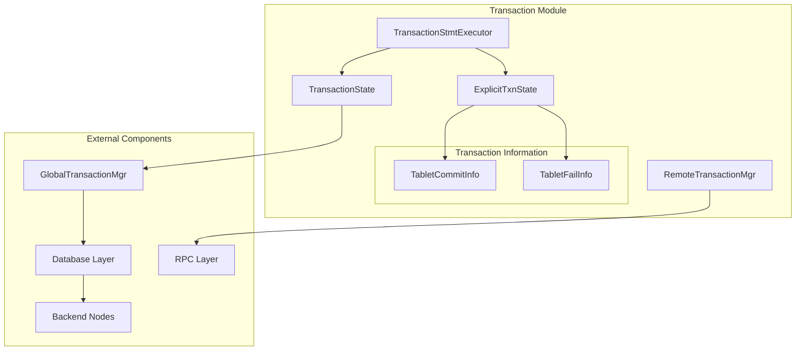
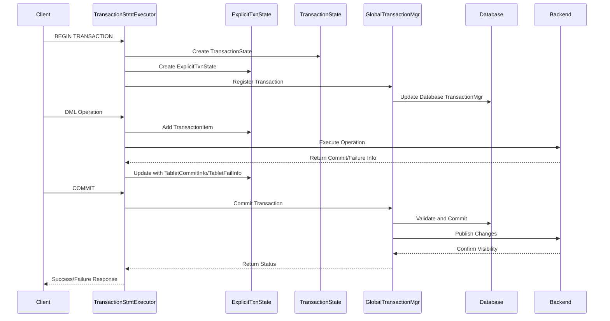

# Transaction Module Documentation

## Overview

The Transaction module is a critical component of StarRocks that manages database transactions, ensuring ACID (Atomicity, Consistency, Isolation, Durability) properties across distributed operations. It provides comprehensive transaction lifecycle management, from initiation through commit or rollback, with support for both local and remote transactions.

## Purpose and Core Functionality

The Transaction module serves as the central coordinator for all database transactions in StarRocks, providing:

- **Transaction Lifecycle Management**: Handles the complete lifecycle of transactions from BEGIN to COMMIT/ROLLBACK
- **Distributed Transaction Coordination**: Manages transactions across multiple nodes and clusters
- **ACID Compliance**: Ensures data consistency and integrity across all transaction operations
- **Concurrency Control**: Manages concurrent transactions with proper isolation levels
- **Failure Recovery**: Provides robust mechanisms for transaction recovery and rollback
- **Multi-Table Transaction Support**: Enables transactions spanning multiple tables and databases

## Architecture Overview

## Core Components

### 1. Transaction State Management

#### TransactionState
The central state container for all transaction-related information, including:
- Transaction ID and label
- Database and table associations
- Transaction status and lifecycle information
- Coordinator details and timeout settings
- Load job source type and callback information

#### ExplicitTxnState
Manages explicit transactions within a session, providing:
- Session-specific transaction state tracking
- Multiple statement coordination within a transaction
- Table-level transaction metadata
- Integration with DML statement execution

### 2. Remote Transaction Management

#### RemoteTransactionMgr
Handles transactions across distributed StarRocks clusters:
- **beginTransaction**: Initiates remote transactions with proper authentication
- **commitRemoteTransaction**: Coordinates commit operations across clusters
- **abortRemoteTransaction**: Manages transaction rollback in remote clusters
- Provides timeout management and error handling for distributed operations

### 3. Transaction Statement Execution

#### TransactionStmtExecutor
The core execution engine for transaction statements:
- **beginStmt**: Processes BEGIN transaction statements
- **commitStmt**: Handles COMMIT operations with visibility management
- **rollbackStmt**: Manages ROLLBACK operations and cleanup
- **loadData**: Coordinates data loading within transactions
- Provides comprehensive error handling and status reporting

### 4. Transaction Information Tracking

#### TabletCommitInfo
Tracks successful tablet operations within transactions:
- Tablet and backend identification
- Dictionary cache column management
- Commit information serialization
- Integration with load operations

#### TabletFailInfo
Records failed tablet operations for rollback and recovery:
- Failed tablet identification
- Backend failure tracking
- Error information propagation
- Transaction abort coordination

## Data Flow Architecture

## Integration with Other Modules

### Storage Engine Integration
The Transaction module works closely with the [storage_engine](storage_engine.md) module to ensure data persistence and consistency across tablet operations.

### Query Execution Integration
Coordinates with [query_execution](query_execution.md) for transaction-aware query processing and DML operation execution.

### SQL Parser Integration
Integrates with [sql_parser_optimizer](sql_parser_optimizer.md) for transaction statement parsing and optimization.

### Frontend Server Integration
Works with [frontend_server](frontend_server.md) components for transaction state management and metadata operations.

## Key Features

### 1. Multi-Statement Transaction Support
- Supports multiple DML statements within a single transaction
- Maintains statement ordering and dependencies
- Provides table-level transaction metadata tracking

### 2. Distributed Transaction Coordination
- Handles transactions across multiple StarRocks clusters
- Provides robust RPC-based transaction management
- Supports timeout and retry mechanisms

### 3. ACID Compliance
- **Atomicity**: All operations within a transaction succeed or fail together
- **Consistency**: Maintains database consistency constraints
- **Isolation**: Provides proper transaction isolation levels
- **Durability**: Ensures committed transactions persist through failures

### 4. Error Handling and Recovery
- Comprehensive error detection and reporting
- Automatic rollback on transaction failures
- Recovery mechanisms for partial failures
- Detailed logging and debugging information

### 5. Performance Optimization
- Efficient transaction state management
- Optimized commit and rollback operations
- Minimal locking overhead
- Batch operation support

## Configuration and Tuning

The Transaction module integrates with StarRocks configuration system to provide:
- Transaction timeout settings
- Load job configuration
- RPC timeout management
- Visibility wait timeout controls

## Monitoring and Observability

Provides comprehensive monitoring capabilities:
- Transaction status tracking
- Performance metrics collection
- Error rate monitoring
- Resource usage tracking

## Security and Access Control

Integrates with StarRocks security framework:
- Authentication for remote transactions
- Authorization for transaction operations
- Audit logging for transaction activities

## Sub-Module Documentation

For detailed information about specific transaction components, refer to:

- **[Transaction State Management](transaction_state_management.md)** - Comprehensive coverage of transaction state lifecycle, explicit transaction management, and session-level transaction coordination
- **[Remote Transaction Operations](remote_transaction_operations.md)** - Detailed documentation of distributed transaction management, cross-cluster coordination, and RPC-based transaction operations
- **[Transaction Statement Execution](transaction_statement_execution.md)** - In-depth guide to transaction statement processing, DML operation coordination, and commit/rollback execution
- **[Transaction Information Tracking](transaction_information_tracking.md)** - Complete reference for tablet commit information management, failure tracking, and transaction metadata handling

## Related Module Documentation

- [Storage Engine](storage_engine.md) - Data persistence and tablet management
- [Query Execution](query_execution.md) - Transaction-aware query processing
- [SQL Parser & Optimizer](sql_parser_optimizer.md) - Transaction statement parsing and optimization
- [Frontend Server](frontend_server.md) - Transaction state management and metadata operations