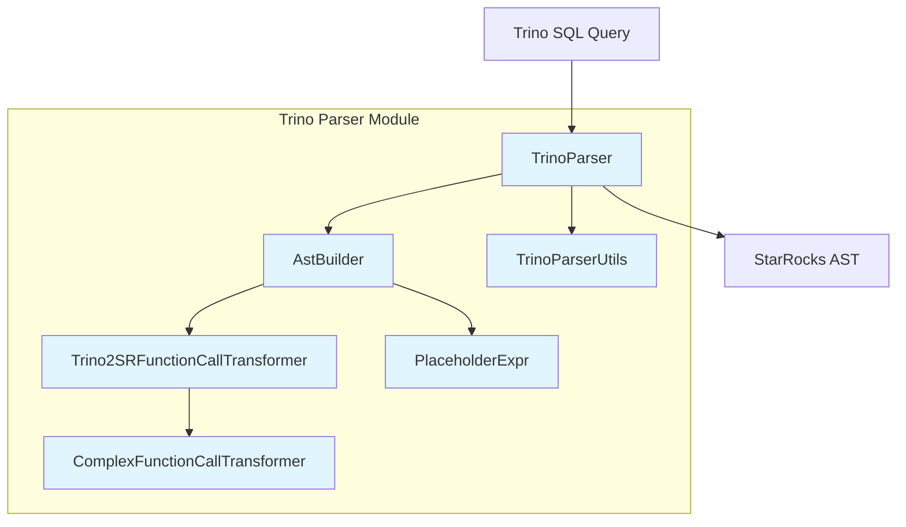
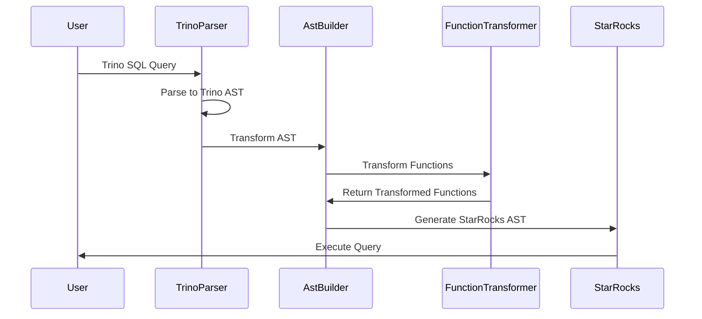

# Trino Parser Module

## Overview

The Trino Parser module is a critical component of StarRocks that enables parsing and transformation of Trino SQL syntax into StarRocks' native SQL AST (Abstract Syntax Tree). This module serves as a compatibility layer, allowing users to write SQL queries using Trino syntax while ensuring seamless execution within the StarRocks query engine.

## Purpose and Scope

The primary purpose of the Trino Parser module is to:
- Parse Trino SQL statements and expressions
- Transform Trino-specific syntax into StarRocks-compatible AST nodes
- Provide function call transformation from Trino to StarRocks equivalents
- Maintain compatibility with Trino SQL semantics while leveraging StarRocks' execution capabilities

## Architecture Overview

## Core Components

### 1. TrinoParser ([trino_parser_core.md](trino_parser_core.md))
The main entry point for parsing Trino SQL statements. It leverages Trino's native SQL parser and provides the foundation for the entire transformation pipeline.

**Key Features:**
- Integrates with Trino's native SQL parser
- Configures parsing options for decimal literal treatment
- Provides static parsing interface for the entire module

### 2. AstBuilder ([trino_ast_builder.md](trino_ast_builder.md))
A comprehensive visitor that transforms Trino's AST nodes into StarRocks' AST nodes. Handles all major SQL constructs including queries, expressions, functions, and data types.

**Key Features:**
- Extensive visitor pattern implementation for AST transformation
- Supports complex SQL constructs (CTEs, JOINs, subqueries, window functions)
- Handles data type mapping between Trino and StarRocks
- Manages SQL mode compatibility and null ordering behavior

### 3. Trino2SRFunctionCallTransformer ([trino_function_transformer.md](trino_function_transformer.md))
Manages the mapping and transformation of Trino functions to their StarRocks equivalents. Maintains a comprehensive registry of function transformations.

**Key Features:**
- Comprehensive function mapping registry with 100+ function transformations
- Supports aggregate, array, date, string, JSON, mathematical, and bitwise functions
- Handles function signature matching and argument validation
- Provides extensible framework for adding new function mappings

### 4. ComplexFunctionCallTransformer ([trino_complex_transformer.md](trino_complex_transformer.md))
Handles complex function transformations that require custom logic beyond simple name mapping, including mathematical operations, date functions, and string manipulations.

**Key Features:**
- Advanced function transformations with custom logic
- Handles date arithmetic, JSON operations, and string manipulations
- Supports conditional expressions and mathematical operations
- Manages complex parameter restructuring

### 5. PlaceholderExpr ([trino_placeholder_expr.md](trino_placeholder_expr.md))
A utility component for representing placeholder expressions during the transformation process, particularly useful in function call transformations.

**Key Features:**
- Represents placeholder expressions in function transformation templates
- Supports visitor pattern for AST traversal
- Enables flexible function argument mapping

### 6. TrinoParserUtils ([trino_parser_utils.md](trino_parser_utils.md))
Provides utility functions for the parsing process, including statement type validation and type alignment for date/time operations.

**Key Features:**
- Statement type validation and routing
- Date/time type alignment between Trino and StarRocks
- SQL mode compatibility checking
- Query preprocessing and validation

## Data Flow

## Key Features

### SQL Statement Support
- **SELECT queries**: Full support for complex queries with JOINs, subqueries, CTEs
- **INSERT statements**: Data insertion with column mapping
- **CREATE TABLE AS SELECT**: CTAS operations
- **DROP TABLE**: Table removal operations
- **EXPLAIN statements**: Query plan analysis

### Expression Transformation
- **Arithmetic expressions**: Binary and unary operations
- **Comparison expressions**: All standard comparison operators
- **Logical expressions**: AND, OR, NOT operations
- **Function calls**: Comprehensive function library transformation
- **Type casting**: Data type conversion support

### Function Compatibility
The module provides extensive function transformation capabilities, mapping Trino functions to StarRocks equivalents across multiple categories:

- **Aggregate functions**: COUNT, SUM, AVG, MIN, MAX, etc.
- **Array functions**: Array manipulation and access functions
- **Date/time functions**: Comprehensive date and time operations
- **String functions**: Text processing and manipulation
- **JSON functions**: JSON data handling
- **Mathematical functions**: Numeric operations and calculations

## Integration Points

The Trino Parser module integrates with several other StarRocks components:

- **[sql_parser_optimizer](sql_parser_optimizer.md)**: Provides parsed AST for further optimization
- **[connectors](connectors.md)**: Enables Trino syntax for external data source queries
- **[frontend_server](frontend_server.md)**: Handles query parsing in the FE layer

## Configuration and Usage

The module is designed to work seamlessly within the StarRocks ecosystem. Users can write queries using Trino syntax, and the parser automatically handles the transformation to StarRocks-native operations.

### Supported SQL Modes
The parser respects StarRocks SQL mode settings, particularly for:
- Null ordering behavior
- Decimal literal treatment
- Date/time format handling

## Error Handling

The module provides comprehensive error handling with:
- Detailed parsing error messages
- Unsupported feature detection
- Type compatibility validation
- Function mapping validation

## Performance Considerations

- **Caching**: Function transformation mappings are pre-computed for optimal performance
- **Lazy evaluation**: Complex transformations are only applied when necessary
- **Minimal overhead**: Designed for minimal impact on query parsing performance

## Future Enhancements

The module is continuously evolving to support:
- Additional Trino SQL constructs
- Enhanced function compatibility
- Performance optimizations
- Extended data type support

## Related Documentation

- [Trino Parser Core](trino_parser_core.md) - Core parsing functionality
- [Trino AST Builder](trino_ast_builder.md) - AST transformation details
- [Trino Function Transformer](trino_function_transformer.md) - Function mapping system
- [Trino Complex Transformer](trino_complex_transformer.md) - Advanced transformations
- [Trino Placeholder Expressions](trino_placeholder_expr.md) - Placeholder expression handling
- [Trino Parser Utilities](trino_parser_utils.md) - Utility functions and helpers