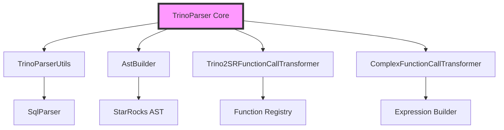
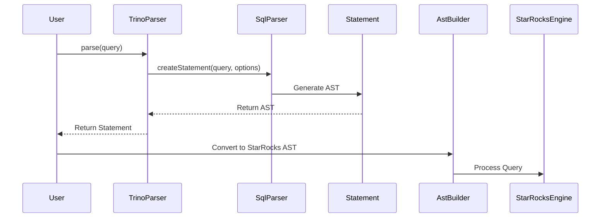
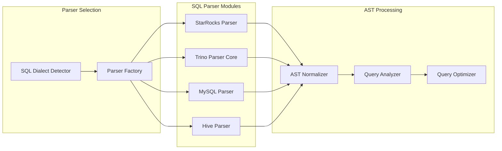
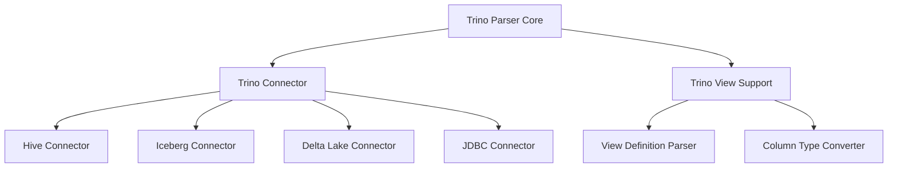
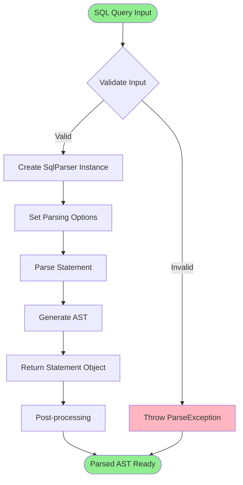
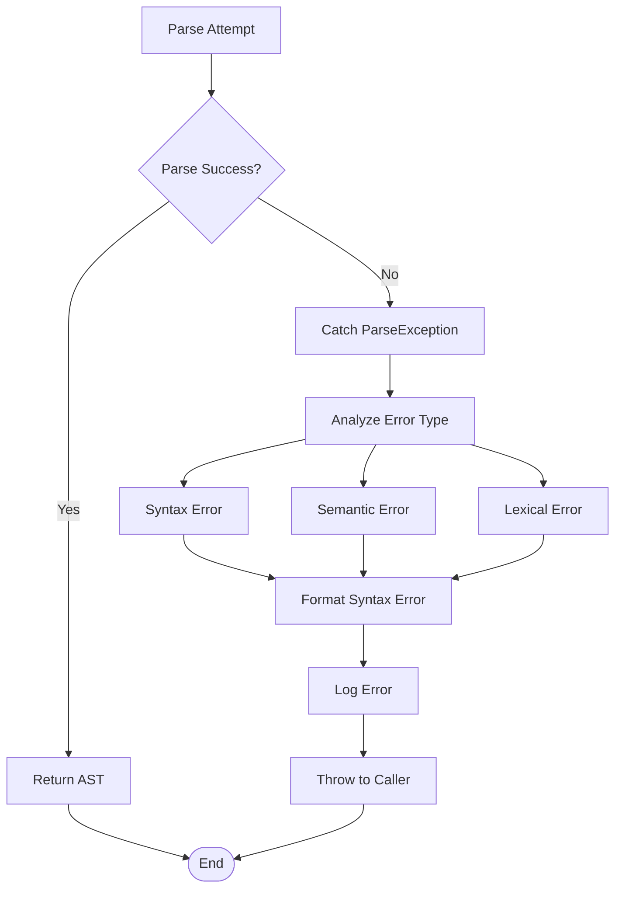

# Trino Parser Core Module Documentation

## Introduction

The Trino Parser Core module serves as a critical bridge between Trino SQL syntax and StarRocks' query processing engine. This module enables StarRocks to parse and understand SQL queries written in Trino's dialect, facilitating seamless integration with Trino-compatible systems and providing users with familiar SQL syntax options.

## Module Overview

The Trino Parser Core module is responsible for converting Trino SQL statements into an abstract syntax tree (AST) that can be processed by StarRocks' query execution engine. It acts as the entry point for Trino-compatible SQL parsing within the StarRocks ecosystem.

## Core Components

### TrinoParser Class

**Location**: `fe.fe-core.src.main.java.com.starrocks.connector.parser.trino.TrinoParser`

The `TrinoParser` class is the primary component of this module, providing a simple yet powerful interface for parsing Trino SQL queries.

#### Key Features:
- **Static Parsing Method**: Provides a single entry point `parse(String query)` for converting SQL strings into Trino AST nodes
- **Decimal Literal Handling**: Configured to treat decimal literals as decimal types (`AS_DECIMAL`)
- **Thread-Safe**: Uses local parser instances, ensuring thread safety in multi-threaded environments
- **Error Handling**: Leverages Trino's built-in parsing error reporting mechanisms

#### Implementation Details:
```java
public class TrinoParser {
    private static final ParsingOptions PARSING_OPTIONS = new ParsingOptions(AS_DECIMAL);
    
    public static Statement parse(String query) {
        SqlParser sqlParser = new SqlParser();
        return sqlParser.createStatement(query, PARSING_OPTIONS);
    }
}
```

## Architecture

### Module Dependencies

The Trino Parser Core module integrates with several other StarRocks modules:



### Data Flow Architecture



## Integration Points

### Parser Module Integration

The Trino Parser Core is part of the larger SQL parser ecosystem within StarRocks:



### Connector Framework Integration

The Trino Parser integrates with the connector framework to support various data sources:



## Process Flow

### Query Parsing Workflow



### Error Handling Flow



## Key Features

### 1. Decimal Literal Precision
The parser is configured to handle decimal literals with full precision, ensuring accurate numerical computations in financial and scientific applications.

### 2. Standard SQL Compliance
Leverages Trino's SQL parser, which follows SQL standards while providing Trino-specific extensions.

### 3. Extensibility
The modular design allows for easy extension to support additional Trino-specific syntax and features.

### 4. Performance Optimization
- **Lazy Initialization**: Parser instances are created on-demand
- **Minimal Overhead**: Direct delegation to Trino's optimized parser
- **Memory Efficient**: No persistent state between parsing operations

## Usage Patterns

### Basic Usage
```java
// Parse a simple SELECT statement
Statement stmt = TrinoParser.parse("SELECT * FROM table1");

// Parse complex queries with joins
Statement complexStmt = TrinoParser.parse(
    "SELECT t1.col1, t2.col2 " +
    "FROM table1 t1 " +
    "JOIN table2 t2 ON t1.id = t2.id " +
    "WHERE t1.status = 'active'"
);
```

### Integration with Query Processing
```java
// Part of larger query processing pipeline
public QueryPlan processTrinoQuery(String sql) {
    // Parse Trino SQL
    Statement trinoAst = TrinoParser.parse(sql);
    
    // Convert to StarRocks AST
    com.starrocks.sql.ast.Statement srAst = AstBuilder.build(trinoAst);
    
    // Continue with analysis and optimization
    return analyzeAndOptimize(srAst);
}
```

## Error Handling

### ParseException Handling
The parser throws `ParseException` for invalid SQL syntax. Applications should handle these exceptions gracefully:

```java
try {
    Statement stmt = TrinoParser.parse(userQuery);
    return processStatement(stmt);
} catch (ParseException e) {
    logger.error("Failed to parse Trino SQL: {}", e.getMessage());
    return createErrorResponse(e.getMessage(), e.getErrorLocation());
}
```

### Common Error Scenarios
1. **Syntax Errors**: Malformed SQL statements
2. **Unsupported Features**: Trino features not yet supported by StarRocks
3. **Identifier Resolution**: Unknown tables or columns
4. **Type Mismatches**: Incompatible data types in expressions

## Testing and Validation

### Unit Testing Strategy
- **Valid SQL Parsing**: Test with standard Trino SQL constructs
- **Invalid SQL Handling**: Verify proper error reporting
- **Edge Cases**: Empty strings, null inputs, very long queries
- **Performance Testing**: Large query parsing performance

### Integration Testing
- **End-to-End Query Processing**: Full query lifecycle testing
- **Connector Integration**: Testing with various data sources
- **View Definition Parsing**: Trino view compatibility testing

## Performance Considerations

### Memory Usage
- No persistent state between parsing operations
- Minimal memory footprint for individual parsing operations
- Automatic garbage collection of temporary parser objects

### Concurrency
- Thread-safe implementation using local parser instances
- No shared mutable state
- Suitable for high-concurrency environments

### Optimization Opportunities
- **Parser Pooling**: Reuse parser instances for better performance
- **Query Caching**: Cache parsed ASTs for repeated queries
- **Incremental Parsing**: Support for partial query updates

## Future Enhancements

### Planned Features
1. **Enhanced Error Reporting**: More detailed syntax error messages
2. **Performance Monitoring**: Built-in parsing performance metrics
3. **Dialect Detection**: Automatic SQL dialect identification
4. **Custom Extensions**: Support for StarRocks-specific syntax extensions

### Scalability Improvements
- **Distributed Parsing**: Support for parsing very large queries across multiple nodes
- **Streaming Parser**: Incremental parsing for continuous query streams
- **Parallel Processing**: Multi-threaded parsing for batch operations

## Related Documentation

- [Trino Parser Module](trino_parser.md) - Complete Trino parser implementation
- [SQL Parser Optimizer](sql_parser_optimizer.md) - Query optimization components
- [Connector Framework](connectors.md) - Data source integration
- [Query Execution](query_execution.md) - Query processing pipeline

## Conclusion

The Trino Parser Core module provides a robust foundation for Trino SQL compatibility within StarRocks. Its simple interface, combined with powerful parsing capabilities, enables seamless integration of Trino-compatible queries into the StarRocks ecosystem. The modular design ensures maintainability and extensibility for future enhancements while maintaining high performance and reliability standards.