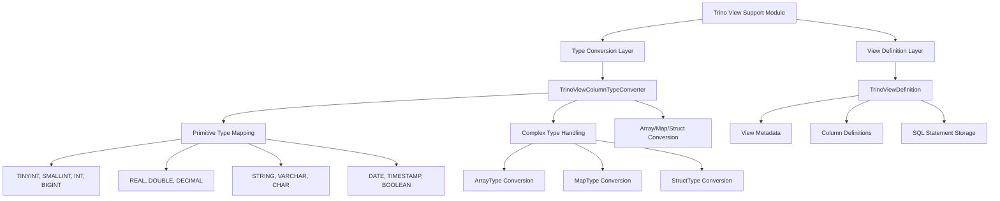

# Trino View Support Module

## Overview

The `trino_view_support` module provides comprehensive support for Trino view integration within the StarRocks system. This module enables StarRocks to understand, parse, and work with view definitions created in Trino, facilitating seamless interoperability between the two systems.

## Purpose

The primary purpose of this module is to:
- Convert Trino-specific data types to StarRocks-compatible types
- Parse and represent Trino view definitions within StarRocks
- Enable cross-platform view compatibility between Trino and StarRocks
- Support complex data types including arrays, maps, and structs

## Architecture



## Core Components

### 1. TrinoViewColumnTypeConverter

The `TrinoViewColumnTypeConverter` class is responsible for converting Trino data types to their StarRocks equivalents. This component handles:

- **Primitive Type Mapping**: Direct conversion of basic data types
- **Complex Type Parsing**: Recursive parsing of nested data structures
- **Type Validation**: Ensuring type compatibility between systems

Key features:
- Support for all major Trino primitive types
- Recursive handling of complex types (Array, Map, Row)
- Pattern-based type string parsing
- Error handling for unsupported types

For detailed implementation details, see [Type Conversion Layer Documentation](type_conversion_layer.md).

### 2. TrinoViewDefinition

The `TrinoViewDefinition` class represents a complete Trino view definition within StarRocks. It encapsulates:

- **View Metadata**: Catalog, schema, and ownership information
- **Column Definitions**: Name, type, and comment for each column
- **SQL Statement**: The original SQL query defining the view
- **Access Control**: Run-as-invoker permissions

For detailed implementation details, see [View Definition Layer Documentation](view_definition_layer.md).

## Data Type Conversion Matrix

| Trino Type | StarRocks Type | Notes |
|------------|----------------|--------|
| TINYINT | TINYINT | Direct mapping |
| SMALLINT | SMALLINT | Direct mapping |
| INT/INTEGER | INT | Direct mapping |
| BIGINT | BIGINT | Direct mapping |
| REAL | FLOAT | Direct mapping |
| DOUBLE/DOUBLE PRECISION | DOUBLE | Direct mapping |
| DECIMAL/NUMERIC | DECIMAL32/DECIMAL64/DECIMAL128 | Based on precision |
| STRING | VARCHAR(1048576) | Default catalog string |
| VARCHAR(n) | VARCHAR(n) | Length preserved |
| CHAR(n) | CHAR(n) | Length preserved |
| BINARY/VARBINARY | VARBINARY | Direct mapping |
| BOOLEAN | BOOLEAN | Direct mapping |
| DATE | DATE | Direct mapping |
| TIMESTAMP | DATETIME | Direct mapping |
| ARRAY<T> | ARRAY<T> | Recursive conversion |
| MAP<K,V> | MAP<K,V> | Recursive conversion |
| ROW<...> | STRUCT<...> | Field-by-field conversion |

## Complex Type Handling

### Array Types
```
Trino: ARRAY<INTEGER>
StarRocks: ARRAY<INT>
```

### Map Types
```
Trino: MAP<VARCHAR, BIGINT>
StarRocks: MAP<VARCHAR, BIGINT>
```

### Struct Types (Row)
```
Trino: ROW(name VARCHAR, age INT)
StarRocks: STRUCT<name VARCHAR(1048576), age INT>
```

## Integration Points

This module integrates with several other StarRocks components:

- **[Column Type System](column_type_system.md)**: For type validation and compatibility
- **[Connector Framework](connector_framework.md)**: As part of the unified connector architecture
- **[View Management](view_management.md)**: For view registration and metadata storage
- **[SQL Parser](sql_parser.md)**: For SQL statement processing

## Error Handling

The module implements comprehensive error handling for:
- Unsupported data types (e.g., UNIONTYPE)
- Malformed type strings
- Type conversion failures
- Missing or invalid metadata

## Usage Examples

### Type Conversion
```java
// Convert Trino type string to StarRocks type
Type starrocksType = TrinoViewColumnTypeConverter.fromTrinoType("ARRAY<VARCHAR(100)>");
```

### View Definition Creation
```java
// Create a Trino view definition
List<ViewColumn> columns = Arrays.asList(
    new ViewColumn("id", "BIGINT"),
    new ViewColumn("name", "VARCHAR(100)")
);
TrinoViewDefinition viewDef = new TrinoViewDefinition(
    "SELECT id, name FROM users",
    "hive_catalog",
    "default",
    columns,
    "User view",
    "admin",
    false
);
```

## Performance Considerations

- Type conversion is performed during view registration, not query time
- Complex type parsing uses compiled regex patterns for efficiency
- Recursive type conversion is optimized for nested structures
- Caching mechanisms can be implemented for frequently used types

## Future Enhancements

Potential improvements include:
- Support for additional Trino-specific types
- Enhanced error reporting with detailed conversion failures
- Performance optimizations for large view definitions
- Support for Trino view properties and options

## Related Documentation

- [Connector Framework Overview](connector_framework.md)
- [Type System Documentation](type_system.md)
- [View Management System](view_management.md)
- [Hive Connector Integration](hive_connector.md)
- [Iceberg Connector Integration](iceberg_connector.md)