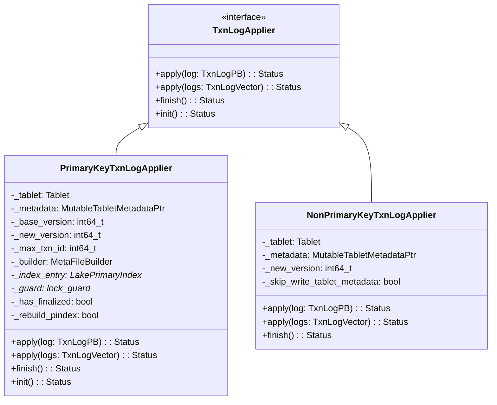
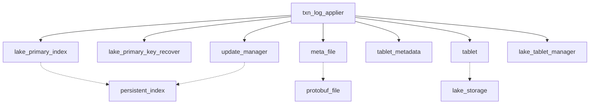
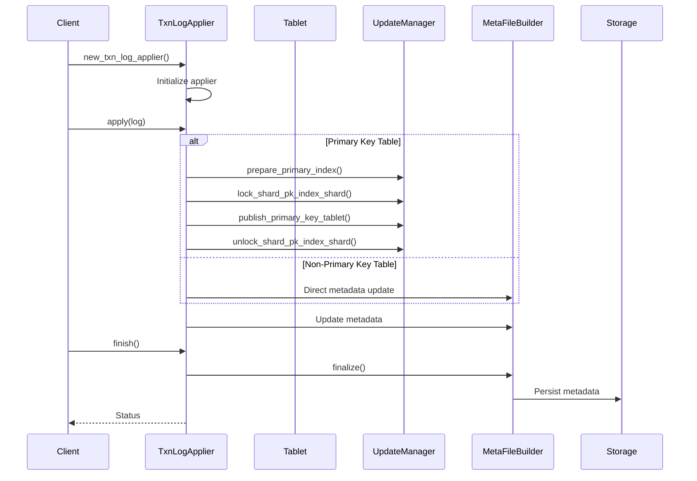
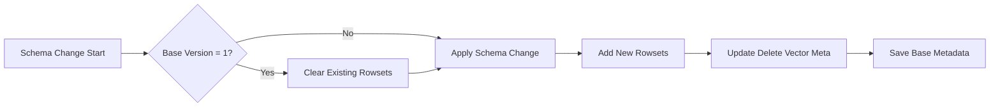
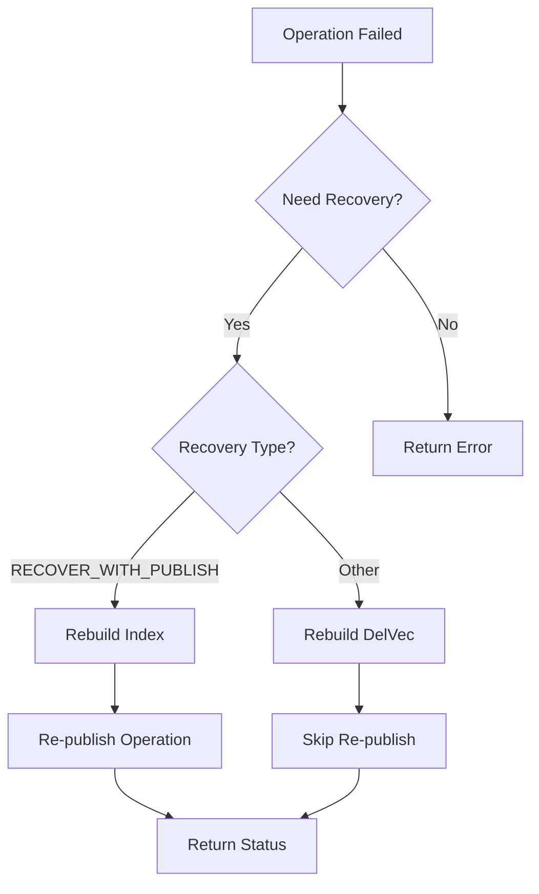

# Transaction Log Applier Module

## Overview

The `txn_log_applier` module is a critical component of StarRocks' lake storage architecture, responsible for applying transaction logs to tablet metadata. It serves as the bridge between transaction logs and the actual data storage, ensuring ACID properties and data consistency in the lake storage format.

## Purpose and Core Functionality

The primary purpose of this module is to:
- Apply transaction logs to tablet metadata in a consistent and atomic manner
- Handle different types of operations (write, compaction, schema change, replication, metadata alteration)
- Support both primary key and non-primary key tables with specialized logic for each
- Ensure data consistency and recoverability in case of failures
- Manage the complex state transitions during transaction application

## Architecture

### Core Components

### Module Dependencies

## Data Flow

### Transaction Log Application Process

## Operation Types

### 1. Write Operations (op_write)

**Primary Key Tables:**
- Apply rowset data with delete vectors
- Update primary index for upserts and deletes
- Handle column-mode partial updates
- Maintain delete vector consistency

**Non-Primary Key Tables:**
- Simple rowset addition to metadata
- No index updates required
- Support for delete predicates

### 2. Compaction Operations (op_compaction)

**Primary Key Tables:**
- Apply compaction to primary index
- Handle SSTable compaction in cloud-native format
- Maintain index consistency during compaction

**Non-Primary Key Tables:**
- Replace input rowsets with output rowset
- Update cumulative compaction point
- Handle schema evolution during compaction

### 3. Schema Change Operations (op_schema_change)

### 4. Metadata Alteration (op_alter_metadata)

Supports:
- **Persistent Index Configuration**: Enable/disable persistent index, change index type
- **Schema Updates**: Handle tablet schema changes with historical schema tracking
- **Compaction Strategy**: Update compaction strategy for the tablet

### 5. Replication Operations (op_replication)

**Incremental Replication:**
- Apply write operations from source
- Maintain version consistency

**Full Replication:**
- Replace all existing rowsets
- Clear delete vector metadata
- Update source schema information

## Error Handling and Recovery

### Primary Key Recovery Mechanism

### Recovery Process:
1. **Index Rebuilding**: Rebuild primary index from scratch
2. **Delete Vector Recovery**: Rebuild delete vectors from transaction logs
3. **Re-publication**: Re-apply operations after recovery
4. **Resource Cleanup**: Remove failed index entries from cache

## Memory Management

### Primary Key Index Cache Management
- **Cache Entry Management**: Dynamic cache for primary indexes
- **Memory Tracking**: Strict memory limit checking for PK operations
- **Resource Cleanup**: Automatic cleanup of failed operations
- **Shard-level Locking**: Prevent GC during critical operations

### Memory Safety Features:
- Scoped memory limit checking
- Thread-local memory trackers
- Automatic resource cleanup on failure
- Guard-based locking mechanisms

## Batch Operations

### Batch Transaction Log Application

**Primary Key Tables:**
- Support only op_write operations in batch mode
- Lock shard for entire batch duration
- Prepare primary index once for the batch
- Apply operations sequentially with consistency checks

**Non-Primary Key Tables:**
- Merge multiple rowsets into single rowset
- Accumulate segment information across logs
- Support encryption metadata preservation
- Handle schema mapping for historical schemas

## Version Management

### Version Consistency
- **Base Version**: Starting version for the transaction
- **New Version**: Target version after application
- **Transaction ID Tracking**: Maximum transaction ID for file naming
- **Version Validation**: Ensure version compatibility across operations

### Schema Versioning
- **Historical Schema Tracking**: Maintain schema evolution history
- **Rowset-to-Schema Mapping**: Track which schema each rowset uses
- **Schema ID Management**: Unique identifiers for schema versions

## Integration Points

### Related Modules
- **[lake_storage](lake_storage.md)**: Core lake storage functionality
- **[persistent_index](persistent_index.md)**: Primary index management
- **[update_manager](update_manager.md)**: Update operation coordination
- **[meta_file](meta_file.md)**: Metadata file operations
- **[tablet_manager](tablet_manager.md)**: Tablet lifecycle management

### External Dependencies
- **Protobuf**: Transaction log serialization
- **Google Libraries**: String utilities and containers
- **Threading**: Memory tracking and synchronization
- **File System**: Metadata persistence

## Performance Considerations

### Optimization Strategies
1. **Index Caching**: Reuse primary index entries across operations
2. **Batch Processing**: Minimize lock contention with batch operations
3. **Memory Pooling**: Reduce allocation overhead with object pools
4. **Early Validation**: Check versions and metadata before expensive operations

### Monitoring and Metrics
- Operation latency tracking
- Memory usage monitoring
- Recovery frequency metrics
- Cache hit/miss ratios

## Configuration

### Key Configuration Parameters
- `enable_pk_strict_memcheck`: Enable strict memory checking for PK operations
- `enable_primary_key_recover`: Enable automatic recovery for PK failures
- `lake_enable_alter_struct`: Enable struct column alteration (testing feature)
- `enable_size_tiered_compaction_strategy`: Use size-tiered compaction

## Best Practices

### Usage Guidelines
1. **Error Handling**: Always check return status from apply operations
2. **Resource Management**: Use RAII patterns for automatic cleanup
3. **Version Validation**: Validate version compatibility before operations
4. **Memory Monitoring**: Monitor memory usage during large operations
5. **Recovery Planning**: Plan for recovery scenarios in production

### Common Pitfalls
- Forgetting to call `finish()` after apply operations
- Not handling recovery scenarios properly
- Ignoring memory limits during large transactions
- Inadequate error handling for batch operations

## Future Enhancements

### Planned Improvements
- Enhanced recovery mechanisms for complex failure scenarios
- Improved batch operation performance
- Better memory management for large transactions
- Extended support for new operation types
- Enhanced monitoring and observability features