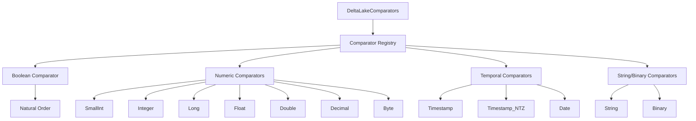
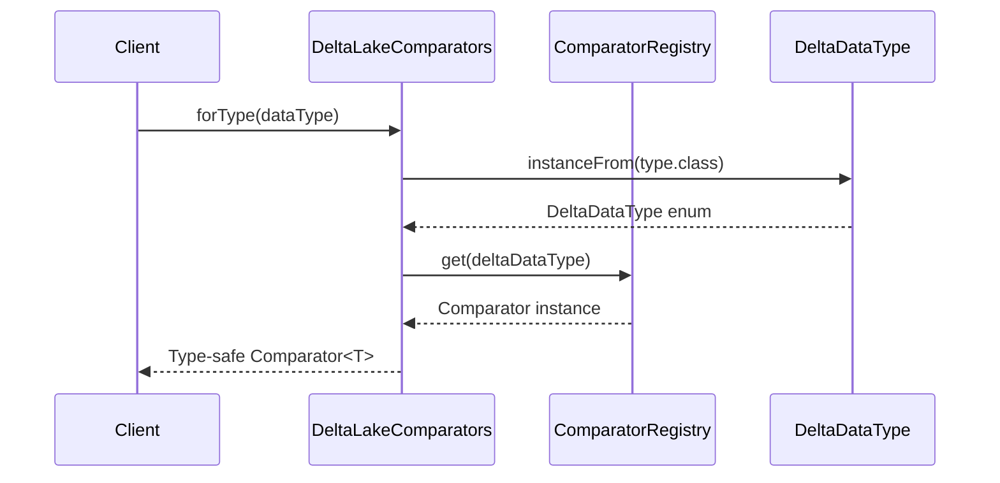

# Type Comparison Module Documentation

## Introduction

The type_comparison module provides type-specific comparison functionality for Delta Lake data types within the StarRocks connector framework. This module is essential for enabling proper data ordering, sorting, and comparison operations when working with Delta Lake tables in StarRocks.

## Core Functionality

The module's primary responsibility is to provide Java `Comparator` instances for different Delta Lake data types, enabling consistent and type-safe comparison operations across the connector ecosystem.

### Key Components

#### DeltaLakeComparators
- **Location**: `fe.fe-core.src.main.java.com.starrocks.connector.delta.DeltaLakeComparators`
- **Purpose**: Central factory class for obtaining type-specific comparators
- **Key Features**:
  - Immutable map-based comparator registry
  - Type-safe comparator retrieval
  - Support for all major Delta Lake data types
  - Natural ordering for comparable types

## Architecture

### Component Structure



### Data Flow



## Supported Data Types

The module supports the following Delta Lake data types with natural ordering:

| Data Type | Comparator Type | Ordering Behavior |
|-----------|----------------|-------------------|
| BOOLEAN | Natural Order | false < true |
| SMALLINT | Natural Order | Numeric ascending |
| INTEGER | Natural Order | Numeric ascending |
| LONG | Natural Order | Numeric ascending |
| FLOAT | Natural Order | Numeric ascending |
| DOUBLE | Natural Order | Numeric ascending |
| DECIMAL | Natural Order | Numeric ascending |
| BYTE | Natural Order | Numeric ascending |
| TIMESTAMP | Natural Order | Chronological |
| TIMESTAMP_NTZ | Natural Order | Chronological |
| DATE | Natural Order | Chronological |
| STRING | Natural Order | Lexicographic |
| BINARY | Natural Order | Byte-wise comparison |

## Integration Points

### Delta Lake Connector Integration

The type_comparison module is integrated within the [delta_lake_connector](delta_lake_connector.md) and provides essential functionality for:

- **Predicate Conversion**: Supporting comparison operations in [predicate_conversion](delta_lake_connector.md#predicate-conversion)
- **Schema Conversion**: Enabling type-aware operations in [schema_conversion](delta_lake_connector.md#schema-conversion)
- **File Scanning**: Facilitating sorted data processing in [file_scanning](delta_lake_connector.md#file-scanning)

### Related Modules

- **[connectors](connectors.md)**: Parent module containing all connector implementations
- **[delta_lake_connector](delta_lake_connector.md)**: Contains the Delta Lake-specific connector implementation
- **[type_system](frontend_server.md#type-system)**: Frontend server type system for cross-type compatibility

## Usage Patterns

### Basic Comparator Retrieval

```java
// Obtain a comparator for a specific Delta Lake data type
DataType timestampType = new TimestampType();
Comparator<Timestamp> timestampComparator = DeltaLakeComparators.forType(timestampType);

// Use the comparator for sorting
List<Timestamp> timestamps = /* ... */;
timestamps.sort(timestampComparator);
```

### Type-Safe Comparison

```java
// The module ensures type safety through generics
DataType stringType = new StringType();
Comparator<String> stringComparator = DeltaLakeComparators.forType(stringType);

// Type-safe string comparison
int result = stringComparator.compare("apple", "banana");
```

## Error Handling

The module implements comprehensive error handling:

- **Unsupported Type Detection**: Throws `UnsupportedOperationException` for unsupported data types
- **Type Safety**: Uses generics to ensure compile-time type safety
- **Null Safety**: Delegates null handling to the underlying comparator implementations

## Performance Considerations

- **Immutable Registry**: The comparator map is immutable, ensuring thread safety
- **Lazy Initialization**: Comparators are retrieved on-demand
- **Natural Ordering**: Leverages Java's natural ordering for optimal performance
- **Type-Specific Optimization**: Each data type uses the most appropriate comparison strategy

## Thread Safety

The module is designed to be thread-safe:

- Immutable comparator registry
- Stateless comparator factory
- No shared mutable state
- Safe for concurrent access across multiple threads

## Future Enhancements

Potential areas for expansion include:

- Support for complex data types (arrays, maps, structs)
- Custom collation support for string comparisons
- Locale-specific comparison rules
- Performance optimizations for large-scale sorting operations
- Integration with StarRocks' native type system for cross-system compatibility