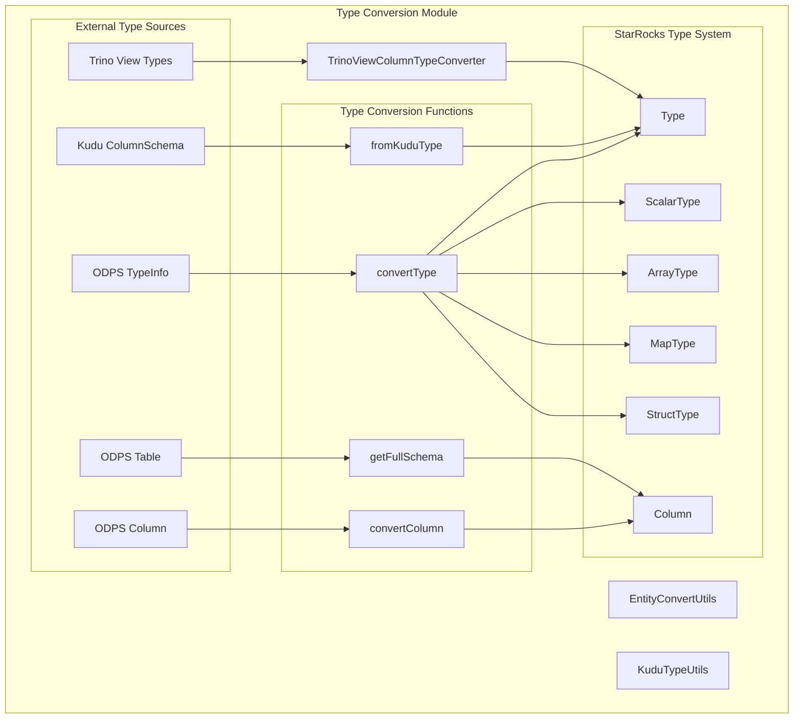
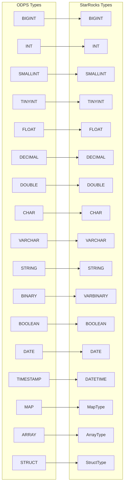
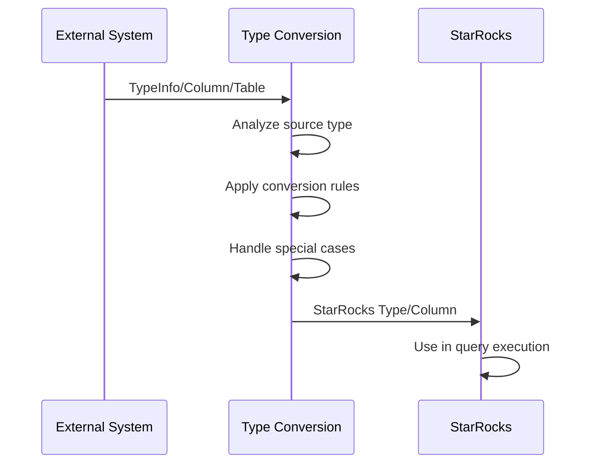
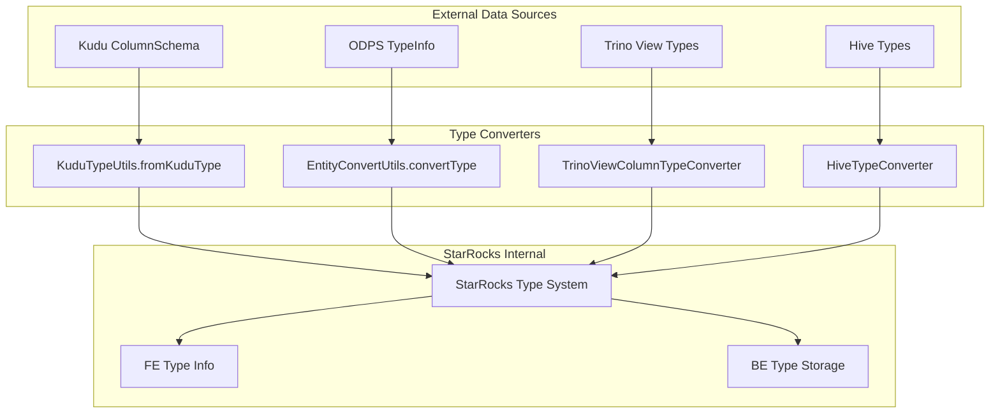

# Type Conversion Module Documentation

## Introduction

The type_conversion module provides comprehensive type mapping and conversion capabilities across different data source systems in StarRocks. This module serves as a critical bridge between StarRocks' internal type system and external data source types, enabling seamless data integration and query processing across heterogeneous systems.

The module handles type conversions for various connectors including Kudu, ODPS, Trino views, and other external data sources, ensuring data type compatibility and proper semantic mapping between systems.

## Core Purpose

The module's primary responsibility is to ensure seamless data type compatibility when integrating with external data sources, particularly focusing on:

- **External-to-Internal Type Mapping**: Converting data types from external systems to StarRocks-compatible types
- **Schema Conversion**: Transforming table schemas and column definitions
- **Type Safety**: Ensuring data integrity during type conversions
- **Complex Type Support**: Handling nested data types like arrays, maps, and structs

## Architecture Overview



## Core Components

### EntityConvertUtils

The main utility class that provides static methods for type conversion operations, particularly for ODPS (Open Data Processing Service) integration:

**Location**: `fe/fe-core/src/main/java/com/starrocks/connector/odps/EntityConvertUtils.java`

#### Key Methods

1. **`convertType(TypeInfo typeInfo)`**
   - Converts ODPS TypeInfo to StarRocks Type
   - Handles all primitive and complex types
   - Implements special handling for edge cases (e.g., high-precision decimals)

2. **`convertColumn(com.aliyun.odps.Column column)`**
   - Converts ODPS Column definition to StarRocks Column
   - Preserves column name and type information
   - Sets nullable property to true by default

3. **`getFullSchema(com.aliyun.odps.Table odpsTable)`**
   - Extracts complete schema including regular and partition columns
   - Returns list of StarRocks Column objects
   - Handles schema composition from multiple sources

### KuduTypeUtils

**Purpose**: Handles type conversion between Apache Kudu and StarRocks type systems.

**Location**: `java-extensions/kudu-reader/src/main/java/com/starrocks/kudu/reader/KuduTypeUtils.java`

**Key Functionality**:
- Converts Kudu column types to Hive string representations
- Supports all major Kudu data types including primitive and complex types
- Handles decimal types with precision and scale information
- Provides comprehensive type mapping for seamless data integration

**Type Mapping Table**:

| Kudu Type | Hive Representation | StarRocks Equivalent |
|-----------|-------------------|---------------------|
| BOOL | "boolean" | BOOLEAN |
| INT8 | "tinyint" | TINYINT |
| INT16 | "short" | SMALLINT |
| INT32 | "int" | INT |
| INT64 | "bigint" | BIGINT |
| FLOAT | "float" | FLOAT |
| DOUBLE | "double" | DOUBLE |
| BINARY | "binary" | VARBINARY |
| STRING/VARCHAR | "string" | STRING/VARCHAR |
| DATE | "date" | DATE |
| UNIXTIME_MICROS | "timestamp-micros" | DATETIME |
| DECIMAL(p,s) | "decimal(p,s)" | DECIMAL(p,s) |

**Code Example**:
```java
public static String fromKuduType(ColumnSchema columnSchema) {
    Type type = columnSchema.getType();
    switch (type) {
        case BOOL:
            return "boolean";
        case INT32:
            return "int";
        case DECIMAL:
            ColumnTypeAttributes typeAttributes = columnSchema.getTypeAttributes();
            int precision = typeAttributes.getPrecision();
            int scale = typeAttributes.getScale();
            return "decimal(" + precision + "," + scale + ")";
        default:
            throw new IllegalArgumentException("Unsupported Kudu type: " + type.name());
    }
}
```

### TrinoViewColumnTypeConverter

**Purpose**: Provides type conversion capabilities for Trino view definitions.

**Location**: `fe/fe-core/src/main/java/com/starrocks/connector/trino/TrinoViewColumnTypeConverter.java`

**Key Functionality**:
- Converts Trino SQL types to StarRocks types
- Handles view column type mapping
- Supports Trino-specific type semantics
- Enables seamless integration of Trino views in StarRocks

## Type Mapping Matrix



## Special Type Handling

### Decimal Precision Handling
The module implements special logic for handling high-precision decimals:
- ODPS 2.0 supports up to 38 digits of precision
- ODPS 1.0 supports up to 54 digits of precision
- When precision > 38, the type is converted to STRING for compatibility

### Complex Type Conversion
The module recursively handles complex types:
- **Arrays**: Element types are converted recursively
- **Maps**: Both key and value types are converted
- **Structs**: All field types are converted maintaining structure

## Data Flow Architecture



### Multi-Source Type Conversion Flow



## Integration Points

### Connector Integration
The type_conversion module is primarily used by:
- [ODPS Connector](connectors.md#odps_connector) - Uses EntityConvertUtils for ODPS type mapping
- [Kudu Connector](connectors.md#kudu_connector) - Uses KuduTypeUtils for Kudu type conversion
- [Trino Connector](connectors.md#trino_connector) - Uses TrinoViewColumnTypeConverter for view type mapping
- [Hive Connector](connectors.md#hive_connector) - Uses various type converters for Hive integration

### Storage Engine Integration
The type_conversion module integrates with the storage engine through:
- [ColumnTypeSystem](column_management.md#type_system) for persistent type information
- [SchemaChangeUtils](storage_engine.md#schema_and_types) for schema evolution support
- [ConvertHelper](storage_engine.md#schema_and_types) for runtime type conversions

### Query Execution Integration
Integration with query execution includes:
- [ArrowConverter](query_execution.md) for Arrow format type mapping
- [ConnectorScanner](query_execution.md) for external data source type handling
- Expression system for type-aware operations

### Connector Framework Integration
The module works closely with:
- [ConnectorFactory](connectors.md) for connector-specific type handling
- [ColumnTypeConverter](connectors.md) for column-level type conversions
- Various connector implementations for data source specific requirements

## Error Handling

The type_conversion module implements comprehensive error handling and graceful fallback mechanisms:

### KuduTypeUtils Error Handling
- **Unsupported Type Detection**: Throws `IllegalArgumentException` for unsupported Kudu types
- **Type Safety**: Ensures all Kudu types are properly mapped before conversion
- **Precision Validation**: Validates decimal precision and scale parameters

### EntityConvertUtils Error Handling
- **Unknown Type Fallback**: Unknown types default to VARCHAR for compatibility
- **Invalid Conversion Handling**: Provides appropriate logging for conversion failures
- **Schema Extraction Failures**: Reports detailed error messages for debugging

### TrinoViewColumnTypeConverter Error Handling
- **View Type Compatibility**: Ensures Trino view types are compatible with StarRocks
- **Complex Type Validation**: Validates nested type structures
- **Semantic Preservation**: Maintains type semantics during conversion

## Performance Considerations

- **Caching**: Type conversion results are cached to avoid repeated computations
- **Lazy Evaluation**: Conversions are performed only when necessary
- **Batch Processing**: Multiple type conversions are handled in batch for efficiency
- **Memory Optimization**: Minimal memory footprint for type mapping operations
- **Schema Caching**: Complex schema conversions can be cached for repeated operations
- **On-Demand Processing**: Complex type conversions are performed on-demand

## Usage Examples

### Kudu Type Conversion
```java
// Convert Kudu ColumnSchema to Hive string representation
ColumnSchema kuduColumn = ...; // Kudu column schema
String hiveType = KuduTypeUtils.fromKuduType(kuduColumn);
// Returns: "int", "bigint", "decimal(10,2)", etc.
```

### ODPS Type Conversion
```java
// Convert ODPS TypeInfo to StarRocks Type
TypeInfo odpsType = ...; // ODPS type information
Type starrocksType = EntityConvertUtils.convertType(odpsType);

// Convert ODPS Column definition to StarRocks Column
com.aliyun.odps.Column odpsColumn = ...; // ODPS column definition
Column starrocksColumn = EntityConvertUtils.convertColumn(odpsColumn);

// Extract complete schema from ODPS table
com.aliyun.odps.Table odpsTable = ...; // ODPS table
List<Column> schema = EntityConvertUtils.getFullSchema(odpsTable);
```

### Trino View Type Conversion
```java
// Convert Trino view column types to StarRocks types
// (Implementation details would be specific to TrinoViewColumnTypeConverter)
```

## Extension Points

The module supports extension through multiple mechanisms:

### Custom Type Converters
- **New Data Sources**: Implement custom converters for emerging data source systems
- **Plugin Architecture**: Support for connector-specific type conversion plugins
- **Configuration-Driven Rules**: Runtime configuration of type mapping rules
- **Type Registration**: Dynamic registration of new type conversion handlers

### Advanced Type Mapping
- **Semantic Type Preservation**: Maintaining business logic during type conversions
- **Custom Validation Rules**: Extensible validation framework for type compatibility
- **Fallback Mechanisms**: Configurable fallback strategies for unsupported types
- **Performance Optimization**: Pluggable caching strategies for type conversion results

## Future Enhancements

- **Extended Type Support**: Additional external system type mappings for emerging data sources
- **Validation Framework**: Enhanced type compatibility checking with semantic validation
- **Performance Optimization**: Advanced caching mechanisms for large-scale conversions
- **Error Recovery**: Improved handling of unsupported type combinations with graceful degradation
- **Type Inference**: Automatic type detection and mapping for unknown data sources
- **Cross-Platform Optimization**: Unified type conversion framework for all connectors

## Related Documentation

### Connector Integration
- [ODPS Connector](connectors.md#odps_connector) - Uses EntityConvertUtils for ODPS type mapping
- [Kudu Connector](connectors.md#kudu_connector) - Uses KuduTypeUtils for Kudu type conversion
- [Trino Connector](connectors.md#trino_connector) - Uses TrinoViewColumnTypeConverter for view type mapping
- [Hive Connector](connectors.md#hive_connector) - Uses various type converters for Hive integration

### Storage Engine Integration
- [Storage Engine Type System](storage_engine.md#schema_and_types) - Runtime type conversions and schema evolution
- [Column Management](column_management.md#type_system) - Persistent type information and column definitions

### Query Execution Integration
- [Query Execution Types](query_execution.md) - Arrow format type mapping and external data source handling
- [Connector Framework](connectors.md) - Connector-specific type handling and column-level conversions

### Frontend Server Integration
- [Type System](frontend_server.md#type_system) - StarRocks internal type definitions and management
- [Catalog Management](frontend_server.md#catalog) - Table and schema operations with type conversion support