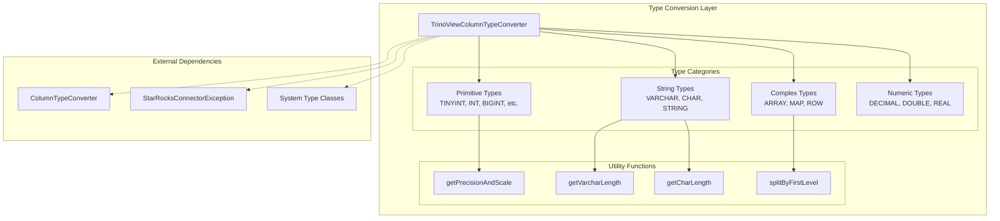
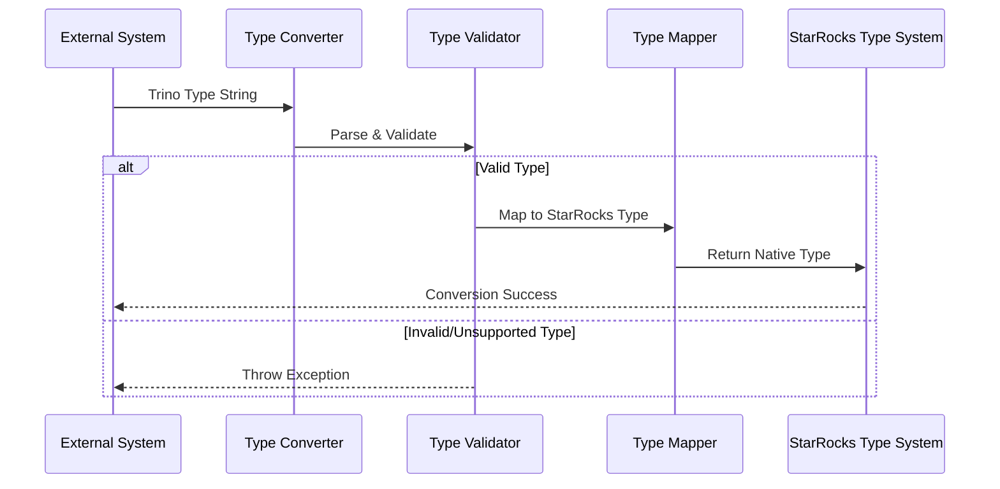
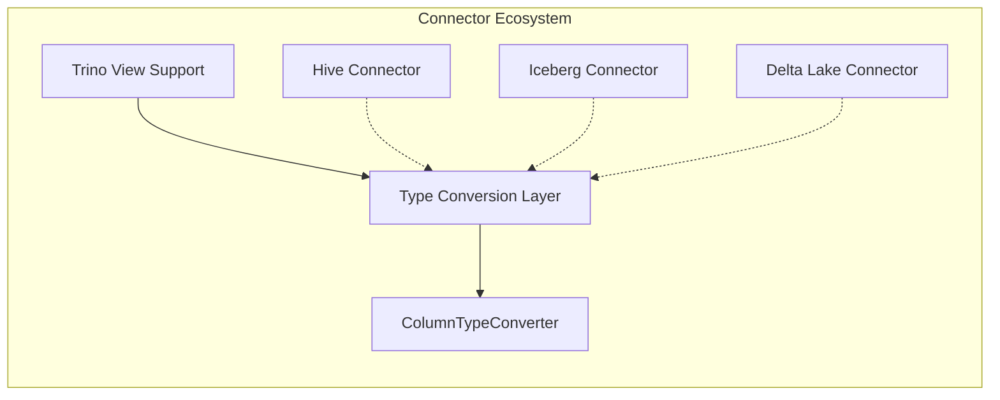
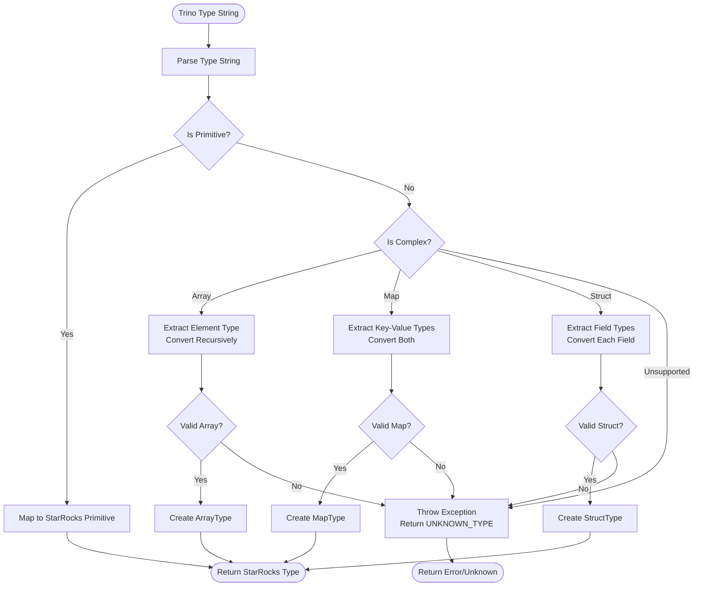
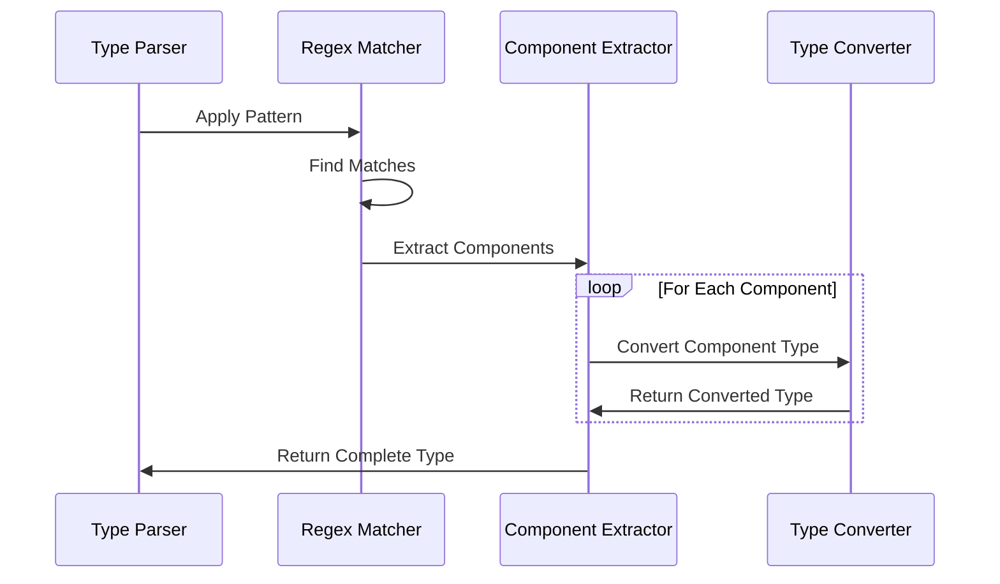

# Type Conversion Layer Module Documentation

## Overview

The type_conversion_layer module serves as a critical bridge for data type compatibility between StarRocks and external systems, particularly focusing on Trino view integration. This module provides comprehensive type conversion capabilities that enable seamless interoperability between different data type systems, ensuring data integrity and consistency across heterogeneous environments.

## Purpose and Core Functionality

The primary purpose of the type_conversion_layer is to handle the complex task of converting data types between StarRocks' native type system and external systems' type representations. The module specializes in:

- **Trino View Integration**: Converting Trino SQL data types to StarRocks-compatible types
- **Complex Type Handling**: Supporting nested data structures including arrays, maps, and structs
- **Type Validation**: Ensuring type compatibility and handling unsupported types gracefully
- **Schema Translation**: Facilitating schema mapping between different database systems

## Architecture

### Component Structure



### Data Flow Architecture



## Core Components

### TrinoViewColumnTypeConverter

The main converter class that orchestrates the type conversion process. It provides static methods for converting Trino type strings to StarRocks types.

**Key Methods:**
- `fromTrinoType(String trinoType)`: Main conversion entry point
- `fromTrinoTypeToArrayType(String typeStr)`: Handles array type conversion
- `fromTrinoTypeToStructType(String typeStr)`: Handles struct/row type conversion
- `fromTrinoTypeToMapType(String typeStr)`: Handles map type conversion
- `getKeyValueStr(String typeStr)`: Parses map key-value pairs

### Type Pattern Recognition

The module uses regex patterns to identify and parse complex types:

```java
COMPLEX_PATTERN = "([0-9a-z<>(),:_ \"]+)"
ARRAY_PATTERN = "^array\\(" + COMPLEX_PATTERN + "\\)"
MAP_PATTERN = "^map\\(" + COMPLEX_PATTERN + "\\)"
STRUCT_PATTERN = "^row\\(" + COMPLEX_PATTERN + "\\)"
```

### Supported Type Mappings

#### Primitive Types
| Trino Type | StarRocks Type |
|------------|----------------|
| TINYINT | TINYINT |
| SMALLINT | SMALLINT |
| INT/INTEGER | INT |
| BIGINT | BIGINT |
| REAL | FLOAT |
| DOUBLE/DOUBLE PRECISION | DOUBLE |
| DECIMAL/NUMERIC | DECIMAL32 |
| TIMESTAMP | DATETIME |
| DATE | DATE |
| STRING | Default String |
| VARCHAR(n) | VARCHAR(n) |
| CHAR(n) | CHAR(n) |
| BINARY/VARBINARY | VARBINARY |
| BOOLEAN | BOOLEAN |

#### Complex Types
- **ARRAY**: Converted to StarRocks ArrayType with recursive element type conversion
- **MAP**: Converted to StarRocks MapType with key-value type conversion
- **ROW**: Converted to StarRocks StructType with field name and type mapping

## Integration Points

### Connector Framework Integration

The type_conversion_layer integrates with the broader connector framework:



### Error Handling

The module implements comprehensive error handling through:
- **StarRocksConnectorException**: For conversion failures
- **Type Validation**: Checking for unsupported types (e.g., UNIONTYPE)
- **Graceful Degradation**: Returning UNKNOWN_TYPE for unresolvable types

## Process Flows

### Type Conversion Process



### Complex Type Parsing



## Dependencies

### Internal Dependencies
- **ColumnTypeConverter**: Provides utility functions for type parsing
- **StarRocks Type System**: ArrayType, MapType, StructType, ScalarType
- **Exception Handling**: StarRocksConnectorException for error reporting

### External Dependencies
- **Java Regex**: Pattern matching for type parsing
- **Java Collections**: ArrayList for struct field management
- **Java Locale**: Case-insensitive string operations

## Usage Examples

### Basic Type Conversion
```java
// Convert Trino VARCHAR to StarRocks VARCHAR
Type result = TrinoViewColumnTypeConverter.fromTrinoType("VARCHAR(100)");
// Returns: ScalarType(VARCHAR, 100)
```

### Complex Type Conversion
```java
// Convert Trino ARRAY<INTEGER> to StarRocks ArrayType
Type result = TrinoViewColumnTypeConverter.fromTrinoType("ARRAY<INTEGER>");
// Returns: ArrayType(INT)
```

### Struct Type Conversion
```java
// Convert Trino ROW to StarRocks StructType
Type result = TrinoViewColumnTypeConverter.fromTrinoType("ROW(name VARCHAR, age INT)");
// Returns: StructType with fields [name: VARCHAR, age: INT]
```

## Error Scenarios

### Unsupported Types
- **UNIONTYPE**: Explicitly listed as unsupported
- **Unknown Primitives**: Mapped to UNKNOWN_TYPE
- **Malformed Complex Types**: Throw StarRocksConnectorException

### Validation Failures
- **Invalid Precision/Scale**: For DECIMAL types
- **Malformed Array/Map/Struct**: Incorrect syntax or nesting
- **Missing Components**: Incomplete type specifications

## Performance Considerations

### Optimization Strategies
- **Pattern Caching**: Regex patterns are compiled once
- **Early Validation**: Quick checks for unsupported types
- **Recursive Processing**: Efficient handling of nested types
- **String Interning**: Case-insensitive comparisons using Locale

### Memory Management
- **Minimal Object Creation**: Reuses pattern matchers
- **Efficient String Processing**: Uses StringBuilder where appropriate
- **Lazy Evaluation**: Components parsed only when needed

## Extension Points

### Adding New Type Support
To add support for new Trino types:

1. **Update Type Mapping**: Add case in `fromTrinoType()` method
2. **Add Pattern**: Create regex pattern if complex type
3. **Implement Converter**: Create specialized conversion method
4. **Update Documentation**: Document new type mapping

### Custom Type Converters
The module can be extended for other systems:
- **Base Pattern**: Follow the same architectural pattern
- **Type Registry**: Implement type mapping registry
- **Validation Logic**: Add system-specific validation

## Testing Strategy

### Unit Testing
- **Individual Type Conversion**: Test each type mapping
- **Complex Type Nesting**: Test deeply nested structures
- **Error Conditions**: Test invalid inputs and edge cases
- **Performance Testing**: Benchmark conversion speed

### Integration Testing
- **End-to-End Conversion**: Full pipeline testing
- **Connector Integration**: Test with actual Trino views
- **Schema Compatibility**: Verify round-trip conversions

## Future Enhancements

### Planned Improvements
- **Additional Type Support**: Expand supported type list
- **Performance Optimization**: Faster pattern matching
- **Caching Layer**: Cache frequently converted types
- **Metadata Preservation**: Preserve type annotations

### Potential Extensions
- **Bidirectional Conversion**: StarRocks to Trino conversion
- **Type Validation API**: Standalone validation service
- **Schema Migration Tools**: Automated schema translation
- **Performance Monitoring**: Conversion metrics and monitoring

## Related Documentation

- [Connector Framework](connectors.md) - Understanding the broader connector ecosystem
- [Trino Integration](trino_view_support.md) - Trino-specific integration details
- [Type System](catalog.md#type_system) - StarRocks native type system
- [Error Handling](common_config.md#status_handling) - Exception handling patterns
- [Column Management](catalog.md#column_management) - Column type management

## Conclusion

The type_conversion_layer module is a foundational component that enables StarRocks to seamlessly integrate with external systems through robust type conversion capabilities. Its comprehensive support for both primitive and complex types, combined with thorough error handling and extensible architecture, makes it a critical piece of the StarRocks connector ecosystem. The module's focus on Trino view integration demonstrates its role in facilitating heterogeneous database environments while maintaining data integrity and type safety.