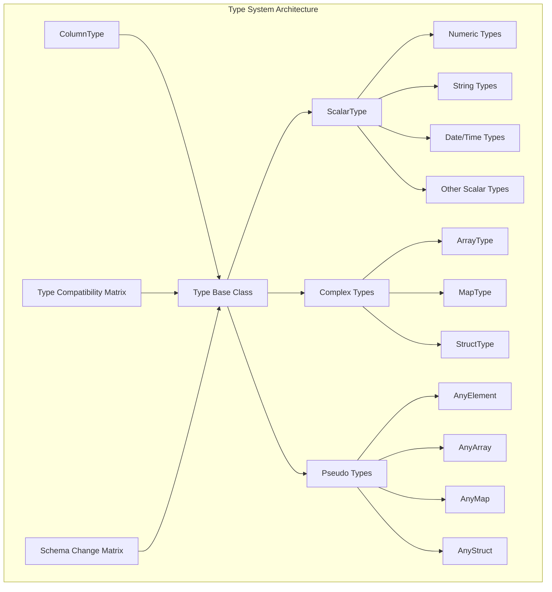
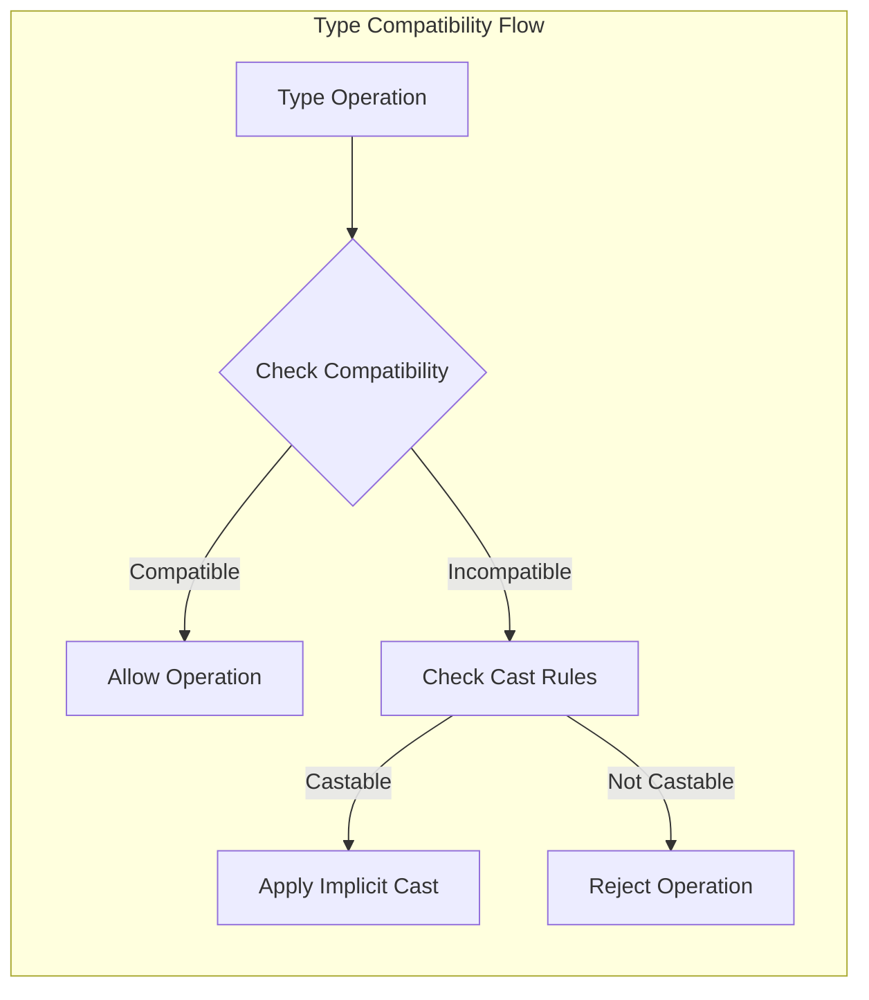

# Type System Module Documentation

## Overview

The Type System module is a fundamental component of StarRocks that provides comprehensive data type management, type compatibility checking, and schema evolution capabilities. It serves as the foundation for data type operations across the entire database system, ensuring type safety and consistency in query processing, storage, and data transformation operations.

## Purpose and Scope

The Type System module is responsible for:
- **Type Definition and Management**: Defining and managing all supported data types in StarRocks
- **Type Compatibility**: Determining type compatibility for operations like joins, aggregations, and comparisons
- **Schema Evolution**: Managing type changes during schema modifications and data migrations
- **Type Conversion**: Handling implicit and explicit type casting operations
- **Type Validation**: Ensuring type safety in query compilation and execution

## Architecture Overview



## Core Components

### 1. Type Base Class (`Type`)
The abstract base class that defines the interface for all data types in StarRocks. It provides:
- Type classification methods (isScalarType(), isComplexType(), etc.)
- Type compatibility checking
- Type conversion utilities
- JDBC metadata support
- Thrift serialization/deserialization

### 2. ColumnType (`ColumnType`)
An abstract class that extends Type and provides schema evolution capabilities:
- Schema change compatibility matrix
- Type conversion rules for schema modifications
- DecimalV3 type handling for schema changes

### 3. ScalarType Implementation
Concrete implementation for scalar data types including:
- **Numeric Types**: TINYINT, SMALLINT, INT, BIGINT, LARGEINT, FLOAT, DOUBLE
- **Decimal Types**: DECIMALV2, DECIMAL32, DECIMAL64, DECIMAL128, DECIMAL256
- **String Types**: CHAR, VARCHAR
- **Date/Time Types**: DATE, DATETIME, TIME
- **Special Types**: BOOLEAN, JSON, HLL, BITMAP, PERCENTILE

## Type Compatibility System

### Compatibility Matrix
The type system implements a comprehensive compatibility matrix that determines:
- **Assignment Compatibility**: Which types can be assigned to other types
- **Operation Compatibility**: Which types can participate in operations together
- **Cast Compatibility**: Which type conversions are allowed



### Schema Change Support
The system supports schema evolution through:
- **Type Promotion**: Allowing safe type changes (e.g., TINYINT → SMALLINT)
- **Decimal Evolution**: Special handling for decimal type changes
- **String Type Changes**: Supporting CHAR ↔ VARCHAR conversions
- **Cross-Category Changes**: Limited support for numeric ↔ string conversions

## Complex Type Support

### ArrayType
- Supports arrays of any supported type
- Nested array support with depth limitations
- Type compatibility checking for array operations

### MapType
- Key-value pair support with type constraints
- Key type must be a valid comparison type
- Value type can be any supported type

### StructType
- Named field support with individual type definitions
- Field access and manipulation capabilities
- Nested struct support

## Integration Points

The Type System module integrates with:
- **[Query Execution](../query_execution.md)**: Type checking during query compilation
- **[Storage Engine](../storage_engine.md)**: Type-specific storage optimizations
- **[SQL Parser/Optimizer](../sql_parser_optimizer.md)**: Type inference and validation
- **[Connectors](../connectors.md)**: External system type mapping

## Key Features

### 1. Type Safety
- Comprehensive type checking prevents invalid operations
- Compile-time type validation
- Runtime type consistency verification

### 2. Performance Optimization
- Type-specific optimizations in query execution
- Efficient type compatibility checking
- Minimal overhead for type operations

### 3. Extensibility
- Easy addition of new data types
- Pluggable type conversion rules
- Configurable compatibility matrices

### 4. Standards Compliance
- JDBC type mapping support
- SQL standard compliance where applicable
- External system compatibility

## Usage Examples

### Type Creation
```java
// Create basic types
Type intType = Type.INT;
Type varcharType = ScalarType.createVarcharType(100);
Type decimalType = ScalarType.createDecimalV3Type(10, 2);

// Create complex types
Type arrayType = new ArrayType(Type.INT);
Type mapType = new MapType(Type.VARCHAR, Type.INT);
```

### Type Compatibility Checking
```java
// Check if types are compatible
boolean compatible = Type.isImplicitlyCastable(Type.INT, Type.BIGINT, true);

// Get assignment compatible type
Type commonType = Type.getAssignmentCompatibleType(Type.INT, Type.BIGINT, false);
```

### Schema Change Validation
```java
// Check if schema change is allowed
boolean allowed = ColumnType.isSchemaChangeAllowed(oldType, newType);
```

## Sub-module Documentation

### Frontend Type System ([fe_type_system.md](fe_type_system.md))
The frontend type system provides comprehensive type management for the StarRocks FE, including:
- Type definition and classification
- Type compatibility checking and conversion rules
- Schema evolution and change validation
- Complex type support (arrays, maps, structs)
- Integration with SQL parser and optimizer

### Backend Type System ([be_type_system.md](be_type_system.md))
The backend type system handles low-level type operations in the StarRocks BE, including:
- Bitmap value type operations and iterators
- Large integer (int256) arithmetic operations
- Scalar field type to logical type mappings
- Type-specific optimizations for query execution

## Related Documentation

- [Column Management](column_management.md) - For column-specific type operations
- [Schema and Types](schema_and_types.md) - For broader schema management context
- [Query Execution](query_execution.md) - For type usage in query processing
- [Storage Engine](storage_engine.md) - For type-specific storage implementations