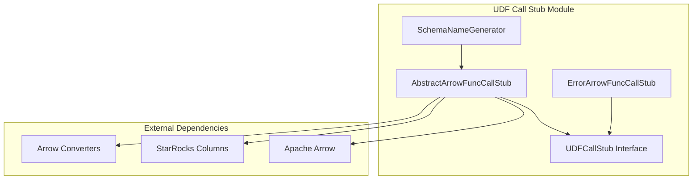
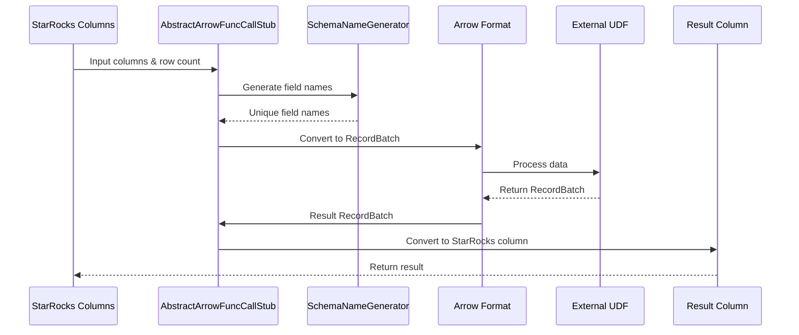
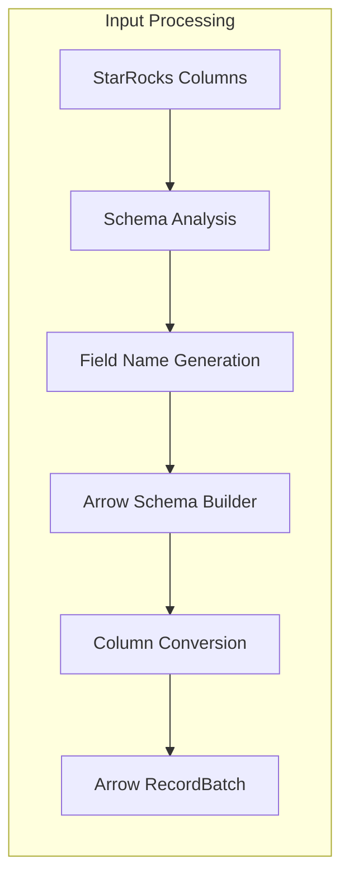
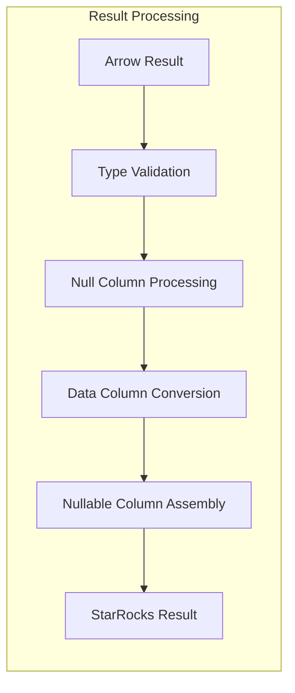
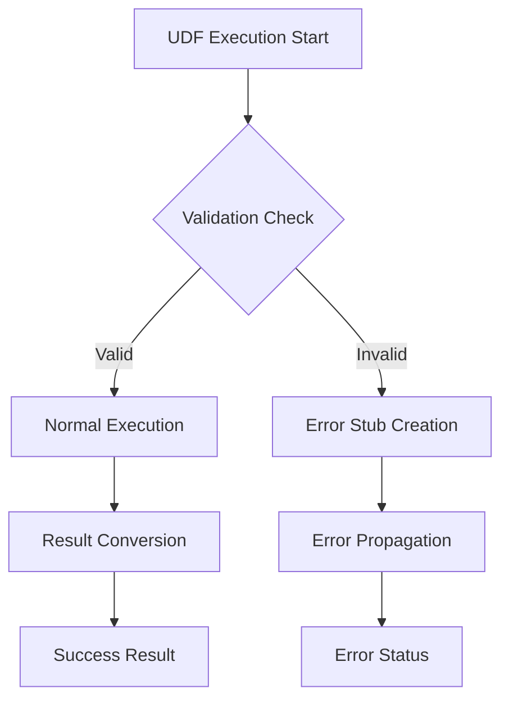

# UDF Call Stub Module Documentation

## Overview

The `udf_call_stub` module serves as a critical bridge between StarRocks' native execution engine and external User Defined Functions (UDFs) that operate on Apache Arrow data format. This module provides the infrastructure for converting StarRocks columnar data to Arrow format, executing UDFs, and converting results back to StarRocks format.

## Purpose and Core Functionality

The primary purpose of the UDF Call Stub module is to:

1. **Data Format Conversion**: Convert StarRocks columnar data to Apache Arrow format for UDF processing
2. **UDF Execution**: Provide a standardized interface for executing external UDFs
3. **Result Conversion**: Convert Arrow-formatted results back to StarRocks columnar format
4. **Error Handling**: Manage errors during UDF execution and data conversion processes

## Architecture

### Component Structure



### Data Flow Architecture



## Core Components

### SchemaNameGenerator

**Purpose**: Generates unique field names for Arrow schema construction

**Key Features**:
- Maintains internal counter for unique naming
- Generates string identifiers for Arrow fields
- Thread-safe sequential ID generation

**Implementation**:
```cpp
struct SchemaNameGenerator {
    size_t id = 0;
    std::string generate() { return std::to_string(id); }
};
```

### AbstractArrowFuncCallStub

**Purpose**: Abstract base class providing core Arrow-based UDF execution functionality

**Key Responsibilities**:
1. **Schema Construction**: Builds Arrow schema from StarRocks column types
2. **Data Conversion**: Converts StarRocks columns to Arrow RecordBatch
3. **UDF Execution**: Delegates to concrete implementations for actual UDF execution
4. **Result Conversion**: Converts Arrow results back to StarRocks format

**Key Methods**:
- `evaluate()`: Main entry point for UDF execution
- `_convert_arrow_to_native()`: Converts Arrow arrays to StarRocks columns
- `do_evaluate()`: Abstract method for concrete UDF implementations

### ErrorArrowFuncCallStub

**Purpose**: Error handling wrapper for failed UDF initializations

**Features**:
- Encapsulates error status from failed UDF setup
- Provides consistent error propagation interface
- Prevents execution of invalid UDF configurations

## Data Conversion Process

### StarRocks to Arrow Conversion



### Arrow to StarRocks Conversion



## Integration with StarRocks System

### Module Dependencies

The UDF Call Stub module integrates with several key StarRocks components:

1. **[Column System](../column_management.md)**: Provides columnar data structures
2. **[Arrow Integration](../arrow_conversion.md)**: Handles Arrow format conversions
3. **[Expression System](../expression_system.md)**: Integrates with expression evaluation
4. **[Runtime System](../runtime_system.md)**: Provides execution context

### Error Handling Strategy



## Performance Considerations

### Memory Management
- Uses Arrow's default memory pool for intermediate allocations
- Reserves capacity in result columns to minimize reallocations
- Implements efficient null column processing

### Type Conversion Optimization
- Caches converter functions based on type combinations
- Supports vectorized operations for batch processing
- Minimizes data copying through direct memory access

### Error Handling Performance
- Early validation prevents unnecessary processing
- Error stubs avoid repeated failed executions
- Status-based error propagation minimizes overhead

## Usage Patterns

### Basic UDF Execution Flow

1. **Initialization**: Create appropriate call stub based on UDF type
2. **Schema Preparation**: Generate Arrow schema from input columns
3. **Data Conversion**: Convert StarRocks data to Arrow format
4. **UDF Execution**: Process data through external UDF
5. **Result Conversion**: Convert Arrow results back to StarRocks format
6. **Error Handling**: Manage any errors during the process

### Error Handling Patterns

```cpp
// Create error stub for failed initialization
auto error_stub = create_error_call_stub(Status::NotSupported("UDF type not supported"));

// Error propagation in evaluation
StatusOr<ColumnPtr> result = error_stub->evaluate(columns, row_count);
if (!result.ok()) {
    // Handle error appropriately
    return result.status();
}
```

## Extension Points

### Custom UDF Implementations

The module provides extension points through:
- `AbstractArrowFuncCallStub::do_evaluate()`: Custom UDF execution logic
- Converter function registration: Support for new data types
- Error handling customization: Domain-specific error types

### Type System Integration

New type support can be added through:
- Arrow type mapping extensions
- Converter function implementations
- Schema generation enhancements

## Security Considerations

### Data Isolation
- UDF execution in isolated context
- Memory management through controlled interfaces
- Type-safe conversions prevent buffer overflows

### Error Sanitization
- Status-based error propagation
- No sensitive information in error messages
- Controlled error type exposure

## Monitoring and Debugging

### Performance Metrics
- Conversion time tracking
- Memory usage monitoring
- UDF execution duration

### Debug Support
- Detailed error messages with context
- Schema validation logging
- Conversion step tracing

## Future Enhancements

### Planned Improvements
1. **Async UDF Support**: Non-blocking UDF execution
2. **Batch Optimization**: Improved batch processing efficiency
3. **Type System Expansion**: Support for complex data types
4. **Caching Layer**: Result caching for deterministic UDFs

### Scalability Considerations
- Distributed UDF execution support
- Memory pool optimization
- Parallel conversion pipelines

## Related Documentation

- [Java UDF Engine](java_udf_engine.md) - Java-based UDF implementation
- [Python UDF Engine](python_udf_engine.md) - Python-based UDF implementation
- [Arrow Conversion](arrow_conversion.md) - Arrow format conversion utilities
- [Expression System](expression_system.md) - Expression evaluation framework
- [Runtime System](runtime_system.md) - Runtime execution environment