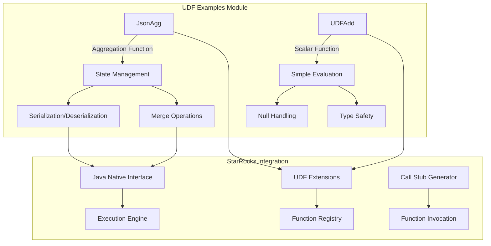
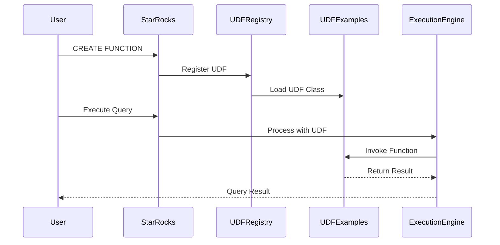

# UDF Examples Module Documentation

## Overview

The `udf_examples` module provides reference implementations and examples for creating User Defined Functions (UDFs) in StarRocks. This module serves as a comprehensive guide for developers who want to extend StarRocks functionality with custom functions, demonstrating best practices and common patterns for UDF development.

## Purpose and Scope

The primary purpose of this module is to:
- Provide working examples of different types of UDFs
- Demonstrate proper UDF implementation patterns
- Serve as a reference for UDF development best practices
- Show integration with StarRocks' execution engine

## Architecture Overview



## Core Components

### 1. JsonAgg - JSON Aggregation Function

The `JsonAgg` class demonstrates a complex aggregation UDF that collects key-value pairs and returns a JSON object. This example showcases:

- **State Management**: Maintains aggregation state across multiple rows
- **Serialization**: Handles state serialization for distributed execution
- **Merge Operations**: Supports parallel aggregation by merging partial results
- **JSON Processing**: Uses Jackson library for JSON manipulation

**Key Features:**
- Thread-safe state management
- Efficient memory usage with ByteBuffer serialization
- Support for partial aggregation in distributed environments
- Proper null handling and error management

For detailed implementation details, see [JSON Aggregation Functions](json_aggregation.md).

### 2. UDFAdd - Simple Scalar Function

The `UDFAdd` class provides a basic example of a scalar UDF that adds two integer values. This demonstrates:

- **Simple Evaluation**: Straightforward function implementation
- **Null Safety**: Proper handling of null input values
- **Type Safety**: Strong typing with Integer parameters
- **Basic Pattern**: Foundation for more complex scalar functions

For detailed implementation patterns, see [Scalar Functions](scalar_functions.md).

## Integration with StarRocks UDF System

The UDF examples integrate with StarRocks' broader UDF ecosystem:



## Best Practices Demonstrated

### 1. State Management (JsonAgg)
- Proper initialization and cleanup of state objects
- Efficient serialization for distributed processing
- Thread-safe operations for concurrent execution

### 2. Error Handling
- Graceful handling of null inputs
- Proper exception management
- Safe type conversions

### 3. Performance Optimization
- Efficient memory usage patterns
- Minimal object creation in hot paths
- Optimized serialization formats

### 4. Code Organization
- Clear separation of concerns
- Well-documented public interfaces
- Consistent naming conventions

## Usage Examples

### Creating a JSON Aggregation
```sql
CREATE AGGREGATE FUNCTION json_agg(string, string)
RETURNS string
PROPERTIES (
    "symbol" = "JsonAgg",
    "type" = "StarrocksJar",
    "file" = "udf-examples.jar"
);
```

### Using the Simple Addition Function
```sql
CREATE FUNCTION add_numbers(int, int)
RETURNS int
PROPERTIES (
    "symbol" = "UDFAdd",
    "type" = "StarrocksJar",
    "file" = "udf-examples.jar"
);
```

## Dependencies and Integration

The UDF examples module depends on several key components:

- **Jackson Library**: For JSON processing in JsonAgg
- **StarRocks UDF Framework**: For base UDF interfaces and execution
- **Java NIO**: For efficient buffer operations
- **Standard Java Libraries**: For core functionality

## Extension Points

Developers can extend these examples to create:
- More complex aggregation functions
- Specialized data processing functions
- Custom mathematical operations
- Domain-specific business logic

## Related Documentation

For more information about UDF development and integration:
- [UDF Extensions System](udf_extensions.md) - Comprehensive UDF framework documentation
- [Java Extensions](java_extensions.md) - Java-based extension system
- [Query Execution](query_execution.md) - How UDFs integrate with query processing

## Conclusion

The udf_examples module serves as both a learning resource and a foundation for custom UDF development in StarRocks. By following the patterns and best practices demonstrated in these examples, developers can create robust, efficient, and well-integrated user-defined functions that extend StarRocks' analytical capabilities.