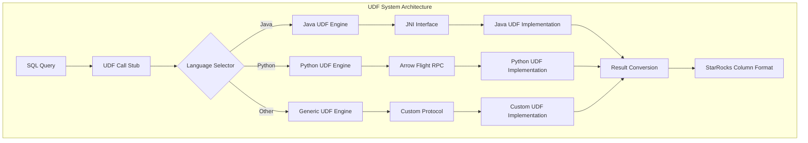
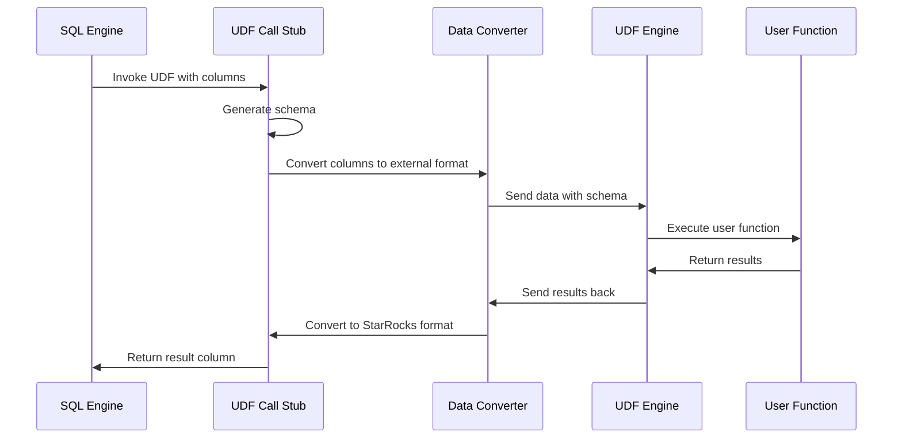

# UDF System Documentation

## Overview

The UDF (User Defined Functions) system in StarRocks provides a comprehensive framework for extending the database's functionality through custom functions written in various programming languages. This system enables users to implement complex business logic, specialized algorithms, and domain-specific operations that are not available in the standard SQL function library.

## Architecture

The UDF system is designed with a multi-language support architecture that allows functions to be written in Java, Python, and other languages. The system handles the complexity of data type conversion, memory management, and execution isolation while maintaining high performance and security.

## Core Components

### 1. UDF Call Stub Framework
The UDF call stub framework provides the foundation for UDF execution, handling:
- Schema generation and type mapping
- Data conversion between StarRocks and external formats
- Error handling and result validation
- Memory management for cross-language data transfer

### 2. Java UDF Support
Java UDF support enables users to write functions in Java with:
- Native method interfaces for direct column access
- Type-safe data conversion between Java and StarRocks types
- Memory-efficient columnar data processing
- Support for complex data types (arrays, maps, structs)

### 3. Python UDF Support
Python UDF support provides:
- Arrow Flight-based RPC communication for efficient data transfer
- Support for popular Python data science libraries
- Process isolation for security and stability
- Automatic type inference and conversion

### 4. Schema Management
The schema management system handles:
- Dynamic schema generation for UDF results
- Type validation and compatibility checking
- Column name generation and metadata handling
- Support for nested and complex data types

## Sub-modules

### [Java UDF Engine](java_udf_engine.md)
The Java UDF engine provides native integration with Java-based user defined functions, featuring high-performance columnar data access and type-safe operations. It includes the GetColumnAddrVistor component for direct memory access to column data.

### [Python UDF Engine](python_udf_engine.md)
The Python UDF engine enables Python-based function execution with Arrow Flight communication protocol for efficient data serialization and transfer. It uses the ArrowFlightWithRW component for bidirectional data streaming.

### [UDF Call Stub](udf_call_stub.md)
The UDF call stub framework provides the core infrastructure for UDF invocation, including schema management, data conversion, and result processing. It features the SchemaNameGenerator for dynamic schema creation and management.

## Data Flow

## Type System Integration

The UDF system integrates with StarRocks' type system through:
- Automatic type mapping between StarRocks and external language types
- Support for nullable columns and complex data types
- Type validation and conversion error handling
- Schema evolution support for changing function signatures

## Security and Isolation

The UDF system implements several security measures:
- Process isolation for Python UDFs to prevent system access
- Memory management with bounds checking
- Type validation to prevent data corruption
- Resource limits and timeout controls

## Performance Optimizations

Key performance features include:
- Columnar data processing for batch operations
- Minimal data copying through direct memory access
- Vectorized execution where possible
- Connection pooling and worker reuse for Python UDFs

## Integration Points

The UDF system integrates with:
- [Query Execution Engine](query_execution.md) for function invocation
- [Type System](backend_server.md#type_system) for data type conversion
- [Arrow Format Support](format_support.md) for cross-language data transfer
- [Runtime System](backend_server.md#runtime_system) for memory and resource management