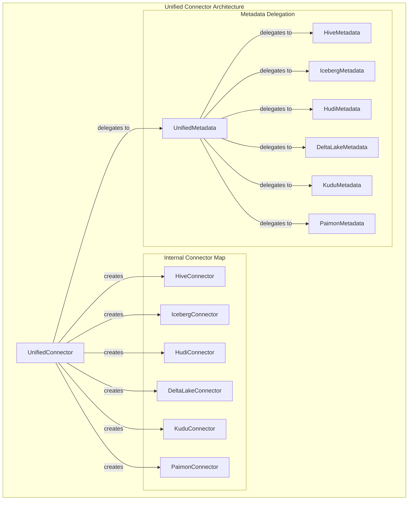
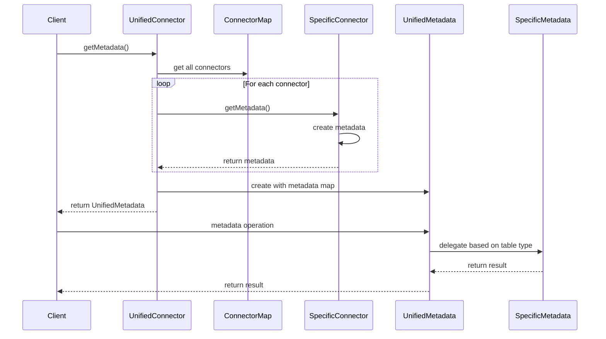
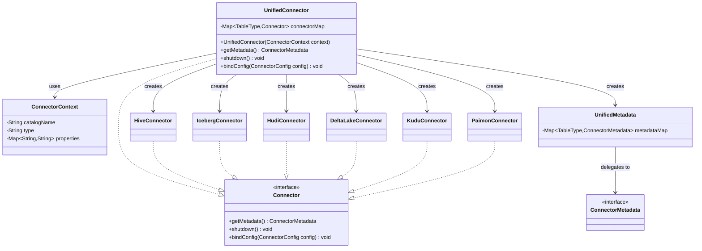
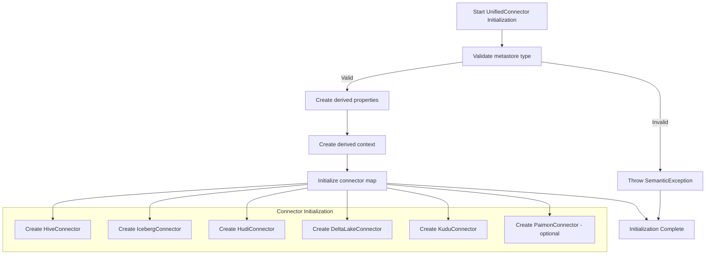
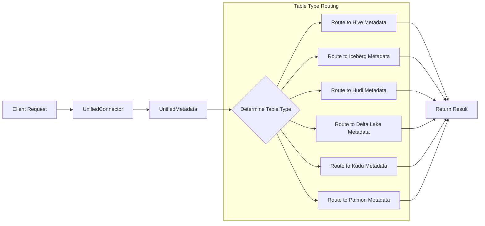

# Unified Connector Module Documentation

## Introduction

The Unified Connector module provides a unified interface for accessing multiple data lake formats through a single connector. It acts as a facade that delegates operations to specific connectors for different table formats like Hive, Iceberg, Hudi, Delta Lake, Kudu, and Paimon. This design simplifies data access by providing a consistent API while supporting multiple storage formats through a unified metastore configuration.

## Architecture Overview

The Unified Connector follows a delegation pattern where it creates and manages multiple specialized connectors internally. Each specialized connector handles operations for its specific table format, while the Unified Connector provides a single point of access for all operations.



## Core Components

### UnifiedConnector

The main entry point that implements the `Connector` interface. It:
- Validates the metastore type configuration (supports "hive" and "glue")
- Creates derived properties for all underlying connectors
- Initializes and manages a map of table type to specific connectors
- Delegates metadata operations to `UnifiedMetadata`
- Handles shutdown and configuration binding for all connectors

#### Key Configuration

- `unified.metastore.type`: Specifies the metastore type ("hive" or "glue")
- Automatically derives catalog type properties for all underlying connectors

#### Supported Table Types

- **HIVE**: Hive tables
- **ICEBERG**: Iceberg tables
- **HUDI**: Hudi tables
- **DELTALAKE**: Delta Lake tables
- **KUDU**: Kudu tables
- **PAIMON**: Paimon tables (optional, enabled when warehouse is configured)

## Data Flow



## Component Relationships



## Process Flow

### Initialization Process



### Metadata Operation Flow



## Integration with Other Modules

### Dependencies

The Unified Connector depends on several other modules:

- **[Connector Framework](connector_framework.md)**: Provides the base `Connector` interface and `ConnectorContext`
- **[Hive Connector](hive_connector.md)**: Handles Hive table operations
- **[Iceberg Connector](iceberg_connector.md)**: Handles Iceberg table operations
- **[Hudi Connector](hudi_connector.md)**: Handles Hudi table operations
- **[Delta Lake Connector](delta_lake_connector.md)**: Handles Delta Lake table operations
- **[Kudu Connector](kudu_connector.md)**: Handles Kudu table operations
- **[Paimon Connector](paimon_connector.md)**: Handles Paimon table operations

### Configuration Integration

The module integrates with the configuration system by:
- Validating metastore type configuration
- Deriving properties for all underlying connectors
- Supporting dynamic configuration binding through `bindConfig()`

## Error Handling

The Unified Connector implements several error handling mechanisms:

1. **Configuration Validation**: Throws `SemanticException` for invalid metastore types
2. **Connector Initialization**: Each connector handles its own initialization errors
3. **Metadata Delegation**: Errors from specific connectors are propagated through the unified interface

## Performance Considerations

- **Lazy Initialization**: Connectors are created during UnifiedConnector initialization
- **Metadata Caching**: Each connector manages its own metadata caching
- **Resource Management**: Proper shutdown sequence ensures all resources are released

## Extension Points

The module can be extended by:
- Adding new table type support in the connector map
- Implementing new specialized connectors
- Extending the UnifiedMetadata to support new operations

## Usage Examples

### Basic Configuration

```properties
# Catalog configuration
catalog.name = unified_catalog
catalog.type = unified
unified.metastore.type = hive
```

### Supported Operations

The Unified Connector supports all operations provided by the underlying connectors:
- Table metadata operations
- Partition management
- Data scanning
- Predicate pushdown
- Statistics collection

## Future Enhancements

Potential improvements include:
- Support for additional metastore types
- Dynamic connector loading
- Enhanced error reporting with connector-specific details
- Performance optimizations for multi-format queries