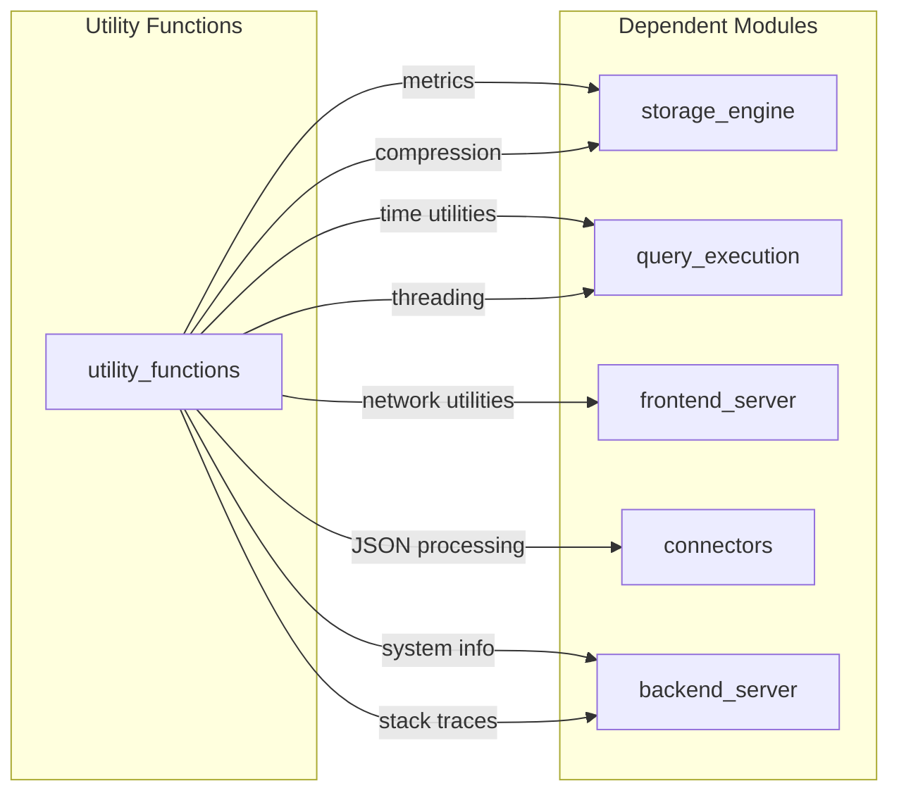

# Utility Functions Module

## Overview

The `utility_functions` module provides a comprehensive collection of utility functions and helper classes that support various system operations across the StarRocks database system. This module serves as a foundational layer, offering essential services for system introspection, data processing, and runtime support.

## Purpose and Scope

The utility functions module is designed to provide:
- System-level utilities for CPU, memory, and performance monitoring
- Data processing utilities including compression, JSON conversion, and time handling
- Network and system information gathering capabilities
- Threading and execution support utilities
- Debugging and profiling tools

## Architecture Overview

```mermaid
graph TB
    subgraph "Utility Functions Module"
        UF[utility_functions]
        
        UF --> BFD[bfd_parser]
        UF --> CIDR[cidr]
        UF --> COMP[compression]
        UF --> CORE[core_local]
        UF --> CPU[cpu_info]
        UF --> JSON[json_converter]
        UF --> MEM[mem_info]
        UF --> MONO[monotime]
        UF --> NET[network_util]
        UF --> SLICE[slice]
        UF --> STACK[stack_util]
        UF --> STATIC[static_asserts]
        UF --> SYS[system_metrics]
        UF --> THREAD[thread]
        UF --> POOL[threadpool]
        UF --> THRIFT[thrift_rpc_helper]
        UF --> TIME[time]
        UF --> TRACE[trace]
    end
    
    BFD --> |"symbol resolution"| DEBUG[debugging]
    CIDR --> |"network analysis"| NETOPS[network operations]
    COMP --> |"data compression"| STORAGE[storage engine]
    CORE --> |"per-CPU data"| PERF[performance]
    CPU --> |"CPU information"| SCHED[scheduler]
    JSON --> |"JSON processing"| QUERY[query engine]
    MEM --> |"memory info"| MEMTRACK[memory tracking]
    MONO --> |"monotonic time"| TIMING[timing operations]
    NET --> |"network utilities"| CLUSTER[cluster management]
    SLICE --> |"data slices"| DATA[data structures]
    STACK --> |"stack traces"| PROF[profiling]
    SYS --> |"system metrics"| MONITOR[monitoring]
    THREAD --> |"thread management"| EXEC[execution engine]
    POOL --> |"thread pools"| ASYNC[async operations]
    THRIFT --> |"RPC support"| COMM[communication]
    TIME --> |"time utilities"| LOG[logging]
    TRACE --> |"execution tracing"| DEBUG
```

## Sub-modules

### 1. System Information and Monitoring

#### [CPU Information](cpu_info.md)
Provides comprehensive CPU detection and information gathering capabilities, including:
- CPU feature detection (SSE, AVX, etc.)
- Core counting and NUMA topology
- Cache information
- cgroup-aware resource detection

#### [Memory Information](mem_info.md)
Handles system memory detection and container-aware memory limits:
- Physical memory detection
- Container memory limit detection (cgroup v1/v2)
- Memory statistics

#### [System Metrics](system_metrics.md)
Comprehensive system monitoring and metrics collection:
- CPU usage metrics
- Memory usage tracking
- Disk I/O statistics
- Network traffic monitoring
- File descriptor usage
- Runtime filter metrics

### 2. Data Processing Utilities

#### [Compression](compression.md)
Multi-format compression support:
- Block compression (LZ4, Snappy, Zlib, ZSTD, Gzip)
- Stream compression
- Hadoop-compatible LZ4
- Compression context pooling

#### [JSON Converter](json_converter.md)
SIMD-accelerated JSON processing:
- SIMD-JSON integration
- JSON to internal format conversion
- High-performance JSON parsing

#### [Slice Management](slice.md)
Efficient data slice operations:
- Memory slice management
- Min/max value handling
- Data buffer operations

### 3. Time and Timing Utilities

#### [Monotonic Time](monotime.md)
High-precision timing operations:
- Monotonic clock operations
- Time delta calculations
- Cross-platform time support

#### [Time Utilities](time.md)
General time handling functions:
- Unix timestamp conversion
- Time formatting
- UTC and local time support

### 4. Network and System Utilities

#### [Network Utilities](network_util.md)
Network interface and address management:
- IP address validation
- Hostname resolution
- Network interface enumeration
- IPv4/IPv6 support

#### [CIDR Processing](cidr.md)
CIDR notation support for network operations:
- CIDR parsing and validation
- IP range containment checking
- IPv4/IPv6 CIDR support

### 5. Threading and Execution

#### [Thread Management](thread.md)
Advanced thread management system:
- Thread lifecycle management
- Thread naming and categorization
- Thread-local storage
- Thread monitoring and debugging

#### [Thread Pool](threadpool.md)
Sophisticated thread pool implementation:
- Dynamic thread pool sizing
- Priority-based task scheduling
- CPU affinity support
- Work-stealing capabilities

### 6. Debugging and Profiling

#### [Stack Utilities](stack_util.md)
Comprehensive stack trace and debugging support:
- Stack trace collection
- Thread stack sampling
- Exception stack tracking
- Signal-based stack inspection

#### [BFD Parser](bfd_parser.md)
Binary symbol resolution for debugging:
- Symbol address resolution
- Function name demangling
- Debug symbol parsing
- Cross-platform binary support

#### [Trace System](trace.md)
Execution tracing and profiling:
- Hierarchical trace collection
- Performance metrics integration
- Trace filtering and analysis
- Child trace support

### 7. Core Infrastructure

#### [Core Local Storage](core_local.md)
Per-CPU data management:
- CPU-local data allocation
- Cache-line aligned storage
- Lock-free per-CPU operations

#### [Thrift RPC Helper](thrift_rpc_helper.md)
RPC communication utilities:
- Thrift RPC wrapper functions
- Connection management
- Retry logic and error handling

#### [Static Assertions](static_asserts.md)
Compile-time validation utilities:
- Structure size validation
- Offset verification
- Build-time consistency checks

## Integration with Other Modules

The utility functions module provides essential services to numerous other modules:

## Performance Characteristics

- **CPU Information**: O(1) cached lookups, system call overhead on first access
- **Compression**: Optimized with context pooling, SIMD acceleration where available
- **JSON Processing**: SIMD-accelerated parsing, streaming support
- **Thread Pool**: Lock-free task submission, work-stealing for load balancing
- **System Metrics**: Periodic background updates, minimal runtime overhead

## Configuration and Tuning

The utility functions module respects various configuration parameters:
- CPU core detection and affinity settings
- Memory limit detection in containerized environments
- Compression level and algorithm selection
- Thread pool sizing and timeout parameters
- Stack trace collection settings

## Error Handling

The module implements comprehensive error handling:
- Graceful degradation for unsupported CPU features
- Fallback mechanisms for compression algorithms
- Container-aware resource detection
- Robust error reporting for debugging utilities

## Thread Safety

All utility functions are designed with thread safety in mind:
- Lock-free operations where possible
- Thread-local storage for per-thread data
- Atomic operations for shared counters
- Proper synchronization for shared resources

This module serves as the foundation for reliable, high-performance system operations throughout the StarRocks database system.