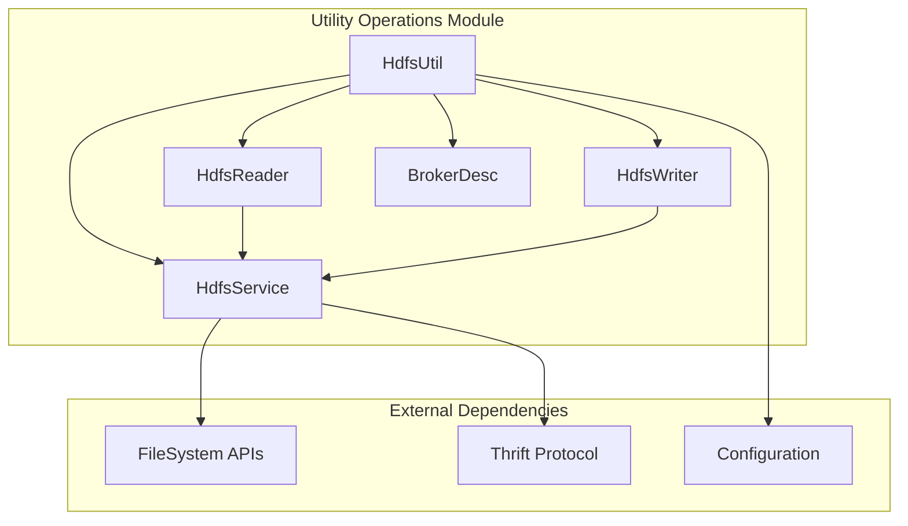
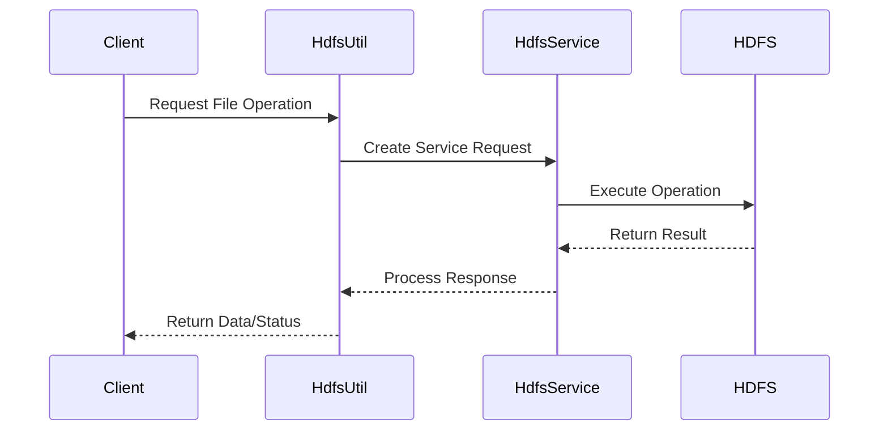
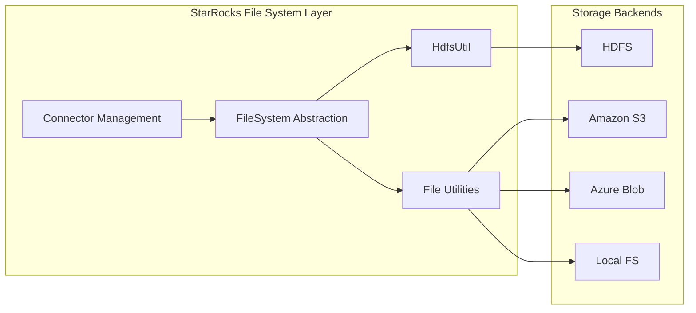

# Utility Operations Module

## Introduction

The utility_operations module provides essential file system utilities and HDFS (Hadoop Distributed File System) operations for StarRocks. This module serves as a bridge between StarRocks and various file systems, particularly HDFS, enabling seamless data import/export operations and file management capabilities.

## Core Functionality

The module's primary component, `HdfsUtil`, offers a comprehensive set of HDFS operations including:

- **File Operations**: Read, write, copy, rename, and delete files
- **Path Management**: Check path existence, list directories, parse file metadata
- **Data Transfer**: Copy files between local and remote HDFS locations
- **Column Extraction**: Parse partition columns from file paths
- **Streaming I/O**: Support for large file operations with buffered reading/writing

## Architecture

### Component Structure



### Data Flow Architecture



## Key Components

### HdfsUtil Class

The main utility class providing static methods for HDFS operations:

- **File Management**: `readFile()`, `writeFile()`, `deletePath()`, `rename()`
- **Path Operations**: `checkPathExist()`, `parseFile()`, `listFileMeta()`
- **Data Transfer**: `copyToLocal()`, `copyFromLocal()`
- **Column Parsing**: `parseColumnsFromPath()`

### HdfsReader Class

Encapsulates file reading operations with:
- Buffered reading capabilities
- File size detection
- Position tracking for sequential reads
- Automatic resource cleanup

### HdfsWriter Class

Handles file writing operations featuring:
- Append mode support
- Byte buffer management
- Position tracking for writes
- Proper resource management

## Integration with StarRocks

### File System Abstraction

The utility_operations module integrates with StarRocks' broader file system architecture:



### Broker Integration

The module works with StarRocks' broker system for distributed file operations:

- **BrokerDesc**: Configuration object containing connection properties
- **Thrift Protocol**: Communication layer for broker services
- **Authentication**: Integrated with StarRocks' security framework

## Usage Patterns

### Basic File Operations

```java
// Reading a file
byte[] data = HdfsUtil.readFile(hdfsPath, brokerDesc);

// Writing data
HdfsUtil.writeFile(data, hdfsPath, brokerDesc);

// Checking path existence
boolean exists = HdfsUtil.checkPathExist(path, brokerDesc);
```

### Streaming Operations

```java
// Streaming read
HdfsReader reader = HdfsUtil.openHdfsReader(path, brokerDesc);
try {
    byte[] chunk = reader.read(bufferSize);
    // Process chunk
} finally {
    reader.close();
}

// Streaming write
HdfsWriter writer = HdfsUtil.openHdfsWriter(path, brokerDesc);
try {
    writer.write(buffer, size);
} finally {
    writer.close();
}
```

## Error Handling

The module implements comprehensive error handling:

- **StarRocksException**: Custom exception for HDFS-related errors
- **Resource Management**: Automatic cleanup of file handles and connections
- **Validation**: Input parameter validation and file existence checks
- **Logging**: Detailed logging for debugging and monitoring

## Performance Considerations

### Buffer Management

- **Read Buffer**: 1MB default buffer size for efficient I/O
- **Streaming Support**: Large file handling without memory overflow
- **Batch Operations**: Optimized for bulk file operations

### Connection Pooling

- **Service Reuse**: Shared HdfsService instance for connection efficiency
- **Timeout Configuration**: Configurable timeouts for broker operations
- **Resource Cleanup**: Proper resource deallocation to prevent leaks

## Dependencies

### Internal Dependencies

- **Configuration System**: Uses StarRocks' Config for timeout settings
- **Broker System**: Integrates with StarRocks' broker infrastructure
- **Exception Framework**: Leverages StarRocksException for error handling
- **Logging Framework**: Uses StarRocks' logging infrastructure

### External Dependencies

- **Hadoop APIs**: HDFS client libraries
- **Thrift**: RPC communication protocol
- **Apache Commons**: Utility libraries for string and collection operations

## Security

### Authentication

- **Broker-based Security**: Leverages broker authentication mechanisms
- **Property-based Configuration**: Security settings through broker properties
- **Integrated Access Control**: Works with StarRocks' authorization framework

### Data Protection

- **Secure Transfers**: Encrypted data transmission where supported
- **Access Validation**: Path existence and permission checks
- **Audit Logging**: Operation tracking for security monitoring

## Monitoring and Observability

### Metrics

- **Operation Counters**: Track file operation frequencies
- **Performance Metrics**: Monitor I/O throughput and latency
- **Error Rates**: Track failure rates by operation type

### Logging

- **Operation Logging**: Detailed logs for file operations
- **Error Logging**: Comprehensive error information for debugging
- **Performance Logging**: Timing information for performance analysis

## Related Modules

- **[filesystem](filesystem.md)**: File system abstraction layer
- **[connector_framework](connector_framework.md)**: External system integration
- **[common_utilities](common_utilities.md)**: Shared utility functions
- **[storage_engine](storage_engine.md)**: Core storage operations

## Future Enhancements

### Planned Features

- **Multi-cloud Support**: Enhanced support for cloud storage systems
- **Performance Optimization**: Improved buffering and caching strategies
- **Monitoring Integration**: Enhanced metrics and observability features
- **Async Operations**: Support for asynchronous file operations

### Scalability Improvements

- **Connection Pooling**: Enhanced connection management for high-throughput scenarios
- **Parallel Operations**: Support for concurrent file operations
- **Caching Layer**: Intelligent caching for frequently accessed files