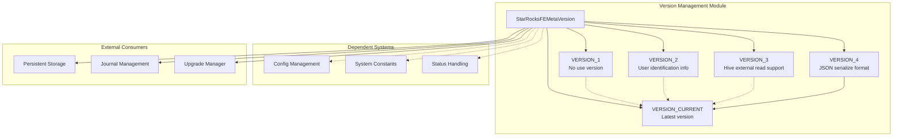
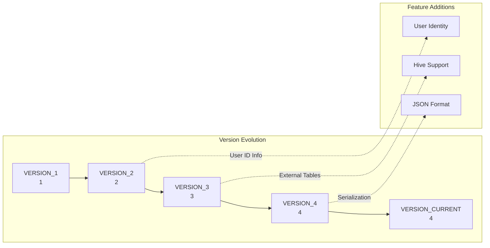
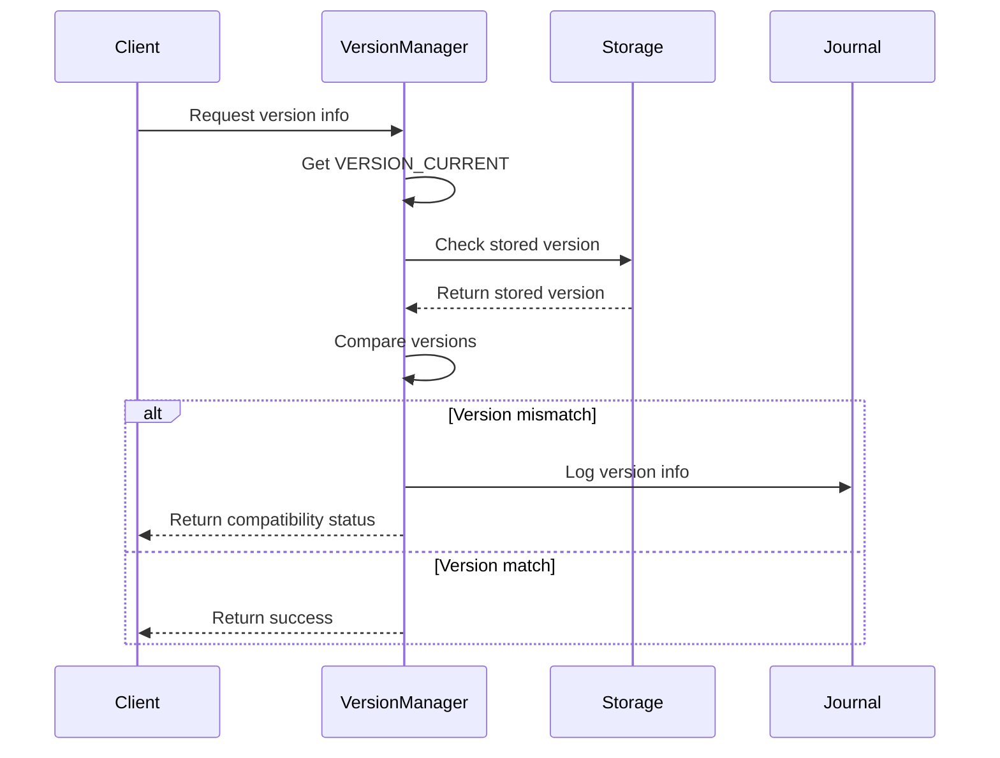
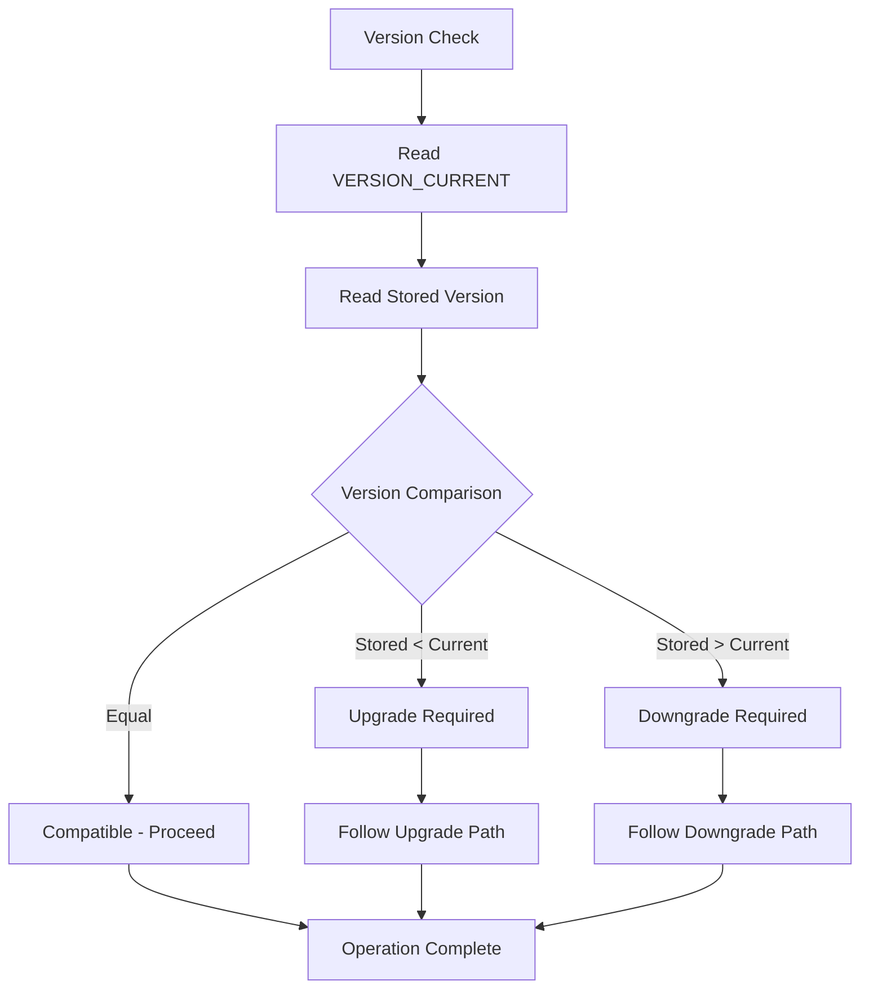

# Version Management Module

## Introduction

The version_management module is a critical component of the StarRocks frontend server that handles metadata versioning and compatibility across different releases of the system. This module ensures that metadata changes are properly tracked and that the system can handle upgrades and downgrades gracefully while maintaining data integrity.

## Core Functionality

The version_management module provides centralized version control for StarRocks FE (Frontend) metadata, serving as the authoritative source for version information used throughout the system. It defines version constants that correspond to significant changes in the metadata format, serialization methods, and feature support.

## Architecture

### Component Structure



### Version Constants and Their Meanings



## Key Components

### StarRocksFEMetaVersion Class

The `StarRocksFEMetaVersion` class serves as the central repository for version constants used throughout the StarRocks frontend system. It maintains a history of significant metadata changes and provides the current version reference.

**Key Features:**
- **Version Constants**: Defines specific version numbers corresponding to major metadata format changes
- **Current Version Reference**: Provides a single source of truth for the latest version
- **Backward Compatibility**: Enables the system to handle metadata from previous versions

**Version History:**
- **VERSION_1 (1)**: Initial version, marked as "no use version"
- **VERSION_2 (2)**: Added user identification information support
- **VERSION_3 (3)**: Introduced support for Hive external table reading
- **VERSION_4 (4)**: Changed all serialization formats to JSON
- **VERSION_CURRENT**: Points to the latest version (VERSION_4)

## Data Flow

### Version Check Process



### Upgrade/Downgrade Flow



## Integration Points

### Module Dependencies

The version_management module is part of the `common_config` module group and has dependencies on:

- **[config_management](config_management.md)**: Provides configuration management capabilities
- **[system_constants](system_constants.md)**: Supplies system-wide constants and identifiers
- **[status_handling](status_handling.md)**: Handles status reporting and error management

### Consumer Modules

The version information is consumed by various system components:

- **[persist_metadata](persist_metadata.md)**: Uses version info for metadata persistence decisions
- **[journal](journal.md)**: Leverages version information for journal compatibility
- **[server_lifecycle](server_lifecycle.md)**: References versions during server startup and shutdown

## Usage Patterns

### Version Checking
```java
// Check if current system supports a feature
if (StarRocksFEMetaVersion.VERSION_CURRENT >= StarRocksFEMetaVersion.VERSION_3) {
    // Hive external table support is available
    processHiveExternalTables();
}
```

### Compatibility Validation
```java
// Validate metadata compatibility
int storedVersion = readStoredVersion();
if (storedVersion > StarRocksFEMetaVersion.VERSION_CURRENT) {
    throw new IncompatibleVersionException(
        "Stored version " + storedVersion + 
        " is newer than current version " + 
        StarRocksFEMetaVersion.VERSION_CURRENT
    );
}
```

## Best Practices

### Version Increment Guidelines

1. **Document Changes**: When incrementing versions, clearly document what changes necessitate the new version
2. **Backward Compatibility**: Ensure new versions can handle data from previous versions
3. **Testing**: Thoroughly test upgrade and downgrade scenarios
4. **Migration Paths**: Provide clear migration paths for version transitions

### Version Management

1. **Single Source**: Always reference `VERSION_CURRENT` rather than hardcoding version numbers
2. **Validation**: Implement version validation at system startup and critical operations
3. **Logging**: Log version information during significant operations for debugging
4. **Compatibility Matrix**: Maintain a compatibility matrix showing supported version combinations

## Error Handling

### Common Version-Related Issues

- **Version Mismatch**: When stored metadata version differs from system version
- **Unsupported Features**: When attempting to use features not available in current version
- **Corruption**: When version information is corrupted or unreadable

### Recovery Strategies

1. **Version Rollback**: Ability to rollback to previous compatible versions
2. **Data Migration**: Automated migration tools for version upgrades
3. **Backup Verification**: Ensure backups are compatible with target versions
4. **Graceful Degradation**: Continue operation with reduced functionality if possible

## Future Considerations

### Planned Enhancements

- **Version Range Support**: Support for version ranges rather than single version checks
- **Feature Flags**: Integration with feature flag systems for gradual rollouts
- **Automated Migration**: Built-in migration tools for seamless upgrades
- **Version History**: Enhanced version history tracking and reporting

### Scalability Considerations

- **Distributed Versioning**: Support for version management in distributed deployments
- **Performance Impact**: Minimize version checking overhead in hot paths
- **Storage Efficiency**: Optimize version metadata storage requirements

## Related Documentation

- [Config Management](config_management.md) - Configuration and settings management
- [System Constants](system_constants.md) - System-wide constants and definitions
- [Status Handling](status_handling.md) - Error and status management
- [Persistent Metadata](persist_metadata.md) - Metadata persistence and storage
- [Journal Management](journal.md) - Transaction logging and recovery
- [Server Lifecycle](server_lifecycle.md) - Server startup and shutdown procedures