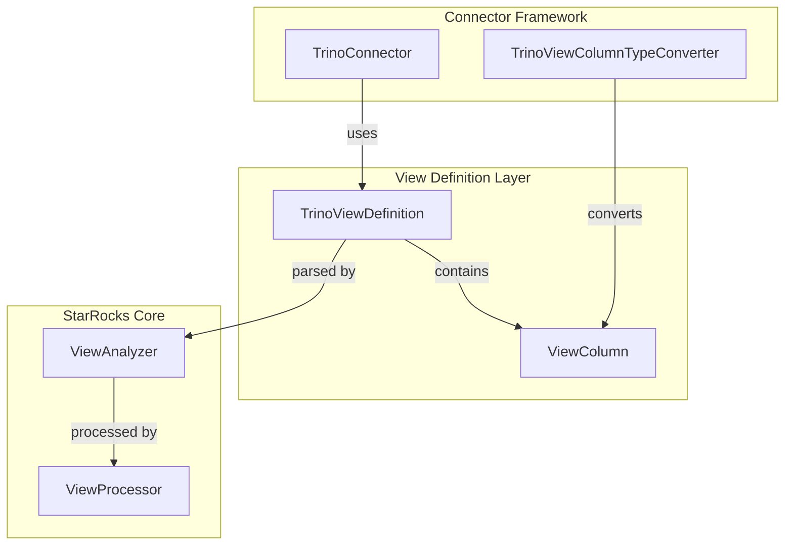
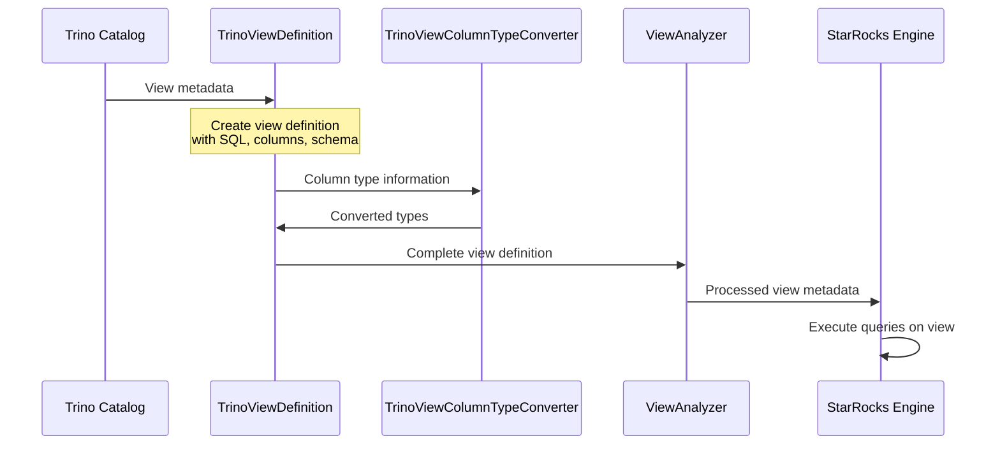
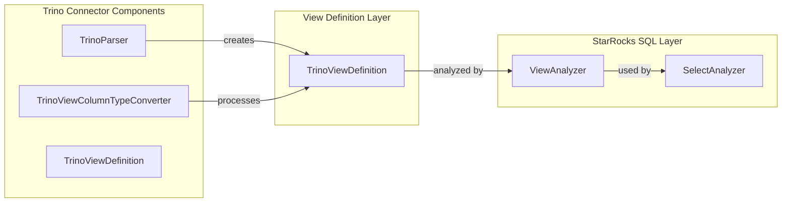
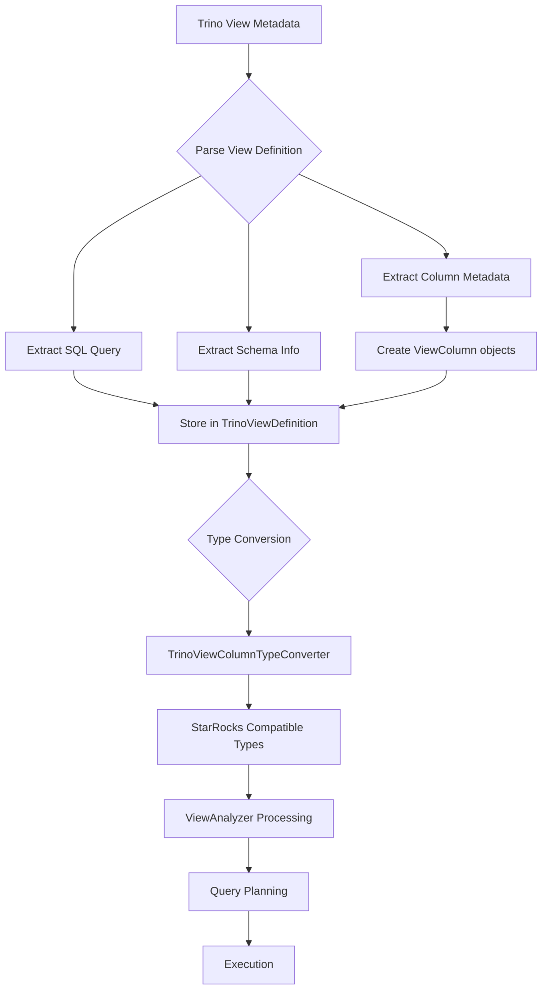

# View Definition Layer Module Documentation

## Introduction

The view_definition_layer module is a specialized component within the StarRocks connector framework that handles the representation and management of view definitions from Trino-compatible systems. This module serves as a bridge between Trino view metadata and StarRocks' internal view handling mechanisms, enabling seamless integration and query federation across different SQL engines.

## Core Purpose

The primary purpose of this module is to provide a standardized representation of view definitions that originate from Trino-based systems, allowing StarRocks to understand, parse, and work with views created in Trino environments. This is particularly important in heterogeneous data lake environments where multiple query engines may be used across the same data sources.

## Architecture Overview

### Component Structure



### Data Flow Architecture



## Core Components

### TrinoViewDefinition

The `TrinoViewDefinition` class is the central component of this module, serving as a data container for view metadata from Trino systems. It encapsulates all essential information needed to represent a view in a way that StarRocks can understand and work with.

#### Key Attributes:

- **originalSql**: The original SQL query that defines the view
- **catalog**: The catalog name where the view resides
- **schema**: The schema name within the catalog
- **columns**: List of view columns with their metadata
- **comment**: Optional description of the view
- **owner**: The user/entity that owns the view
- **runAsInvoker**: Security flag indicating execution context

#### Serialization Support:

The class uses Gson annotations (`@SerializedName`) to ensure proper serialization and deserialization, which is crucial for:
- Metadata persistence
- Cross-system communication
- View definition caching

### ViewColumn

The nested `ViewColumn` class represents individual columns within a view definition:

- **name**: Column identifier
- **type**: Data type representation (as string)
- **comment**: Optional column description

## Integration Points

### Connector Framework Integration

The view_definition_layer integrates with the broader connector framework through several key interfaces:



### Type System Integration

The module works closely with type conversion components to ensure that Trino-specific data types are properly mapped to StarRocks' internal type system. This integration is handled through the [trino_view_support](trino_view_support.md) module's type conversion layer.

## Data Processing Flow

### View Definition Processing Pipeline



### Column Type Resolution

The module handles complex type resolution scenarios:

1. **Primitive Types**: Direct mapping between Trino and StarRocks primitive types
2. **Complex Types**: Array, Map, and Struct type handling through type converters
3. **Custom Types**: User-defined type resolution through extension points

## Security and Access Control

### View Ownership and Execution Context

The `runAsInvoker` flag in `TrinoViewDefinition` plays a crucial role in security:

- **true**: View executes with the privileges of the calling user
- **false**: View executes with the privileges of the view owner

This security model integrates with StarRocks' authorization framework through the [authentication_authorization](authentication_authorization.md) module.

## Performance Considerations

### Metadata Caching

View definitions are designed to be cached efficiently:

- **Immutable Design**: All fields are final, ensuring thread-safety
- **Serializable**: Gson annotations enable efficient serialization
- **Lightweight**: Minimal memory footprint for metadata storage

### Query Optimization

The module supports query optimization through:

- **Column Pruning**: Only necessary columns are processed
- **Type Information**: Complete type metadata enables better optimization
- **Schema Awareness**: Catalog and schema information for partition pruning

## Error Handling and Validation

### Validation Points

The module includes validation at multiple levels:

1. **Syntax Validation**: SQL query validation during parsing
2. **Type Validation**: Column type compatibility checking
3. **Schema Validation**: Catalog and schema existence verification
4. **Permission Validation**: Access control verification

### Error Recovery

Common error scenarios and recovery mechanisms:

- **Invalid SQL**: Graceful degradation with detailed error messages
- **Type Mismatches**: Fallback to compatible types or explicit error
- **Missing Schema**: Deferred validation until query execution

## Extension Points

### Custom Type Converters

The module can be extended with custom type converters for specialized data types:

```java
// Extension point for custom type handling
public interface ViewColumnTypeConverter {
    String convertType(String trinoType);
}
```

### View Definition Enhancers

Additional metadata can be attached through extension mechanisms:

- **Custom Properties**: Additional key-value pairs
- **Lineage Information**: Data lineage tracking
- **Statistics**: View-level statistics integration

## Testing and Quality Assurance

### Unit Testing Strategy

The module is designed for comprehensive testing:

- **Serialization Tests**: Verify Gson serialization/deserialization
- **Type Conversion Tests**: Validate type mapping accuracy
- **Integration Tests**: End-to-end view processing validation

### Performance Testing

Performance validation includes:

- **Metadata Loading**: Large view catalog performance
- **Memory Usage**: Memory efficiency under load
- **Concurrent Access**: Thread-safety validation

## Future Enhancements

### Planned Features

1. **View Lineage Tracking**: Enhanced metadata for data lineage
2. **Incremental Updates**: Support for incremental view metadata updates
3. **Cross-Engine Optimization**: Query optimization across multiple engines
4. **Materialized View Integration**: Support for materialized view definitions

### Scalability Improvements

- **Distributed Metadata**: Support for distributed view metadata storage
- **Lazy Loading**: On-demand view definition loading
- **Caching Strategies**: Advanced caching mechanisms for large deployments

## Related Modules

The view_definition_layer module interacts with several other system components:

- **[trino_parser](trino_parser.md)**: SQL parsing and AST generation
- **[trino_view_support](trino_view_support.md)**: Type conversion and view utilities
- **[connector_framework](connector_framework.md)**: General connector infrastructure
- **[sql_parser_optimizer](sql_parser_optimizer.md)**: Query analysis and optimization
- **[authentication_authorization](authentication_authorization.md)**: Security and access control

## Conclusion

The view_definition_layer module serves as a critical bridge between Trino-based view definitions and StarRocks' query processing engine. Its design emphasizes compatibility, performance, and extensibility, enabling seamless integration of heterogeneous data lake environments while maintaining the performance and reliability characteristics expected from StarRocks.