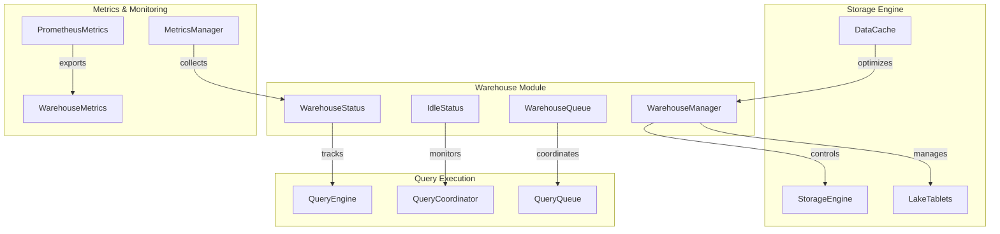
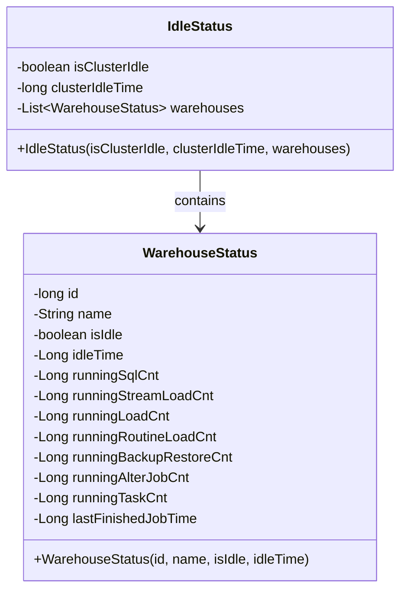
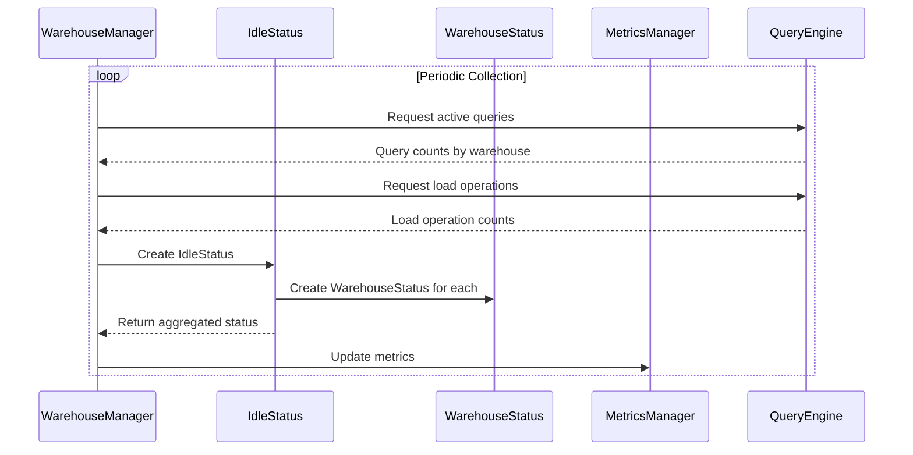
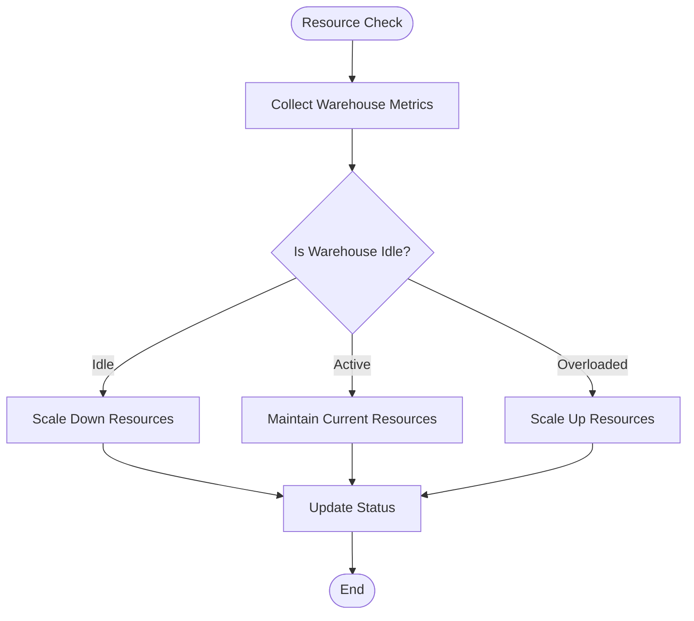
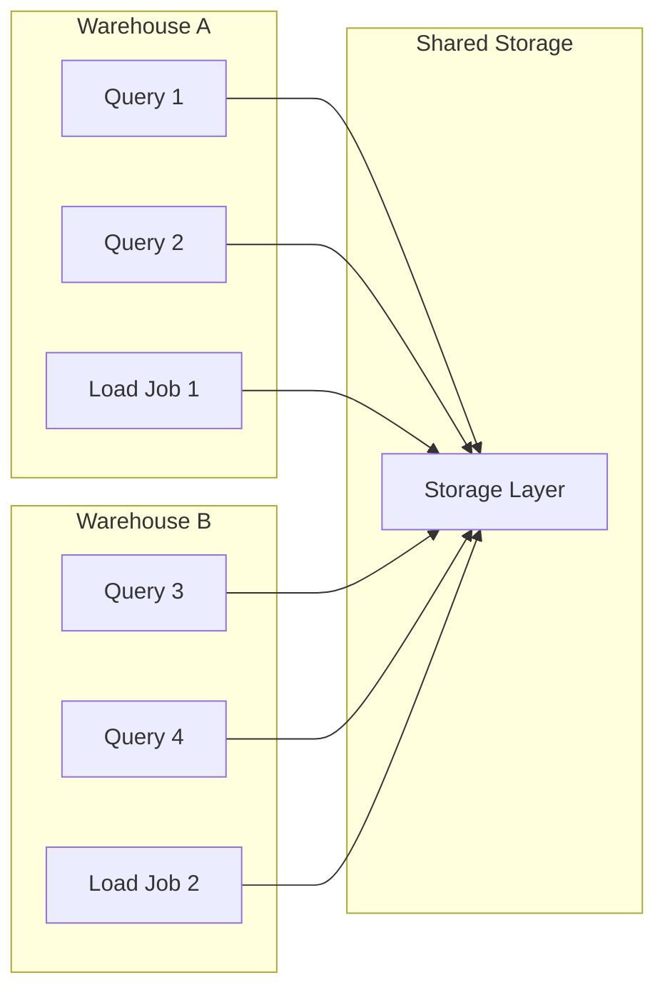

# Warehouse Module Documentation

## Introduction

The Warehouse module in StarRocks provides comprehensive resource management and isolation capabilities for multi-tenant environments. It enables organizations to manage compute resources efficiently by creating isolated warehouse instances that can handle different workloads independently. The module tracks resource utilization, manages idle status monitoring, and provides the foundation for elastic scaling and cost optimization in cloud-native deployments.

## Architecture Overview

The warehouse module serves as a central component for resource management in StarRocks, integrating with multiple subsystems including query execution, storage management, and cluster coordination. The architecture is designed to support both on-premises and cloud deployments with elastic scaling capabilities.

## Core Components

### WarehouseStatus

The `WarehouseStatus` class is the primary data structure that represents the current state of a warehouse instance. It provides comprehensive tracking of resource utilization and activity metrics.

### IdleStatus

The `IdleStatus` class provides cluster-wide idle detection and warehouse-specific status aggregation. It enables intelligent resource management decisions based on actual usage patterns.

## Data Flow

### Warehouse Status Collection

### Resource Management Flow

## Integration Points

### Query Execution Integration

The warehouse module integrates with the query execution system through the [query_execution](query_execution.md) module:

- **Query Coordination**: Warehouse status affects query scheduling decisions
- **Resource Allocation**: Query engines respect warehouse resource limits
- **Queue Management**: Query queues are warehouse-aware for proper isolation

### Storage Engine Integration

Integration with the [storage_engine](storage_engine.md) module provides:

- **Lake Storage Management**: Warehouse-specific tablet management
- **Compaction Coordination**: Idle warehouses trigger compaction operations
- **Cache Management**: Warehouse-aware data caching strategies

### Metrics and Monitoring

The module integrates with [metrics](metrics.md) systems:

- **Prometheus Export**: Warehouse metrics are exposed for monitoring
- **Resource Group Metrics**: Integration with resource group monitoring
- **Query Performance**: Warehouse-specific query performance tracking

## Key Features

### 1. Multi-Tenant Resource Isolation

### 2. Idle Detection and Auto-Scaling

The warehouse module provides intelligent idle detection based on multiple criteria:

- **Query Activity**: Number of running SQL queries
- **Load Operations**: Stream loads, batch loads, and routine loads
- **Background Tasks**: Backup/restore operations and schema changes
- **Time-based Idle**: Configurable idle timeout thresholds

### 3. Resource Usage Tracking

Comprehensive tracking of:

- **Compute Resources**: CPU and memory utilization
- **Storage Resources**: Data size and growth patterns
- **Network Resources**: Data transfer metrics
- **Query Patterns**: Query types and frequency analysis

## Configuration and Management

### Warehouse Configuration

Warehouses can be configured with:

- **Resource Limits**: CPU, memory, and concurrency limits
- **Scaling Policies**: Auto-scaling rules and thresholds
- **Idle Timeouts**: Time-based resource reclamation
- **Priority Settings**: Query priority and resource allocation

### Monitoring and Alerting

The module supports:

- **Real-time Metrics**: Live warehouse status monitoring
- **Historical Analysis**: Trend analysis and capacity planning
- **Alert Integration**: Integration with external monitoring systems
- **Cost Optimization**: Resource usage optimization recommendations

## Dependencies

### Internal Dependencies

- **[query_execution](query_execution.md)**: Query coordination and execution management
- **[storage_engine](storage_engine.md)**: Storage resource management
- **[metrics](metrics.md)**: Performance monitoring and metrics collection
- **[frontend_server](frontend_server.md)**: Cluster management and coordination

### External Dependencies

- **Cloud Storage**: Integration with cloud object storage systems
- **Monitoring Systems**: Prometheus, Grafana, and other monitoring tools
- **Resource Orchestration**: Kubernetes and cloud-native orchestration platforms

## Best Practices

### 1. Warehouse Sizing

- Size warehouses based on expected concurrent query load
- Consider data volume and complexity for resource allocation
- Monitor actual usage patterns and adjust accordingly

### 2. Idle Management

- Set appropriate idle timeouts based on usage patterns
- Configure auto-scaling policies for cost optimization
- Monitor idle status to identify optimization opportunities

### 3. Resource Isolation

- Separate analytical and operational workloads
- Use dedicated warehouses for critical applications
- Implement proper resource quotas and limits

## Performance Considerations

### Status Collection Overhead

- Status collection is designed to be lightweight
- Metrics are aggregated to minimize collection frequency
- Background processes handle status updates asynchronously

### Memory Usage

- Warehouse status objects are kept in memory for fast access
- Historical data is periodically archived to reduce memory footprint
- Garbage collection is optimized for warehouse lifecycle management

### Scalability

- The module supports hundreds of concurrent warehouses
- Status aggregation is parallelized for large deployments
- Resource management scales with cluster size

## Future Enhancements

### Planned Features

- **Predictive Scaling**: ML-based resource prediction and auto-scaling
- **Cost Analytics**: Detailed cost analysis and optimization recommendations
- **Cross-Region Support**: Multi-region warehouse management
- **Serverless Integration**: Native serverless compute integration

### API Extensions

- RESTful API for warehouse management
- GraphQL interface for complex queries
- Webhook support for real-time notifications
- Integration with infrastructure-as-code tools

## Conclusion

The Warehouse module provides a robust foundation for resource management in StarRocks, enabling efficient multi-tenant deployments with intelligent resource allocation and cost optimization. Its integration with query execution, storage management, and monitoring systems creates a comprehensive solution for enterprise-scale data warehouse operations.