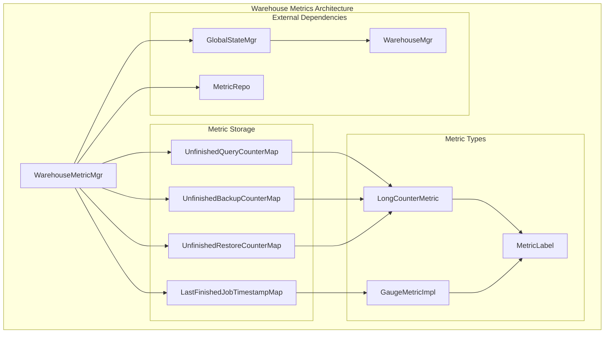
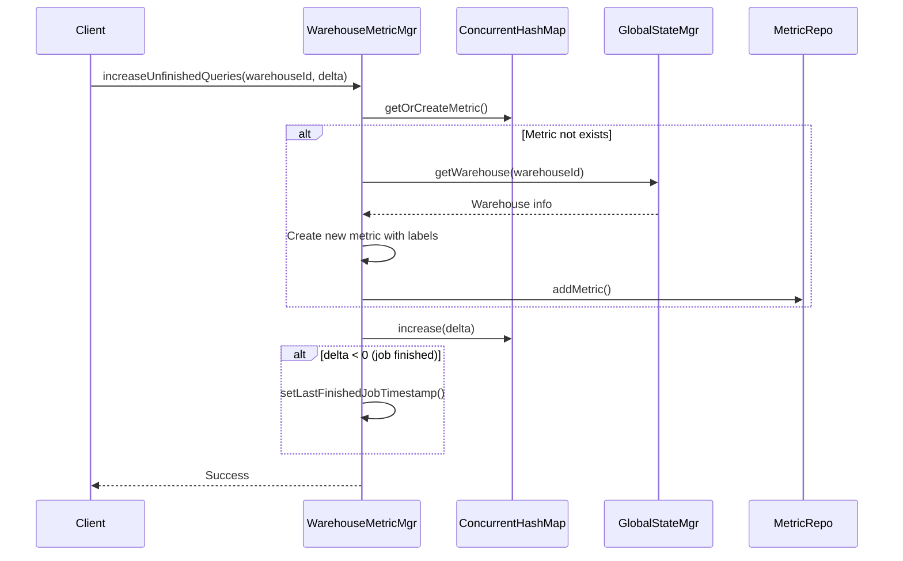
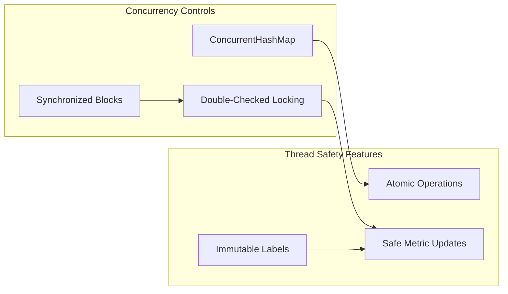

# Warehouse Metrics Module

## Introduction

The warehouse_metrics module provides comprehensive monitoring and metrics collection capabilities for StarRocks warehouse operations. It tracks key performance indicators including unfinished queries, backup/restore jobs, and job completion timestamps across all warehouses in the system. This module serves as a critical component for system observability, resource management, and operational monitoring.

## Architecture Overview

The warehouse_metrics module implements a centralized metrics management system that maintains per-warehouse counters and gauges for tracking operational state. The architecture follows a singleton pattern with thread-safe concurrent data structures to handle high-throughput metric updates from multiple warehouse operations.



## Core Components

### WarehouseMetricMgr

The `WarehouseMetricMgr` class serves as the central manager for all warehouse-related metrics. It implements a thread-safe singleton pattern and provides static methods for metric operations.

**Key Responsibilities:**
- Manage per-warehouse metric counters and gauges
- Handle metric lifecycle (creation, updates, retrieval)
- Coordinate with GlobalStateMgr for warehouse information
- Integrate with the system-wide MetricRepo

**Core Methods:**
- `increaseUnfinishedQueries()`: Updates query counter for a warehouse
- `increaseUnfinishedBackupJobs()`: Updates backup job counter
- `increaseUnfinishedRestoreJobs()`: Updates restore job counter
- `getUnfinishedQueries()`: Retrieves current query counts
- `getLastFinishedJobTimestampMs()`: Retrieves completion timestamps

## Data Flow Architecture



## Metric Types and Labels

### Supported Metrics

1. **Unfinished Queries Counter**
   - Type: LongCounterMetric
   - Unit: REQUESTS
   - Description: Current unfinished queries of the warehouse
   - Labels: warehouse_id, warehouse_name

2. **Unfinished Backup Jobs Counter**
   - Type: LongCounterMetric
   - Unit: REQUESTS
   - Description: Current unfinished backup jobs of the warehouse
   - Labels: warehouse_id, warehouse_name

3. **Unfinished Restore Jobs Counter**
   - Type: LongCounterMetric
   - Unit: REQUESTS
   - Description: Current unfinished restore jobs of the warehouse
   - Labels: warehouse_id, warehouse_name

4. **Last Finished Job Timestamp**
   - Type: GaugeMetricImpl<Long>
   - Unit: MICROSECONDS
   - Description: Timestamp of last finished job
   - Labels: warehouse_id, warehouse_name

### Label Management

Each metric is automatically labeled with:
- `warehouse_id`: Unique identifier of the warehouse
- `warehouse_name`: Human-readable name of the warehouse (retrieved from GlobalStateMgr)

## Thread Safety and Concurrency

The module implements several concurrency control mechanisms:



**Key Concurrency Features:**
- **ConcurrentHashMap**: Used for all metric storage maps
- **Double-Checked Locking**: Prevents race conditions during metric creation
- **Synchronized Blocks**: Protect critical sections during metric initialization
- **Atomic Operations**: Metric value updates are thread-safe

## Integration Points

### GlobalStateMgr Integration

The module integrates with GlobalStateMgr to retrieve warehouse information:

```java
Warehouse wh = GlobalStateMgr.getCurrentState().getWarehouseMgr().getWarehouse(warehouseId);
String whName = wh == null ? "unknown" : wh.getName();
```

### MetricRepo Integration

All metrics are registered with the system-wide MetricRepo:

```java
MetricRepo.addMetric(metric);
```

## Operational Monitoring

### Metric Collection Patterns

The module supports two primary operational patterns:

1. **Incremental Updates**: Positive deltas indicate new operations starting
2. **Completion Tracking**: Negative deltas indicate operations completing, triggering timestamp updates

### Error Handling

- **Missing Warehouses**: Gracefully handles cases where warehouse information is unavailable
- **Unknown Warehouse Names**: Defaults to "unknown" when warehouse lookup fails
- **Concurrent Access**: Thread-safe operations prevent data corruption

## Performance Characteristics

### Memory Management
- **Lazy Initialization**: Metrics are created only when needed
- **Concurrent Data Structures**: Minimize lock contention
- **Efficient Lookups**: O(1) complexity for metric operations

### Scalability Considerations
- **Per-Warehouse Isolation**: Each warehouse maintains independent metrics
- **Concurrent Access**: Supports high-throughput metric updates
- **Memory Efficiency**: Minimal overhead per warehouse metric

## Dependencies

### Internal Dependencies
- **GlobalStateMgr**: Provides warehouse management and metadata
- **MetricRepo**: System-wide metric registry
- **Warehouse**: Warehouse entity representation

### Related Modules
- [resource_group_metrics](resource_group_metrics.md): Related metrics for resource groups
- [metrics](metrics.md): Base metric infrastructure
- [warehouse](warehouse.md): Warehouse management system

## Usage Examples

### Basic Metric Updates

```java
// Increment unfinished queries
WarehouseMetricMgr.increaseUnfinishedQueries(warehouseId, 1L);

// Decrement when query completes (automatically updates timestamp)
WarehouseMetricMgr.increaseUnfinishedQueries(warehouseId, -1L);
```

### Retrieving Current Metrics

```java
// Get all unfinished query counts
Map<Long, Long> unfinishedQueries = WarehouseMetricMgr.getUnfinishedQueries();

// Get last finished job timestamps
Map<Long, Long> timestamps = WarehouseMetricMgr.getLastFinishedJobTimestampMs();
```

## Monitoring and Observability

The warehouse_metrics module provides essential visibility into:

- **Resource Utilization**: Track query load per warehouse
- **Job Progress**: Monitor backup and restore operations
- **System Health**: Identify warehouses with long-running operations
- **Performance Analysis**: Correlate metrics with system performance

This comprehensive monitoring capability enables proactive system management and helps maintain optimal warehouse performance across the StarRocks cluster.