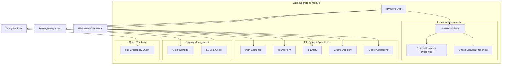
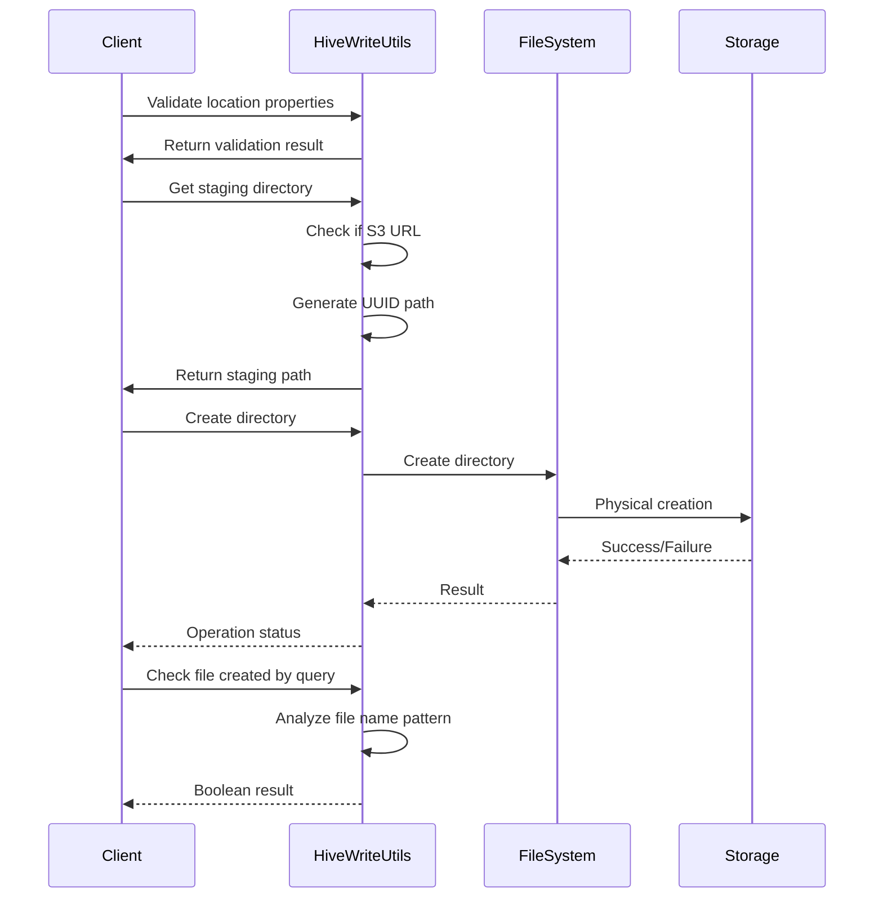

# Write Operations Module Documentation

## Introduction

The write_operations module is a critical component of the StarRocks connector framework, specifically designed to handle write operations for Hive tables. This module provides essential utilities for managing file system operations, validating write locations, and ensuring data integrity during write processes. It serves as the foundation for reliable data ingestion into Hive tables from StarRocks.

## Module Architecture

### Core Components

The module is built around the `HiveWriteUtils` class, which provides a comprehensive set of static utility methods for handling various aspects of write operations:

- **Location Validation**: Ensures proper configuration of external and managed table locations
- **File System Operations**: Handles directory creation, file existence checks, and cleanup operations
- **Staging Directory Management**: Manages temporary staging areas for write operations
- **Query Identification**: Tracks files created by specific queries for cleanup and debugging

### Architecture Overview



## Component Details

### Location Validation

The location validation component ensures that Hive tables are created with appropriate location properties:

- **External Location Validation**: Prevents creation of non-managed Hive tables with external location properties
- **Managed Table Validation**: Ensures external tables have the required external_location property
- **Property Consistency**: Maintains consistency between table type and location configuration

### File System Operations

This component provides robust file system interaction capabilities:

- **Path Existence Checking**: Verifies if paths exist before operations
- **Directory Validation**: Confirms whether paths are directories
- **Empty Directory Detection**: Checks if directories contain files
- **Directory Creation**: Creates directories with proper error handling
- **Safe Deletion**: Implements safe file and directory deletion with existence checks

### Staging Directory Management

Manages temporary staging areas for write operations:

- **S3-Aware Staging**: Handles special staging logic for S3-compatible storage systems
- **UUID-Based Naming**: Uses UUIDs to create unique staging directories
- **Path Normalization**: Ensures consistent path formatting with trailing slashes

### Query Tracking

Provides mechanisms to track files created by specific queries:

- **Query ID Validation**: Validates query ID format and length
- **File Name Pattern Matching**: Identifies files created by specific queries
- **Cleanup Support**: Enables targeted cleanup of files from failed queries

## Data Flow



## Integration with Other Modules

### Connector Framework Integration

The write_operations module integrates with the broader connector framework:

- **Hive Connector**: Provides write utilities for the [hive_connector](hive_connector.md) module
- **File System Abstraction**: Works with various file systems through the [filesystem](filesystem.md) module
- **Error Handling**: Leverages the connector exception framework for consistent error reporting

### Storage Engine Integration

The module interacts with storage components:

- **Lake Storage**: Supports write operations for lakehouse storage through [lake_storage](lake_storage.md)
- **File Systems**: Integrates with multiple file system implementations in [file_systems](file_systems.md)

## Error Handling and Validation

### Exception Management

The module implements comprehensive error handling:

- **DdlException**: Used for DDL-related validation errors
- **StarRocksConnectorException**: Handles connector-specific errors
- **IOException**: Manages file system operation failures
- **FileNotFoundException**: Specifically handles missing file scenarios

### Validation Strategies

- **Pre-operation Validation**: Checks conditions before performing operations
- **Post-operation Verification**: Confirms operation success
- **Graceful Degradation**: Handles partial failures appropriately
- **Logging**: Comprehensive logging for debugging and monitoring

## Performance Considerations

### Optimization Strategies

- **Lazy FileSystem Creation**: Creates FileSystem instances only when needed
- **Exception-Based Flow Control**: Uses exceptions for control flow in error scenarios
- **UUID Generation**: Efficient UUID-based naming for staging directories
- **Batch Operations**: Supports batch deletion operations

### Resource Management

- **FileSystem Lifecycle**: Proper FileSystem instance management
- **Error Recovery**: Automatic cleanup on operation failures
- **Memory Efficiency**: Minimal memory footprint for utility operations

## Security Considerations

### Access Control

- **FileSystem Permissions**: Respects underlying file system permissions
- **Path Validation**: Prevents path traversal attacks
- **External Location Restrictions**: Enforces security policies for external locations

### Data Integrity

- **Atomic Operations**: Ensures atomic directory creation
- **Existence Verification**: Confirms file existence before operations
- **Safe Deletion**: Implements safe deletion patterns

## Usage Examples

### Basic Directory Operations

```java
// Check if path exists
boolean exists = HiveWriteUtils.pathExists(path, configuration);

// Create directory if it doesn't exist
if (!exists) {
    HiveWriteUtils.createDirectory(path, configuration);
}

// Check if directory is empty
boolean isEmpty = HiveWriteUtils.isEmpty(path, configuration);
```

### Staging Directory Management

```java
// Get staging directory for table
String stagingDir = HiveWriteUtils.getStagingDir(hiveTable, ".tmp");

// The staging directory will be either:
// - Table location for S3 URLs
// - UUID-based subdirectory for other file systems
```

### Query-Based File Tracking

```java
// Check if file was created by specific query
boolean createdByQuery = HiveWriteUtils.fileCreatedByQuery(fileName, queryId);

// Use for cleanup or debugging purposes
if (createdByQuery) {
    // File belongs to this query
}
```

## Future Enhancements

### Planned Improvements

- **Enhanced S3 Support**: Improved handling of S3-specific operations
- **Performance Metrics**: Addition of performance monitoring capabilities
- **Extended Validation**: More comprehensive location validation
- **Batch Operations**: Enhanced support for bulk operations

### Scalability Considerations

- **Concurrent Operations**: Thread-safe operations for concurrent access
- **Large Directory Handling**: Optimized handling of directories with many files
- **Network Storage**: Enhanced support for network-based storage systems

## Related Documentation

- [Hive Connector](hive_connector.md) - Main Hive connector documentation
- [File Systems](file_systems.md) - File system abstraction layer
- [Lake Storage](lake_storage.md) - Lakehouse storage integration
- [Connector Framework](connector_framework.md) - General connector framework
- [Storage Engine](storage_engine.md) - Core storage engine documentation