<OVERVIEW>
# Built-in RL Algorithms

## Purpose

The `Built-in_RL_Algorithms` module provides the concrete, production-ready reinforcement learning algorithm implementations shipped with the ML-Agents Toolkit: **PPO** (Proximal Policy Optimization), **SAC** (Soft Actor-Critic), and **POCA** (MA-POCA, Multi-Agent POsthumous Credit Assignment). Each algorithm is implemented as a pair of cooperating classes — a `Trainer` subclass that manages experience collection, trajectory processing, and update scheduling, and an `Optimizer` subclass that implements the algorithm-specific loss functions and performs the neural network gradient updates.

These three algorithms cover the primary reinforcement learning paradigms supported out-of-the-box:

- **PPO** — on-policy, single/multi-agent actor-critic with a clipped surrogate objective; the default and most general-purpose algorithm.
- **SAC** — off-policy, maximum-entropy actor-critic with a replay buffer and twin Q-networks; more sample-efficient, especially for continuous control.
- **POCA** — on-policy, cooperative multi-agent extension of the PPO approach with a centralized attention-based critic and counterfactual baseline for proper credit assignment among teammates.

The module builds directly on the generic scaffolding provided by [Training Orchestration & Lifecycle Infrastructure](trainers_trainer_base.md) (`Trainer`, `RLTrainer`, `OnPolicyTrainer`, `OffPolicyTrainer`, `TrainerFactory`) and [trainers_optimizer](trainers_optimizer.md) (`Optimizer`, `TorchOptimizer`), and consumes neural network building blocks from [Neural Network Building Blocks](trainers_torch_entities.md) (networks, encoders, distributions, reward providers). It is registered with, and instantiated by, the `TrainerFactory` based on the `trainer_type` specified in a behavior's YAML configuration.

## Architecture

```mermaid
graph TB
    subgraph Built_in_RL_Algorithms["Built-in RL Algorithms"]
        subgraph PPO["trainers_ppo"]
            PPOTrainer
            TorchPPOOptimizer
            PPOSettings
        end
        subgraph SAC["trainers_sac"]
            SACTrainer
            TorchSACOptimizer
            SACSettings
        end
        subgraph POCA["trainers_poca"]
            POCATrainer
            TorchPOCAOptimizer
            POCAValueNetwork
            POCASettings
        end
    end

    subgraph Base["trainers_trainer_base"]
        Trainer
        RLTrainer
        OnPolicyTrainer
        OffPolicyTrainer
        TrainerFactory
    end

    subgraph OptBase["trainers_optimizer"]
        Optimizer
        TorchOptimizer
    end

    subgraph Policy["trainers_policy"]
        TorchPolicy
    end

    subgraph Networks["trainers_torch_entities_networks"]
        ValueNetwork
        SimpleActor
        SharedActorCritic
        MultiAgentNetworkBody
    end

    subgraph DataPipeline["trainers_core_data_pipeline"]
        AgentBuffer
        Trajectory
    end

    subgraph Components["trainers_torch_components_reward_providers"]
        RewardProviders
    end

    TrainerFactory -->|instantiates| PPOTrainer
    TrainerFactory -->|instantiates| SACTrainer
    TrainerFactory -->|instantiates| POCATrainer

    PPOTrainer -->|extends| OnPolicyTrainer
    POCATrainer -->|extends| OnPolicyTrainer
    SACTrainer -->|extends| OffPolicyTrainer
    OnPolicyTrainer -->|extends| RLTrainer
    OffPolicyTrainer -->|extends| RLTrainer
    RLTrainer -->|extends| Trainer

    PPOTrainer -->|creates| TorchPPOOptimizer
    SACTrainer -->|creates| TorchSACOptimizer
    POCATrainer -->|creates| TorchPOCAOptimizer

    TorchPPOOptimizer -->|extends| TorchOptimizer
    TorchSACOptimizer -->|extends| TorchOptimizer
    TorchPOCAOptimizer -->|extends| TorchOptimizer
    TorchOptimizer -->|extends| Optimizer

    PPOTrainer -->|creates| TorchPolicy
    SACTrainer -->|creates| TorchPolicy
    POCATrainer -->|creates| TorchPolicy

    TorchPPOOptimizer -->|uses| ValueNetwork
    TorchSACOptimizer -->|uses twin| ValueNetwork
    TorchPOCAOptimizer -->|contains| POCAValueNetwork
    POCAValueNetwork -->|uses| MultiAgentNetworkBody

    PPOTrainer -->|actor| SimpleActor
    PPOTrainer -.optional shared critic.-> SharedActorCritic
    SACTrainer -->|actor tanh-squashed| SimpleActor
    POCATrainer -->|decentralized actor| SimpleActor

    PPOTrainer -->|reads/writes| AgentBuffer
    SACTrainer -->|reads/writes| AgentBuffer
    POCATrainer -->|reads/writes| AgentBuffer
    PPOTrainer -->|consumes| Trajectory
    SACTrainer -->|consumes| Trajectory
    POCATrainer -->|consumes| Trajectory

    TorchPPOOptimizer -->|evaluates| RewardProviders
    TorchSACOptimizer -->|evaluates| RewardProviders
    TorchPOCAOptimizer -->|evaluates, forces extrinsic groupmate rewards| RewardProviders
```



## Algorithm Comparison

| Algorithm | Learning style | Trainer base | Key network(s) | Distinctive mechanism |
|---|---|---|---|---|
| **PPO** | On-policy | `OnPolicyTrainer` | `ValueNetwork` or `SharedActorCritic` | Clipped surrogate objective + GAE advantages |
| **SAC** | Off-policy | `OffPolicyTrainer` | Twin `ValueNetwork` (Q1/Q2) + target network | Replay buffer, automatic entropy tuning, soft target updates |
| **POCA** | On-policy, multi-agent | `OnPolicyTrainer` | `POCAValueNetwork` (attention-based `MultiAgentNetworkBody`) | Centralized critic + counterfactual baseline for credit assignment |

## Sequence: Generic Training Cycle

```mermaid
sequenceDiagram
    participant Env as Environment / AgentManager
    participant Trainer as {PPO|SAC|POCA}Trainer
    participant Opt as Torch{PPO|SAC|POCA}Optimizer
    participant Net as Critic/Value Network(s)
    participant Buf as AgentBuffer

    Env->>Trainer: Trajectory
    Trainer->>Trainer: _process_trajectory()
    Trainer->>Opt: value/baseline estimates
    Opt->>Net: forward pass
    Net-->>Opt: values, memories
    Trainer->>Buf: append processed experience
    Note over Trainer,Buf: PPO/POCA wait for buffer_size;<br/>SAC updates every steps_per_update
    Trainer->>Opt: update(minibatch, num_sequences)
    Opt->>Opt: compute algorithm-specific losses
    Opt->>Opt: backprop + optimizer step
    Opt-->>Trainer: update stats (losses, LR, etc.)
```

## Core Components Documentation

- **[trainers_ppo](trainers_ppo.md)** — `PPOTrainer`, `TorchPPOOptimizer`, `PPOSettings`: the default on-policy algorithm implementing GAE-based advantage estimation and the clipped PPO objective.
- **[trainers_sac](trainers_sac.md)** — `SACTrainer`, `TorchSACOptimizer`, `SACSettings`: the off-policy, replay-buffer-based algorithm with twin Q-networks and automatic entropy tuning.
- **[trainers_poca](trainers_poca.md)** — `POCATrainer`, `TorchPOCAOptimizer`, `POCAValueNetwork`, `POCASettings`: the cooperative multi-agent algorithm with a centralized attention-based critic and counterfactual baseline, further documented in its own sub-pages (`trainers_poca_trainer`, `trainers_poca_optimizer`).

### Related Modules

- [Training_Orchestration_&_Lifecycle_Infrastructure](trainers_trainer_base.md) — supplies the base `Trainer`/`RLTrainer`/`OnPolicyTrainer`/`OffPolicyTrainer` classes and the `TrainerFactory` used to instantiate these algorithms.
- [Neural_Network_Building_Blocks](trainers_torch_entities.md) — supplies the networks, encoders, distributions, and reward providers consumed by all three algorithms.
- [Extensible_RL_Algorithm_Plugins](trainer_plugin_a2c.md) — demonstrates how additional algorithms (A2C, DQN) can be added externally following the same `Trainer`/`Optimizer` extension pattern established by this module.