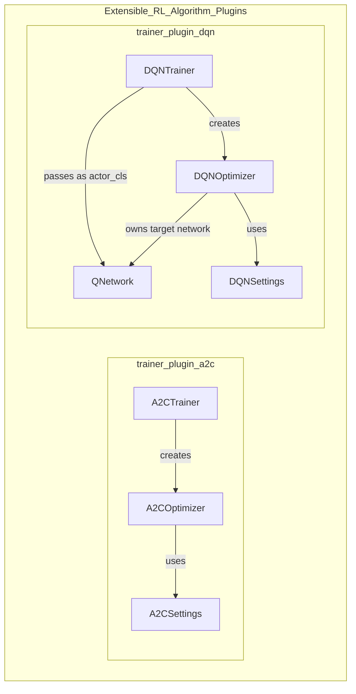
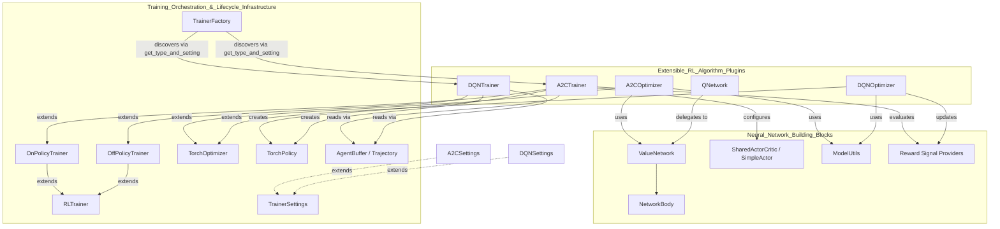
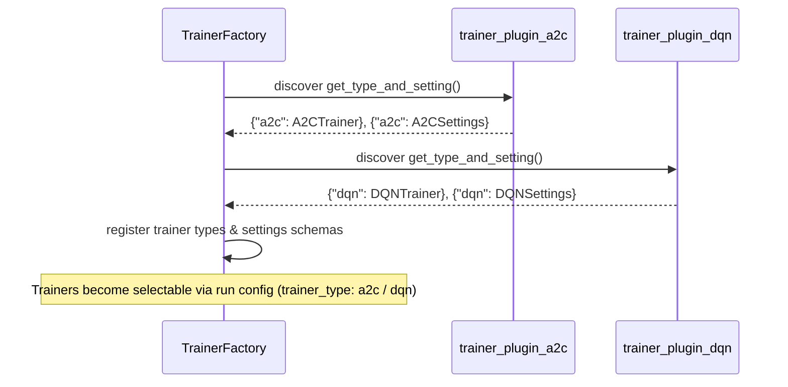

# Extensible RL Algorithm Plugins

## 1. Purpose

The `Extensible_RL_Algorithm_Plugins` module (`ml-agents-trainer-plugin/mlagents_trainer_plugin`) demonstrates and provides the **out-of-tree plugin mechanism** for adding new reinforcement learning algorithms to the ML-Agents Toolkit without modifying the core `mlagents` package.

It contains two fully-worked example trainer plugins:

- **A2C (Advantage Actor-Critic)** — an on-policy, policy-gradient algorithm.
- **DQN (Deep Q-Network)** — an off-policy, value-based algorithm for discrete action spaces.

Both plugins reuse the core training infrastructure (`Trainer`, `RLTrainer`, `OnPolicyTrainer`/`OffPolicyTrainer`, `TorchOptimizer`, `TorchPolicy`) and the shared neural-network building blocks (`NetworkBody`, `ValueNetwork`, `ValueHeads`, `ModelUtils`, reward-signal providers) documented in the core `ml-agents/mlagents/trainers` package. Each plugin exposes a module-level `get_type_and_setting()` function that is discovered by the core `TrainerFactory`, allowing the trainer type (e.g. `"a2c"`, `"dqn"`) and its settings schema to be registered dynamically at runtime — the canonical pattern for extending ML-Agents with custom algorithms.

## 2. Architecture

### 2.1 Module Composition

### 2.2 Integration with Core Training Infrastructure

### 2.3 Plugin Registration Flow

## 3. Sub-modules & Core Components

| Sub-module | Path | Core Components | Summary |
|---|---|---|---|
| **trainer_plugin_a2c** | `ml-agents-trainer-plugin/mlagents_trainer_plugin/a2c` | `A2CTrainer`, `A2COptimizer`, `A2CSettings` | On-policy Advantage Actor-Critic algorithm; single-epoch policy-gradient update with GAE, optional shared actor-critic network, and aggregated multi-reward-signal advantages/returns. Extends `OnPolicyTrainer` / `TorchOptimizer`. |
| **trainer_plugin_dqn** | `ml-agents-trainer-plugin/mlagents_trainer_plugin/dqn` | `QNetwork`, `DQNOptimizer`, `DQNSettings`, `DQNTrainer` | Off-policy Deep Q-Network algorithm for discrete actions; combined actor/critic `QNetwork`, epsilon-greedy exploration, Double-DQN-style target computation with soft target updates. Extends `OffPolicyTrainer` / `TorchOptimizer`. |

### References

- [trainer_plugin_a2c](trainer_plugin_a2c.md) — Advantage Actor-Critic plugin implementation.
- [trainer_plugin_dqn](trainer_plugin_dqn.md) — Deep Q-Network plugin implementation.
- [Training_Orchestration_&_Lifecycle_Infrastructure](trainers_core.md) — `Trainer`, `RLTrainer`, `TrainerFactory`, settings schema, and data pipeline consumed by both plugins.
- [Neural_Network_Building_Blocks](trainers_torch_entities_networks.md) — shared network components (`NetworkBody`, `ValueNetwork`, `ValueHeads`, `ModelUtils`, reward signal providers) used by both algorithms.
- [Built-in_RL_Algorithms](trainers_ppo.md) — PPO/SAC/POCA implementations that serve as the architectural reference the plugins mirror.