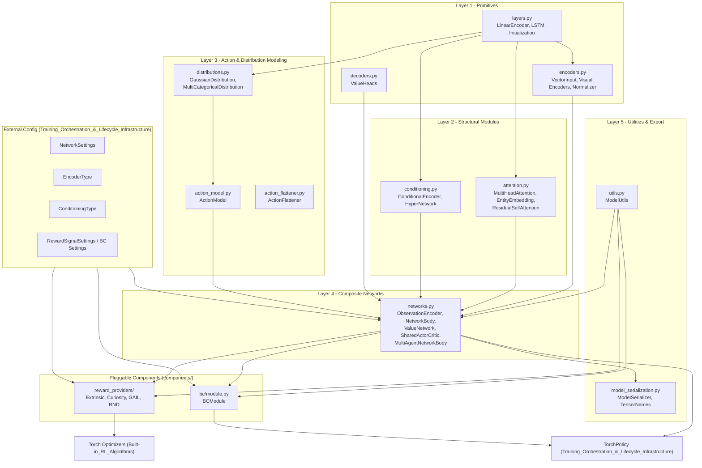
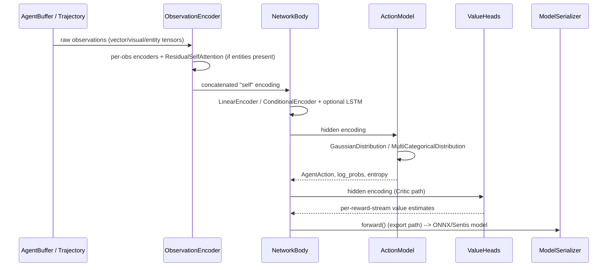

# Neural Network Building Blocks

## 1. Purpose

The `Neural_Network_Building_Blocks` module (`ml-agents/mlagents/trainers/torch_entities`) is the **PyTorch neural-network foundation** of the ML-Agents trainer stack. It provides the reusable, algorithm-agnostic `torch.nn.Module` implementations used to construct agent **Actors** and **Critics**, including:

- Input encoders for vector, visual, and variable-length ("entity") observations
- Self-attention mechanisms for handling variable numbers of entities/teammates
- Conditioning modules (goal-conditioning via HyperNetworks)
- Probability distributions and action sampling/evaluation logic
- Composite network bodies (`NetworkBody`, `ValueNetwork`, `SharedActorCritic`)
- Utility helpers (`ModelUtils`) and model export/serialization tools (ONNX/Sentis)
- Pluggable auxiliary components: Behavioral Cloning and intrinsic/extrinsic reward providers (Curiosity, GAIL, RND, Extrinsic)

This module knows nothing about specific RL algorithms (PPO, SAC, POCA). Instead, it is consumed by:
- **Training_Orchestration_&_Lifecycle_Infrastructure** — `TorchPolicy` instantiates actors/critics from this module.
- **Built-in_RL_Algorithms** (PPO, SAC, POCA) — optimizers build networks and reuse `ModelUtils` loss helpers.
- **Extensible_RL_Algorithm_Plugins** (A2C, DQN) — third-party trainers depend on the same building blocks.

Configuration objects (`NetworkSettings`, `EncoderType`, `ConditioningType`, `RewardSignalSettings`, etc.) that parameterize these networks live in `Training_Orchestration_&_Lifecycle_Infrastructure` and are passed into the constructors documented here.

## 2. Architecture Overview

The module is organized into two major areas: **generic building blocks** (`torch_entities`) and **pluggable components** (`torch_entities/components`) built on top of them.

## 3. Data Flow (Inference / Training)

## 4. Sub-modules & Core Components

| Sub-module | Key Files | Responsibility |
|---|---|---|
| **trainers_torch_entities_layers_encoders** | `layers.py`, `encoders.py`, `decoders.py` | Foundational primitives: `LinearEncoder`, `LSTM`, `Initialization`, vector/visual observation encoders (`VectorInput`, `SimpleVisualEncoder`, `NatureVisualEncoder`, `ResNetVisualEncoder`, `SmallVisualEncoder`), `Normalizer`, and `ValueHeads`. |
| **trainers_torch_entities_attention_conditioning** | `attention.py`, `conditioning.py` | `MultiHeadAttention`, `EntityEmbedding`, `ResidualSelfAttention` for variable-length/multi-agent observations; `ConditionalEncoder`/`HyperNetwork` for goal-conditioning. |
| **trainers_torch_entities_actions** | `action_flattener.py`, `action_model.py`, `distributions.py` | `ActionFlattener`, `ActionModel`, and distribution classes (`GaussianDistribution`, `TanhGaussianDistInstance`, `MultiCategoricalDistribution`, `CategoricalDistInstance`) for sampling/evaluating continuous and discrete actions. |
| **trainers_torch_entities_networks** | `networks.py` | Composite bodies: `ObservationEncoder`, `NetworkBody`, `MultiAgentNetworkBody`, `ValueNetwork`, `SharedActorCritic`, `GlobalSteps`, `LearningRate` — the top-level Actor/Critic implementations consumed by policies and optimizers. |
| **trainers_torch_entities_utils_serialization** | `utils.py`, `model_serialization.py` | `ModelUtils` static helpers (encoder factories, tensor math, trust-region loss helpers) and `ModelSerializer`/`TensorNames` for exporting trained policies to ONNX/Sentis. |
| **trainers_torch_components** (`components/bc`, `components/reward_providers`) | `bc/module.py`, `reward_providers/*.py` | `BCModule` for inline behavioral cloning; `BaseRewardProvider` family (`ExtrinsicRewardProvider`, `CuriosityRewardProvider`/`CuriosityNetwork`, `GAILRewardProvider`/`DiscriminatorNetwork`, `RNDRewardProvider`/`RNDNetwork`) supplying auxiliary/alternative reward signals. |

## 5. Key Design Notes

- **ONNX/Sentis compatibility**: `MultiHeadAttention`, `LSTM`, and `MultiCategoricalDistribution` avoid PyTorch operators unsupported by Unity's Sentis runtime; `model_serialization.py` exposes an `exporting_to_onnx` context to toggle export-safe code paths.
- **Composable observation encoding**: `ObservationEncoder` dynamically assembles encoders per `ObservationSpec`, allocating `ResidualSelfAttention` only when variable-length observations exist.
- **Actor/Critic separation**: Actor-only and Critic-only (`ValueNetwork`) paths can be composed independently or fused into `SharedActorCritic` for shared-trunk algorithms like PPO.
- **Multi-agent support**: `MultiAgentNetworkBody` plus attention modules provide the machinery required by POCA to process a variable number of teammates.
- **Pluggable extensions**: `BCModule` and reward providers are attached to a `TorchPolicy`/`TorchOptimizer` rather than hard-coded into any trainer, enabling combinations such as PPO + GAIL + BC.

## 6. Related Modules

- **Training_Orchestration_&_Lifecycle_Infrastructure** — `TorchPolicy` wraps actor/critic networks from this module; `NetworkSettings`/`RewardSignalSettings` configure it; `AgentBuffer`/`ObsUtil` supply observation batches.
- **Built-in_RL_Algorithms** (PPO, SAC, POCA) — optimizers build networks from this module and call `ModelUtils` for loss computation.
- **Extensible_RL_Algorithm_Plugins** (A2C, DQN) — third-party trainers reuse these same building blocks.