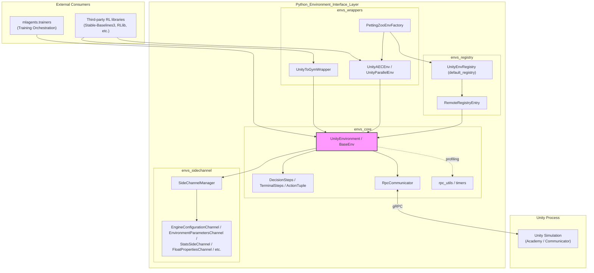
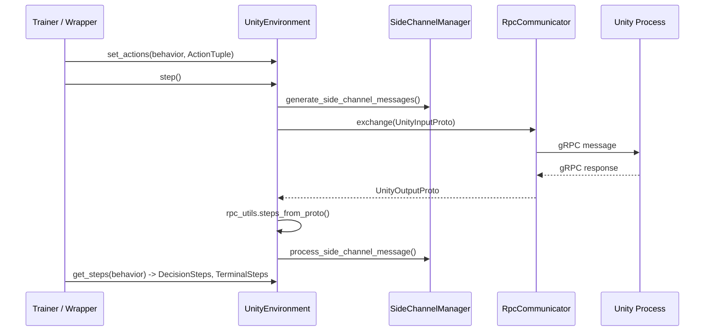

# Python Environment Interface Layer

## 1. Purpose

The `Python_Environment_Interface_Layer` module (`mlagents_envs`) is the Python-side gateway to a running Unity ML-Agents simulation. It provides:

- A **stable public API** (`UnityEnvironment`, `BaseEnv`, `DecisionSteps`/`TerminalSteps`, `ActionTuple`) for stepping, resetting, and exchanging observations/actions with Unity.
- The **transport layer** (gRPC-based `RpcCommunicator` and generated protobuf stubs) that physically carries messages between the Python process and the Unity executable/editor.
- **Side channels** for out-of-band data exchange (engine configuration, environment parameters, statistics, analytics) that runs alongside the main RL step loop.
- **Third-party ecosystem adapters** (OpenAI Gym, PettingZoo) that expose Unity environments through standardized RL interfaces.
- A **registry** of pre-built, downloadable Unity environments for quick experimentation without requiring the Unity Editor.
- Supporting **utilities** for decoding wire-format data into NumPy arrays and hierarchical performance timing.

This module underpins the entire Python ML-Agents ecosystem: it is consumed directly by the [Training Orchestration & Lifecycle Infrastructure](trainers_core.md) (via `SimpleEnvManager`/`SubprocessEnvManager`) and by external users who want Gym/PettingZoo-compatible access to Unity environments.

## 2. Architecture Overview

### Step-cycle interaction

## 3. Sub-modules

| Sub-module | Description | Documentation |
|---|---|---|
| **envs_core** | Foundational API (`UnityEnvironment`, `BaseEnv`, `DecisionSteps`/`TerminalSteps`), the gRPC communication transport (`RpcCommunicator`, generated protobuf stubs, `MockCommunicator`), and supporting utilities (protobuf→NumPy decoding, hierarchical timers). | [envs_core.md](envs_core.md) |
| **envs_wrappers** | Adapters exposing `BaseEnv` as OpenAI Gym (`UnityToGymWrapper`) and PettingZoo (`UnityAECEnv`, `UnityParallelEnv`, `PettingZooEnvFactory`) compatible environments. | [envs_wrappers.md](envs_wrappers.md) |
| **envs_registry** | Catalog of pre-built, downloadable Unity environments (`UnityEnvRegistry`, `RemoteRegistryEntry`, `default_registry`) enabling environment creation without the Unity Editor. | [envs_registry.md](envs_registry.md) |
| **envs_sidechannel** | Out-of-band messaging framework (`SideChannel`, `IncomingMessage`, `OutgoingMessage`, `SideChannelManager`) plus built-in channels for engine config, environment parameters, stats, and analytics. | [envs_sidechannel.md](envs_sidechannel.md) |

## 4. Relationship to Other Modules

- **[Training_Orchestration_&_Lifecycle_Infrastructure](trainers_core.md)** — drives `UnityEnvironment` instances directly through `SimpleEnvManager`/`SubprocessEnvManager` during RL training loops, and reuses `DefaultTrainingAnalyticsSideChannel` for analytics reporting.
- **[Unity-Python_Bridge_&_ML_Integration](runtime_communicator.md)** — the C# counterpart (`Academy`, `Communicator`, C# `SideChannels`) implements the matching wire protocol that this module's `RpcCommunicator` and side channels communicate with over gRPC.
- **External RL ecosystems** — via `envs_wrappers`, this module is the primary integration surface for Gym- and PettingZoo-based training tools outside of the native `mlagents_envs`/`mlagents.trainers` stack.

## 5. Key Design Points

- **Batched, behavior-grouped data model**: `DecisionSteps`/`TerminalSteps` group all agents sharing a `BehaviorName` for efficient vectorized processing.
- **Version-gated compatibility**: API and capability negotiation with the connected Unity build fails fast on incompatible versions.
- **Pluggable transport**: `RpcCommunicator` (production) and `MockCommunicator` (testing) are interchangeable behind the `Communicator` abstraction.
- **Out-of-band side channels**: auxiliary data (config, parameters, stats, analytics) is multiplexed over the same connection without polluting the core observation/action loop.
- **Decoupled ecosystem adapters**: Gym/PettingZoo wrappers and the environment registry depend only on the small, stable `BaseEnv` surface, keeping them independent from low-level gRPC/transport details.