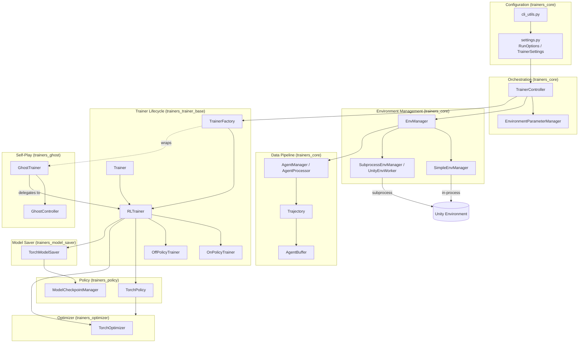
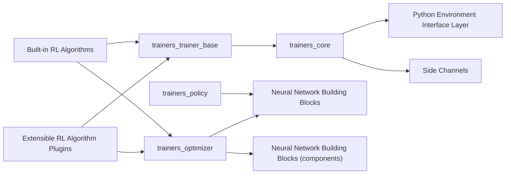

# Training Orchestration & Lifecycle Infrastructure

## 1. Purpose

The `Training_Orchestration_&_Lifecycle_Infrastructure` module (`ml-agents/mlagents/trainers`) is the **central nervous system of the ML-Agents Python training package**. It does not implement any specific reinforcement-learning algorithm; instead it provides the generic, algorithm-agnostic machinery required to run a complete training session end-to-end:

- Parsing and validating run configuration (YAML + CLI) into strongly-typed settings objects.
- Managing one or more Unity environment instances (in-process or multi-process/subprocess).
- Converting raw environment observations/rewards into per-agent `Trajectory` objects and buffering them for training.
- Defining the abstract `Trainer` lifecycle (on-policy vs. off-policy update strategies) and the `Policy`/`Optimizer` contracts that concrete algorithms implement.
- Persisting and restoring model weights/checkpoints across resumed runs.
- Driving the main training loop (`TrainerController`), including curriculum/environment-parameter progression.
- Reporting statistics (console, TensorBoard) and training analytics.
- Supporting self-play (ghost) training for adversarial multi-agent scenarios.

Because it sits at the center of the training stack, virtually every other trainer-related module depends on it: [Neural Network Building Blocks](Neural_Network_Building_Blocks.md) supplies the PyTorch modules consumed here, [Built-in RL Algorithms](Built-in_RL_Algorithms.md) (PPO, SAC, POCA) and [Extensible RL Algorithm Plugins](Extensible_RL_Algorithm_Plugins.md) (A2C, DQN) build directly on top of the abstractions defined here, and it depends on the [Python Environment Interface Layer](Python_Environment_Interface_Layer.md) (`mlagents_envs`) for the actual Unity communication protocol, side channels, and RPC plumbing.

## 2. Architecture Overview

The module is organized into seven cohesive sub-modules, each with a distinct responsibility along the training lifecycle:

| Sub-module | Responsibility |
|---|---|
| `trainers_core` | Configuration, environment management, data pipeline, monitoring/status, and top-level orchestration |
| `trainers_trainer_base` | Abstract `Trainer`/`RLTrainer` lifecycle, `OnPolicyTrainer`/`OffPolicyTrainer` strategies, `TrainerFactory` |
| `trainers_policy` | `Policy`/`TorchPolicy` action-selection abstraction and `ModelCheckpointManager` |
| `trainers_optimizer` | `Optimizer`/`TorchOptimizer` — loss computation, value estimation, reward-signal management |
| `trainers_model_saver` | `BaseModelSaver`/`TorchModelSaver` — checkpointing and ONNX export |
| `trainers_ghost` | `GhostController`/`GhostTrainer` — self-play team rotation and ELO tracking |

### 2.1 High-Level Component Diagram



### 2.2 End-to-End Training Loop

```mermaid
sequenceDiagram
    participant CLI as CLI / YAML
    participant TC as TrainerController
    participant EM as EnvManager
    participant Unity as Unity Environment
    participant AP as AgentManager
    participant Trainer as Trainer/RLTrainer
    participant Pol as TorchPolicy
    participant Opt as TorchOptimizer
    participant MS as TorchModelSaver

    CLI->>TC: RunOptions
    TC->>EM: reset()
    EM->>Unity: reset()
    loop training loop
        EM->>Unity: set_actions() + step()
        Unity-->>EM: DecisionSteps/TerminalSteps
        EM->>AP: add_experiences()
        AP->>Trainer: trajectory_queue.put(Trajectory)
        Trainer->>Pol: get_action() (for stepping)
        Trainer->>Opt: update(batch)
        Trainer->>MS: save_checkpoint() (periodic)
        TC->>TC: EnvironmentParameterManager.update_lessons()
    end
    TC->>Trainer: save_model() (on completion/interrupt)
```

### 2.3 External Dependencies



## 3. Core Components

### 3.1 [`trainers_core`](trainers_core.md)
The backbone infrastructure providing five internal capabilities:
- **Configuration** (`cli_utils.py`, `settings.py`) — `RunOptions`, `TrainerSettings`, `NetworkSettings`, reward-signal/curriculum settings.
- **Environment Management** (`env_manager.py`, `simple_env_manager.py`, `subprocess_env_manager.py`) — `EnvManager`, `SimpleEnvManager`, `SubprocessEnvManager`, `UnityEnvWorker`.
- **Data Pipeline** (`agent_processor.py`, `trajectory.py`, `buffer.py`) — `AgentManager`, `AgentManagerQueue`, `Trajectory`, `AgentBuffer`.
- **Monitoring & Status** (`stats.py`, `training_status.py`, `training_analytics_side_channel.py`) — `StatsReporter`, `GlobalTrainingStatus`, `TrainingAnalyticsSideChannel`.
- **Orchestration** (`trainer_controller.py`, `environment_parameter_manager.py`) — `TrainerController`, `EnvironmentParameterManager`.

### 3.2 [`trainers_trainer_base`](trainers_trainer_base.md)
Defines the abstract training lifecycle: `Trainer` (base contract), `RLTrainer` (buffering/checkpointing/stats), `OnPolicyTrainer` and `OffPolicyTrainer` (the two update strategies subclassed by PPO/POCA/A2C and SAC/DQN respectively), and `TrainerFactory` (instantiates the correct trainer, optionally wrapped for self-play).

### 3.3 [`trainers_policy`](trainers_policy.md)
Defines the decision-making abstraction: `Policy` (abstract) and `TorchPolicy` (PyTorch implementation) that turn observations into actions, manage recurrent memory, and expose weights for optimization/export. `ModelCheckpointManager` tracks checkpoint metadata (paths, rewards, retention) via `GlobalTrainingStatus`.

### 3.4 [`trainers_optimizer`](trainers_optimizer.md)
Defines `Optimizer` (abstract `update()` contract) and `TorchOptimizer` (shared PyTorch machinery for reward-signal management, recurrent value estimation via `_evaluate_by_sequence`, and trajectory bootstrapping via `get_trajectory_value_estimates`). Subclassed by algorithm-specific optimizers (PPO/SAC/POCA/A2C/DQN).

### 3.5 [`trainers_model_saver`](trainers_model_saver.md)
Defines `BaseModelSaver` (abstract) and `TorchModelSaver` (concrete): checkpoint serialization (`.pt`), ONNX export via `ModelSerializer`, and load/resume/initialize-from-prior-run logic.

### 3.6 [`trainers_ghost`](trainers_ghost.md)
Implements self-play: `GhostController` (global learning-team arbitration and ELO computation) and `GhostTrainer` (per-behavior decorator around a wrapped RL trainer that manages policy snapshotting, opponent swapping, and trajectory/policy queue routing).