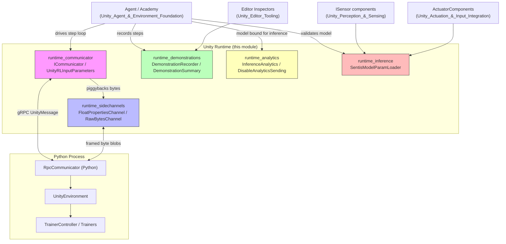
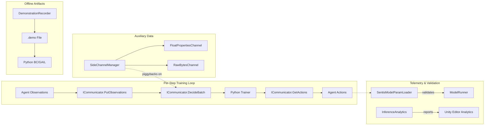
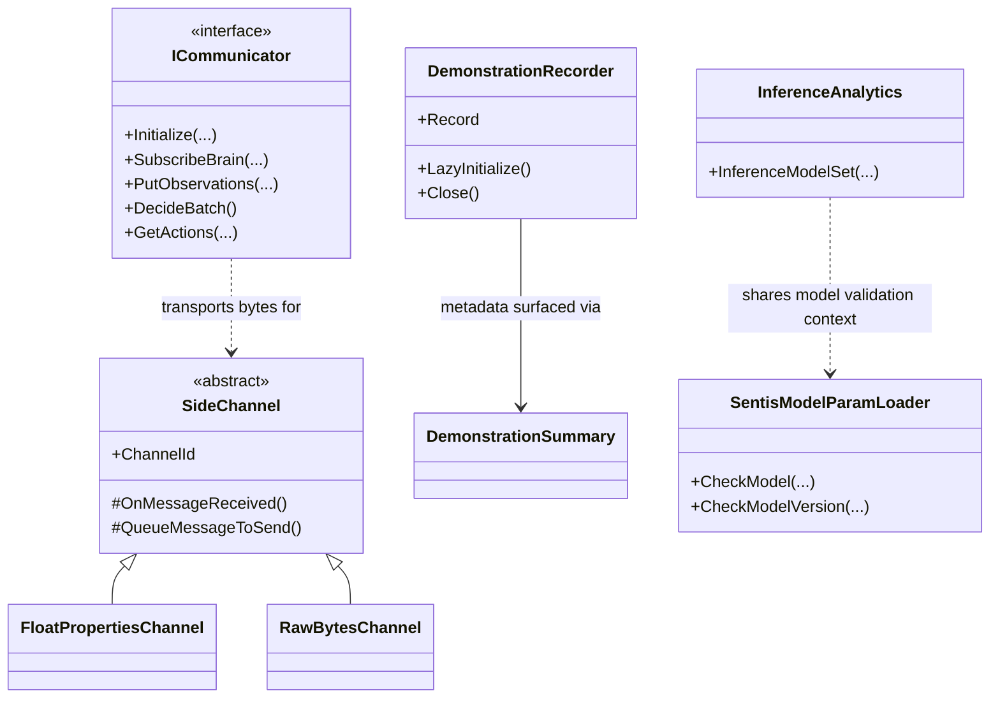

# Unity-Python Bridge & ML Integration

## 1. Purpose

The **Unity-Python Bridge & ML Integration** module is the connective tissue between the Unity C# runtime and the external Python training/inference ecosystem. It lives under `com.unity.ml-agents/Runtime` and provides all the infrastructure required to:

- Define the **wire-level contract** (`ICommunicator`) used to exchange observations, actions, and control commands between Unity and Python over gRPC.
- Provide **side channels** (`FloatPropertiesChannel`, `RawBytesChannel`) for exchanging auxiliary, out-of-band data (configuration, custom metrics, raw payloads) alongside the main RL loop.
- **Record demonstrations** (`DemonstrationRecorder`, `DemonstrationSummary`) of agent/human gameplay for imitation learning (Behavioral Cloning, GAIL) and expose their metadata to Editor tooling.
- Collect **privacy-preserving analytics** (`InferenceAnalytics`, `DisableAnalyticsSending`) about inference model usage without leaking PII.
- **Validate trained models** (`SentisModelParamLoader`) against an Agent's sensors, actuators, and brain parameters before they are used for in-engine inference via Sentis.

Together, these components let a Unity simulation be trained by, and later run independently of, an external Python trainer — bridging network communication, data recording, telemetry, and model-compatibility validation into a single cohesive integration layer.

## 2. Architecture Overview

## 3. Sub-Modules & Data Flow

The module is organized into five focused sub-modules, each with a distinct responsibility in the Unity↔Python integration pipeline:

- **runtime_communicator** — Defines `ICommunicator`, `CommunicatorInitParameters`, `UnityRLInitParameters`, and `UnityRLInputParameters`, the protocol boundary implemented by the gRPC-based `RpcCommunicator`. Handles the initialization handshake and the per-step observation/action exchange.
- **runtime_sidechannels** — `FloatPropertiesChannel` and `RawBytesChannel`, concrete side-channel implementations built on the shared `SideChannel`/`SideChannelManager` infrastructure, allowing arbitrary keyed or raw data exchange alongside RL traffic.
- **runtime_demonstrations** — `DemonstrationRecorder` and `DemonstrationSummary`, capturing agent trajectories to `.demo` files for imitation learning and surfacing their metadata in the Unity Editor.
- **runtime_analytics** — `InferenceAnalytics` and `AnalyticsUtils.DisableAnalyticsSending`, collecting anonymized, opt-in telemetry about loaded inference models.
- **runtime_inference** — `SentisModelParamLoader`, validating a Sentis `Model`'s tensors against an Agent's `BrainParameters`, `ISensor`s, and `ActuatorComponent`s before inference begins.

## 4. Component Relationships

## 5. Core Components Documentation

| Sub-module | Description | Reference |
|---|---|---|
| **runtime_communicator** | `ICommunicator` contract and RL init/exchange parameter structs bridging Unity and Python via gRPC. | [runtime_communicator.md](runtime_communicator.md) |
| **runtime_sidechannels** | `FloatPropertiesChannel` and `RawBytesChannel` for keyed and raw out-of-band data exchange. | [runtime_sidechannels.md](runtime_sidechannels.md) |
| **runtime_demonstrations** | `DemonstrationRecorder` and `DemonstrationSummary` for recording and inspecting imitation-learning demonstrations. | [runtime_demonstrations.md](runtime_demonstrations.md) |
| **runtime_analytics** | `InferenceAnalytics` and `DisableAnalyticsSending` for privacy-preserving inference telemetry. | [runtime_analytics.md](runtime_analytics.md) |
| **runtime_inference** | `SentisModelParamLoader` for validating trained models against Agent sensor/actuator/brain configuration. | [runtime_inference.md](runtime_inference.md) |

## 6. Relationship to Other Modules

- [Unity_Agent_&_Environment_Foundation](runtime_core_agent.md) — `Academy`/`Agent` drive the step loop consumed by `ICommunicator` and feed data into `DemonstrationRecorder`.
- [Unity_Perception_&_Sensing](runtime_sensors.md) / [Unity_Actuation_&_Input_Integration](runtime_input.md) — Sensor/actuator specs validated by `SentisModelParamLoader` and reported by `InferenceAnalytics`.
- [Python_Environment_Interface_Layer](envs_core.md) — Python-side `RpcCommunicator`/`UnityEnvironment` and side channels that mirror this module's protocol.
- [Training_Orchestration_&_Lifecycle_Infrastructure](trainers_core.md) — Trainer-side consumers of side channels, demonstrations, and communicator exchanges.
- [Neural_Network_Building_Blocks](trainers_torch_entities.md) — `ModelSerializer`/`TensorNames`, whose export format is validated by `SentisModelParamLoader`.