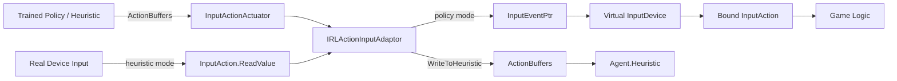
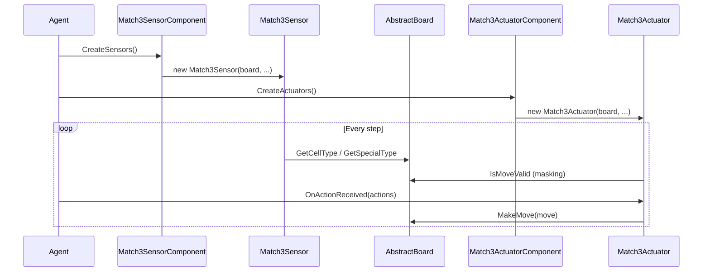

# Unity Actuation & Input Integration

## Purpose

The `Unity_Actuation_&_Input_Integration` module provides ready-made, domain-specific **Actuator** and **Sensor** integrations that plug game-specific input/action mechanisms into the generic ML-Agents `Agent`/`ActuatorComponent`/`SensorComponent` framework. It removes the need for game developers to hand-write custom `IActuator`/`ISensor` implementations for two common scenarios:

1. **Unity Input System integration** (`runtime_input`) — allows any game built on Unity's new Input System (`InputActionAsset`) to be controlled transparently by a trained policy or recorded from a human via heuristic mode, without modifying gameplay code. It works by creating a virtual `InputDevice` and generating one ML-Agents actuator per `InputAction`.
2. **Match-3 puzzle game integration** (`runtime_integrations_match3`) — provides a declarative `Match3ActuatorComponent`/`Match3SensorComponent` pair that converts board state into observations and Agent decisions into board swap-moves, given a user-supplied `AbstractBoard` implementation.

Both sub-modules follow the same architectural pattern: a Unity Inspector-configurable `*Component` (a `MonoBehaviour`) lazily builds the actual runtime `IActuator`/`ISensor` objects consumed by the Agent's decision loop, and both have dedicated Editor inspectors for configuration.

## Architecture

```mermaid
graph TB
    subgraph "Unity_Actuation_&_Input_Integration"
        subgraph "runtime_input"
            Provider[IInputActionAssetProvider]
            InputComp[InputActuatorComponent]
            InputActuator[InputActionActuator]
            Adaptors["IRLActionInputAdaptor
            (Button/Double/Float/Integer/Vector2)"]
            EventCtx[InputActuatorEventContext]
        end

        subgraph "runtime_integrations_match3"
            M3ActComp[Match3ActuatorComponent]
            M3SensComp[Match3SensorComponent]
            M3Actuator[Match3Actuator]
            M3Sensor[Match3Sensor]
            Board["AbstractBoard (user-provided)"]
        end
    end

    subgraph "ML-Agents Core Runtime"
        ActuatorComponent[ActuatorComponent]
        SensorComponent[SensorComponent]
        IActuator[IActuator]
        ISensor[ISensor]
        BehaviorParameters[BehaviorParameters]
        Agent[Agent]
    end

    subgraph "Unity Editor Tooling"
        InputEditor[InputActuatorComponentEditor]
        M3ActEditor[Match3ActuatorComponentEditor]
        M3SensEditor[Match3SensorComponentEditor]
    end

    subgraph "Unity Input System"
        InputActionAsset
        InputDevice[Virtual InputDevice]
    end

    InputComp -->|extends| ActuatorComponent
    InputComp --> Provider
    InputComp --> InputActuator
    InputComp --> InputDevice
    InputActuator --> Adaptors
    InputActuator --> EventCtx
    Provider --> InputActionAsset
    InputComp --> BehaviorParameters

    M3ActComp -->|extends| ActuatorComponent
    M3SensComp -->|extends| SensorComponent
    M3ActComp --> M3Actuator
    M3SensComp --> M3Sensor
    M3Actuator --> Board
    M3Sensor --> Board

    IActuator <|.. InputActuator
    IActuator <|.. M3Actuator
    ISensor <|.. M3Sensor

    Agent --> InputComp
    Agent --> M3ActComp
    Agent --> M3SensComp

    InputEditor -.configures.-> InputComp
    M3ActEditor -.configures.-> M3ActComp
    M3SensEditor -.configures.-> M3SensComp
```

### Data Flow: Input System Integration



### Data Flow: Match-3 Integration



## Core Components

### `runtime_input` — Unity Input System Integration
Bridges Unity's Input System with ML-Agents actuators, guarded by the `MLA_INPUT_SYSTEM` compile symbol.

- **`IInputActionAssetProvider`** — interface exposing the `InputActionAsset` to simulate.
- **`InputActuatorComponent`** — discovers `InputAction`s, creates a virtual `InputDevice`, and builds one `InputActionActuator` per action; toggles device bindings between heuristic and policy-driven modes.
- **`InputActionActuator`** — `IActuator` wrapper around a single `InputAction`, delegating conversion to an adaptor.
- **`IRLActionInputAdaptor` implementations** — `ButtonInputActionAdaptor`, `DoubleInputActionAdaptor`, `FloatInputActionAdaptor`, `IntegerInputActionAdaptor`, `Vector2InputActionAdaptor` — convert between Input System control values and ML-Agents `ActionBuffers`/`ActionSpec`.
- **`InputActuatorEventContext`** — batches multiple actuator writes into a single Input System event per tick.

Full documentation: see `runtime_input` module docs.

### `runtime_integrations_match3` — Match-3 Game Integration
Provides drop-in components for match-3 style puzzle games.

- **`Match3ActuatorComponent`** — creates a `Match3Actuator` that converts discrete action indices into board swap `Move`s, masks invalid moves, and supports a forced heuristic/greedy mode.
- **`Match3SensorComponent`** — creates one or two `Match3Sensor`s (cell-type and optional special-type) encoding board state as vector or visual observations.
- Both rely on a user-implemented **`AbstractBoard`** exposing board dimensions, cell types, move validation, and move execution.

Full documentation: see `runtime_integrations_match3` module docs.

## References

- Editor inspectors for these components: `editor_component_inspectors` (`InputActuatorComponentEditor`, `Match3ActuatorComponentEditor`, `Match3SensorComponentEditor`) within `Unity_Editor_Tooling`.
- Core Agent/Behavior infrastructure consumed by both sub-modules: `runtime_core_agent` (`DecisionRequester`, `BehaviorParameters`) in `Unity_Agent_&_Environment_Foundation`.
- Related built-in sensor family for comparison: `runtime_sensors` in `Unity_Perception_&_Sensing`.
- Demonstration recording that consumes heuristic-mode actions: `runtime_demonstrations` in `Unity-Python_Bridge_&_ML_Integration`.