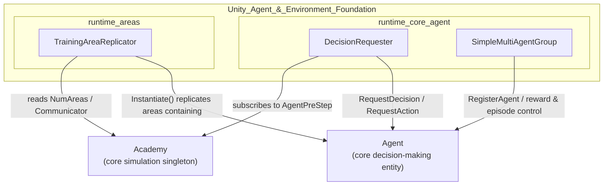
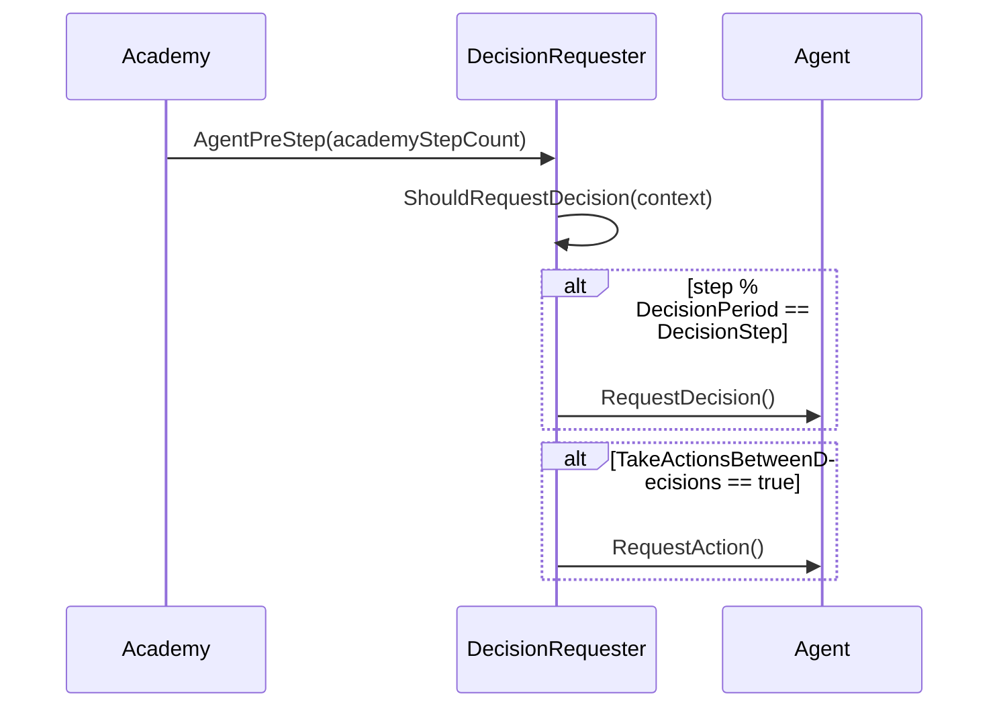
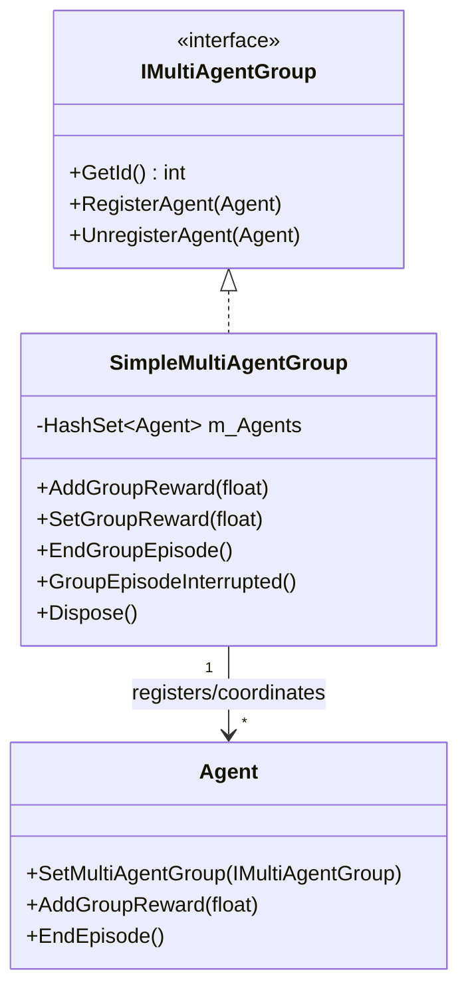
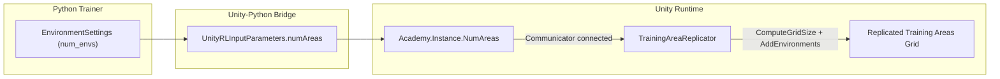

# Unity Agent & Environment Foundation

## 1. Purpose

The **Unity_Agent_&_Environment_Foundation** module provides the foundational runtime utilities that sit on top of ML-Agents' core `Agent`/`Academy` simulation loop, enabling designers to build scalable, multi-agent, parallelized Unity training environments without writing custom simulation-loop plumbing. It answers three practical needs that arise when authoring RL environments in Unity:

1. **Decision cadence control** — `DecisionRequester` automatically drives when an `Agent` requests decisions/actions from the `Academy`'s per-step event system, removing the need for manual `RequestDecision()`/`RequestAction()` calls.
2. **Multi-agent coordination** — `SimpleMultiAgentGroup` groups multiple `Agent` instances so that group-level rewards and episode-termination signals (essential for cooperative algorithms like POCA) can be broadcast to every member.
3. **Environment parallelization** — `TrainingAreaReplicator` clones a single "base" training area into a 3D grid of copies at runtime, scaling training throughput based on the number of parallel environments requested by the connected Python trainer (or a designer-configured value at inference time).

Together, these components form the glue layer between designer-authored scene content (agents, training areas) and the lower-level `Agent`/`Academy` lifecycle, while remaining orchestration-only — they contain no ML algorithm logic themselves.

## 2. Architecture

### 2.1 Module Structure

### 2.2 Decision Cadence Flow (`DecisionRequester`)

### 2.3 Multi-Agent Grouping (`SimpleMultiAgentGroup`)

### 2.4 Environment Replication (`TrainingAreaReplicator`)

## 3. Sub-modules

| Sub-module | Key Components | Responsibility |
|---|---|---|
| `runtime_core_agent` | `DecisionRequester`, `SimpleMultiAgentGroup` | Drives per-agent decision cadence and coordinates group rewards/episode termination across multiple agents. |
| `runtime_areas` | `TrainingAreaReplicator` | Replicates a base training area into a grid of parallel environments, driven by the number of areas requested by the Python trainer or a designer-set fallback. |

## 4. Core Components Documentation

- **`runtime_core_agent`** — Details `DecisionRequester`'s event subscription to `Academy.AgentPreStep`, its configurable `DecisionPeriod`/`DecisionStep`/`TakeActionsBetweenDecisions` fields, and `SimpleMultiAgentGroup`'s registration, reward-broadcasting, and episode-control APIs used for cooperative multi-agent training (e.g., POCA).
- **`runtime_areas`** — Details `TrainingAreaReplicator`'s lifecycle (`Awake`/`OnEnable`), grid-size computation based on `Academy.Instance.NumAreas` vs. Inspector-configured `numAreas`, the `buildOnly` Editor/build distinction, and its `[DefaultExecutionOrder(-5)]` guarantee that replicated areas exist before `Academy` begins its per-step event dispatch.

## 5. Related Modules

- **Unity Perception & Sensing** — Sensor components typically attached to agents within each (replicated) training area.
- **Unity Actuation & Input Integration** — Actuator components driving agent actions within each training area.
- **Unity Editor Tooling** — Custom inspectors (`AgentEditor`, `BehaviorParametersEditor`) for configuring `Agent`/`DecisionRequester` fields.
- **Unity-Python Bridge & ML Integration** — Supplies `UnityRLInputParameters.numAreas` via the communicator handshake, consumed by `TrainingAreaReplicator`.
- **Training Orchestration & Lifecycle Infrastructure** — Python-side `AgentManager` and `EnvironmentSettings` that determine parallel environment counts and consume per-agent/group data produced by this module.
- **Built-in RL Algorithms (POCA)** — Consumes the group-reward signal produced via `SimpleMultiAgentGroup` for cooperative multi-agent policy optimization.