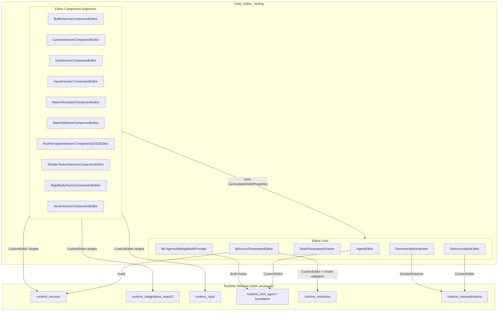
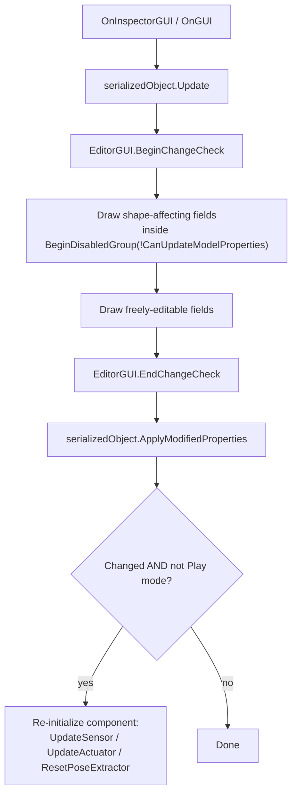

# Unity Editor Tooling

## 1. Purpose

The **Unity_Editor_Tooling** module contains all Unity Editor–only (design-time) extensions for the ML-Agents Unity package, located under `com.unity.ml-agents/Editor`. It has no role in the runtime game loop or in training — its sole purpose is to make configuring ML-Agents components inside the Unity Editor safer and more convenient. It provides:

- Custom Inspector UIs for every sensor and actuator `MonoBehaviour` component shipped with the package (Camera, Ray Perception, Grid, Buffer, Vector, Render Texture, Rigid Body, Match-3, Input).
- Custom Inspectors/Drawers for the core agent-configuration types: `Agent`, `BehaviorParameters`, and the `BrainParameters` struct, including live validation of a `BehaviorParameters`' assigned model against the Agent's sensors/actuators.
- Asset-pipeline tooling (`ScriptedImporter` + `CustomEditor`) to import and preview `.demo` demonstration recording files as Unity assets.
- Build-pipeline hooks that ensure the project's `MLAgentsSettings` asset is correctly preloaded into player builds.

A recurring theme across the module is **Play-mode safety**: fields that would change the shape of an observation/action tensor (names, sizes, counts) are disabled while the game is running, guarded via the shared `EditorUtilities.CanUpdateModelProperties()` helper, preventing silent desynchronization between a trained model and a live component.

## 2. Architecture Overview

The module is organized into two cohesive sub-modules, both living under `com.unity.ml-agents/Editor`, each targeting a different family of runtime types.

### Shared inspector pattern

Both sub-modules apply the same guarding pattern to protect against unsafe edits at runtime:

## 3. Core Components / Sub-modules

### 3.1 Editor Component Inspectors
Custom Inspectors for every sensor and actuator component (`BufferSensorComponentEditor`, `CameraSensorComponentEditor`, `GridSensorComponentEditor`, `RayPerceptionSensorComponentBaseEditor` and its 2D/3D subclasses, `RenderTextureSensorComponentEditor`, `RigidBodySensorComponentEditor`, `VectorSensorComponentEditor`, `Match3SensorComponentEditor`, `Match3ActuatorComponentEditor`, `InputActuatorComponentEditor`). Each is a 1:1 (or shared-base) `[CustomEditor]` wrapper around a runtime `*Component` class, locking shape-affecting fields during Play mode and triggering re-initialization on change.

📄 See [editor_component_inspectors](editor_component_inspectors.md) for full details.

### 3.2 Editor Core
Higher-level tooling covering:
- **Agent & Behavior Inspectors** — `AgentEditor`, `BehaviorParametersEditor`, `BrainParametersDrawer`, which render/edit the Agent and its Behavior/Brain configuration and validate the assigned Sentis model against sensors/actuators.
- **Demonstration Tooling** — `DemonstrationImporter` (ScriptedImporter for `.demo` files) and `DemonstrationEditor`, which parse and preview recorded demonstration data as Unity assets.
- **Build Pipeline Integration** — `MLAgentsSettingsBuildProvider`, an `IPreprocessBuildWithReport`/`IPostprocessBuildWithReport` implementation that temporarily preloads the `MLAgentsSettings` asset for player builds.

📄 See [editor_core](editor_core.md) for full details.

## 4. Cross-Module References

- **[editor_component_inspectors](editor_component_inspectors.md)** — sensor/actuator component inspectors; depends on `editor_core`'s `EditorUtilities.CanUpdateModelProperties()`.
- **[editor_core](editor_core.md)** — Agent/Behavior/BrainParameters inspectors, demonstration asset tooling, and build pipeline hooks.
- **[runtime_sensors](runtime_sensors.md)** / **[runtime_integrations_match3](runtime_integrations_match3.md)** / **[runtime_input](runtime_input.md)** — runtime components edited by `editor_component_inspectors`.
- **[runtime_core_agent](runtime_core_agent.md)** — runtime `Agent`/behavior types edited by `editor_core`'s Agent & Behavior inspectors.
- **[runtime_inference](runtime_inference.md)** — `SentisModelParamLoader`, used by `BehaviorParametersEditor` for model/sensor compatibility validation.
- **[runtime_demonstrations](runtime_demonstrations.md)** — `DemonstrationSummary`/`DemonstrationRecorder`, consumed by `DemonstrationImporter`/`DemonstrationEditor`.