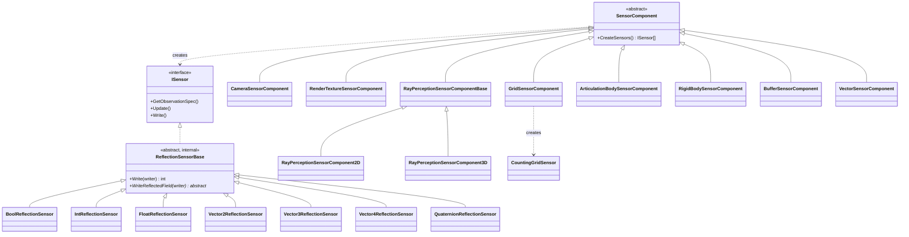
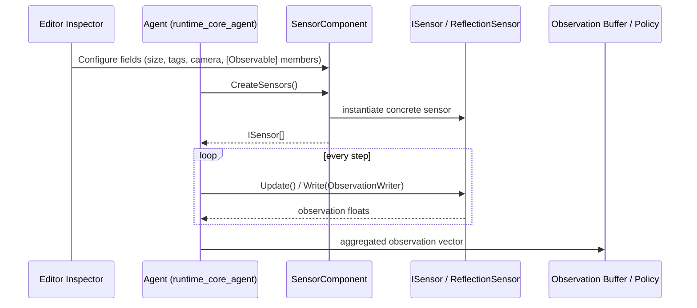
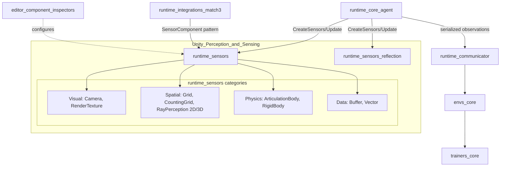

# Unity Perception & Sensing

## Purpose

The **Unity Perception & Sensing** module (`com.unity.ml-agents/Runtime/Sensors`) is the component of ML-Agents responsible for **generating observations** that feed an Agent's decision-making policy. It provides the full catalog of built-in `SensorComponent` implementations that can be attached to Agents in the Unity Editor, as well as reflection-based sensors that automatically observe annotated C# fields/properties.

This module operates purely on the **Unity (client) side** of the ML-Agents architecture — it has no awareness of neural networks, training algorithms, or the Python backend. Its sole responsibility is to translate scene state (physics, visuals, geometry, or arbitrary game data) into a well-defined, structured observation buffer (`ISensor`/`ObservationWriter` contract) that is consumed downstream by the Agent and, ultimately, by the training/inference pipeline.

The module is composed of two closely related sub-modules:

- **`runtime_sensors`** — concrete `SensorComponent` implementations (camera, grid, ray-perception, physics-body, buffer, vector) that users explicitly attach to GameObjects.
- **`runtime_sensors_reflection`** — internal sensor classes that back the `[Observable]` attribute, allowing values to be observed declaratively via reflection without an explicit `SensorComponent`.

## Architecture

### Component / Sensor Class Hierarchy

### Observation Lifecycle

### Module Grouping

## Core Components

### `runtime_sensors` — Concrete Sensor Components
Provides the ten user-facing `SensorComponent` classes attached directly to Agents, grouped by category:

- **Visual** — `CameraSensorComponent`, `RenderTextureSensorComponent`: pixel observations with optional grayscale, compression, and stacking.
- **Spatial** — `GridSensorComponent`, `CountingGridSensor`, `RayPerceptionSensorComponent2D`, `RayPerceptionSensorComponent3D`: tag-based grid detection and ray-cast perception.
- **Physics** — `ArticulationBodySensorComponent`, `RigidBodySensorComponent`: pose observations for physics-driven bodies.
- **Data** — `BufferSensorComponent`, `VectorSensorComponent`: generic user-populated numeric/entity observations.

Each component follows the Component/Sensor separation pattern: a `MonoBehaviour` factory (`CreateSensors()`) produces the actual plain-C# `ISensor` implementation that performs per-step observation writing.

### `runtime_sensors_reflection` — Reflection-Based Sensors
Implements the internal sensor classes backing the `[Observable]` attribute mechanism: `BoolReflectionSensor`, `IntReflectionSensor`, `FloatReflectionSensor`, `Vector2/3/4ReflectionSensor`, and `QuaternionReflectionSensor`. These are automatically instantiated via reflection (not user-constructed) to observe annotated fields/properties without requiring a dedicated `SensorComponent`, sharing the same `ISensor` write pipeline as `runtime_sensors`.

## Related Modules

- **`editor_component_inspectors`** — custom Editor Inspectors rendering configuration UI for the `SensorComponent` classes in this module.
- **`runtime_core_agent`** — owns and drives the `SensorComponent`s attached to an Agent, aggregating their outputs into the observation buffer.
- **`runtime_integrations_match3`** — a specialized sensor/actuator integration following the same `SensorComponent` pattern.
- **`runtime_communicator`** / **`envs_core`** — downstream consumers that transport generated observations to the Python training backend.
- **`trainers_torch_entities`** — neural network encoders (e.g., `VectorInput`, visual encoders) that ultimately consume the observation data produced by this module.