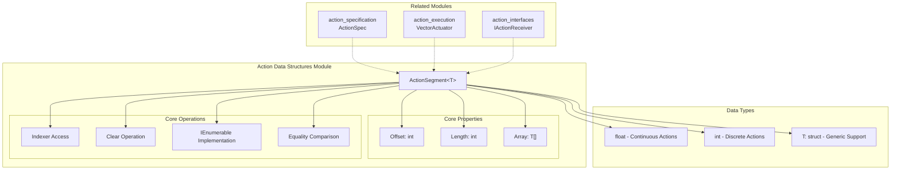
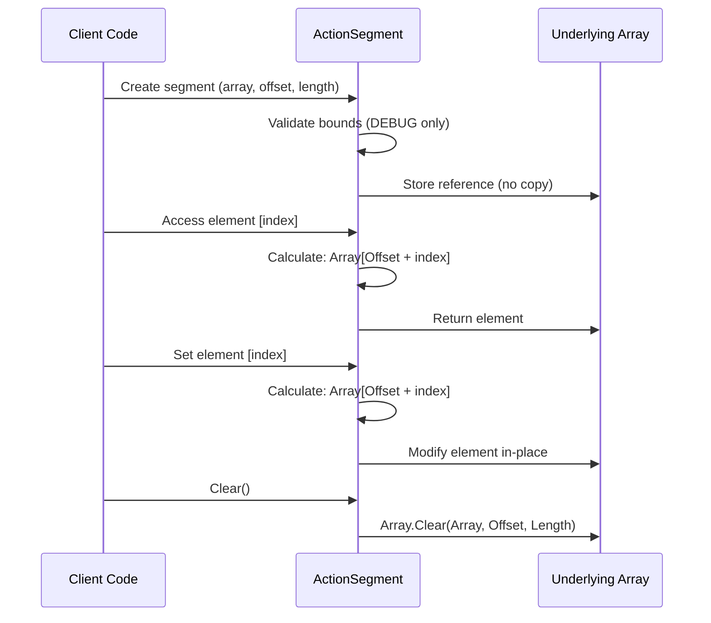
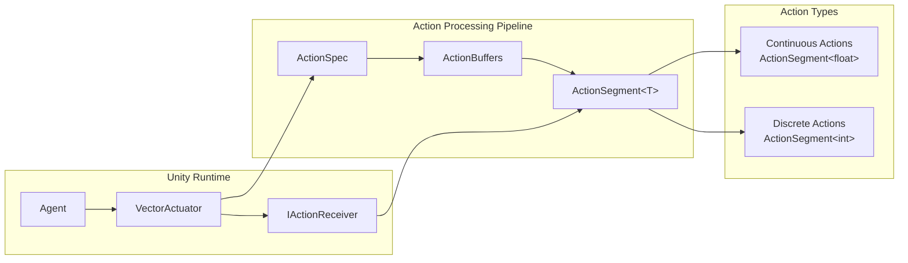

# Action Data Structures Module

## Overview

The **action_data_structures** module is a fundamental component of the Unity ML-Agents actuator system that provides efficient data structures for managing action data. This module implements memory-efficient array segmentation through the `ActionSegment<T>` structure, which allows access to portions of underlying action arrays without copying or allocating sub-arrays.

As a child module of [unity_actuators](unity_actuators.md), action_data_structures serves as the foundational data layer that enables efficient action data manipulation across the ML-Agents framework. It provides zero-copy array views that are essential for performance-critical action processing in machine learning environments.

## Architecture

The action_data_structures module implements a lightweight, generic data structure pattern that supports both continuous and discrete action types while maintaining memory efficiency and type safety.



## Component Details

### ActionSegment<T>

The `ActionSegment<T>` is a readonly struct that provides a memory-efficient view into a segment of an underlying array. It implements the fundamental data structure for action data management in the ML-Agents framework.

#### Key Features

1. **Zero-Copy Array Views**: Provides access to array segments without copying data
2. **Generic Type Support**: Works with any struct type, enabling both continuous (float) and discrete (int) actions
3. **Bounds Safety**: Includes comprehensive bounds checking in debug builds
4. **Enumerable Interface**: Supports iteration through standard C# enumeration patterns
5. **Equality Semantics**: Implements proper equality comparison for value semantics

#### Core Properties

- **Offset** (`int`): Zero-based starting index into the underlying array
- **Length** (`int`): Number of elements accessible in this segment  
- **Array** (`T[]`): Reference to the underlying data array

#### Memory Management



## Integration with ML-Agents Framework

The action_data_structures module integrates with several other components in the ML-Agents ecosystem:

### Data Flow Architecture



### Integration Points

1. **With [action_specification](action_specification.md)**: `ActionSpec` defines the structure that determines how action arrays are segmented
2. **With [action_execution](action_execution.md)**: `VectorActuator` uses action segments to efficiently pass action data
3. **With [action_interfaces](action_interfaces.md)**: `IActionReceiver` receives action data through ActionBuffers containing segments
4. **With [unity_runtime_core](unity_runtime_core.md)**: Agent components rely on efficient action data structures for performance

## Usage Patterns

### Basic Segment Creation

```csharp
// Create a segment covering entire array
float[] actions = new float[10];
var fullSegment = new ActionSegment<float>(actions);

// Create a partial segment
var partialSegment = new ActionSegment<float>(actions, offset: 3, length: 4);

// Empty segment
var emptySegment = ActionSegment<float>.Empty;
```

### Continuous Action Processing

```csharp
// Typical continuous action segment usage
public void OnActionReceived(ActionBuffers actionBuffers)
{
    ActionSegment<float> continuousActions = actionBuffers.ContinuousActions;
    
    // Access actions by index
    float forwardAction = continuousActions[0];
    float turnAction = continuousActions[1];
    
    // Iterate through actions
    foreach (float action in continuousActions)
    {
        // Process each action value
        ProcessContinuousAction(action);
    }
}
```

### Discrete Action Processing

```csharp
// Typical discrete action segment usage  
public void OnActionReceived(ActionBuffers actionBuffers)
{
    ActionSegment<int> discreteActions = actionBuffers.DiscreteActions;
    
    // Access discrete action branches
    int movementBranch = discreteActions[0];
    int jumpBranch = discreteActions[1];
    
    // Process actions based on branch values
    ProcessMovement(movementBranch);
    ProcessJump(jumpBranch);
}
```

## Performance Characteristics

### Memory Efficiency

The ActionSegment design provides several performance benefits:

- **Zero Allocation**: No memory allocation for accessing array segments
- **Cache Friendly**: Maintains data locality of the original array
- **Minimal Overhead**: Only 3 fields (reference + 2 integers) per segment
- **Struct Semantics**: Value type avoids heap allocation and garbage collection pressure

### Computational Complexity

- **Index Access**: O(1) - Direct array access with offset calculation
- **Enumeration**: O(n) - Linear iteration through segment elements
- **Equality Check**: O(n) - Compares all elements in both segments
- **Clear Operation**: O(n) - Uses optimized Array.Clear implementation

## Thread Safety

ActionSegment<T> itself is thread-safe for read operations when the underlying array is not being modified. However, write operations and modifications to the underlying array require external synchronization in multi-threaded scenarios.

## Debug Features

The module includes comprehensive debugging support:

- **Bounds Checking**: Validates array access in DEBUG builds
- **Parameter Validation**: Checks constructor parameters for validity
- **Exception Messages**: Provides detailed error information for troubleshooting

## Extensibility

The generic design of ActionSegment<T> allows for extension to custom action types:

```csharp
// Custom action type
public struct CustomAction
{
    public float intensity;
    public int category;
}

// ActionSegment supports any struct type
var customSegment = new ActionSegment<CustomAction>(customActions);
```

## Related Modules

- **[action_specification](action_specification.md)**: Defines action space structure using ActionSpec
- **[action_execution](action_execution.md)**: Implements action execution through VectorActuator
- **[action_interfaces](action_interfaces.md)**: Provides action receiver interfaces
- **[unity_actuators](unity_actuators.md)**: Parent module containing the complete actuator system
- **[unity_runtime_core](unity_runtime_core.md)**: Core agent functionality that relies on efficient action processing

## Conclusion

The action_data_structures module provides the fundamental building blocks for efficient action data management in Unity ML-Agents. Through the ActionSegment<T> structure, it enables zero-copy array operations that are essential for the performance-critical nature of machine learning environments. Its generic design and integration with the broader actuator system make it a cornerstone of the ML-Agents action processing pipeline.