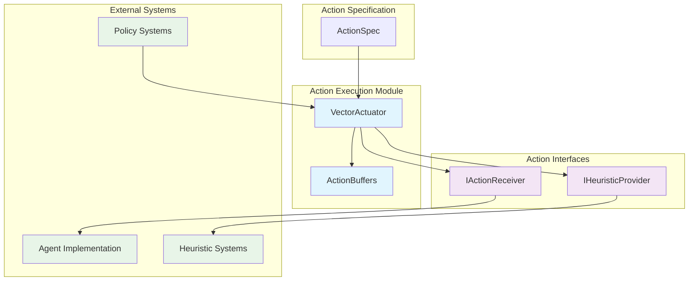
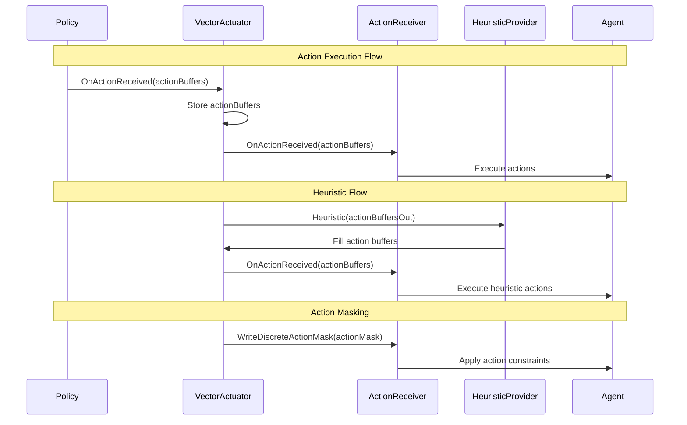
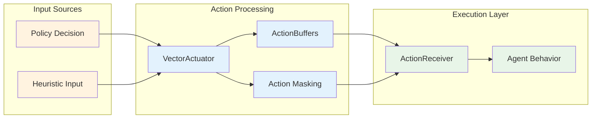
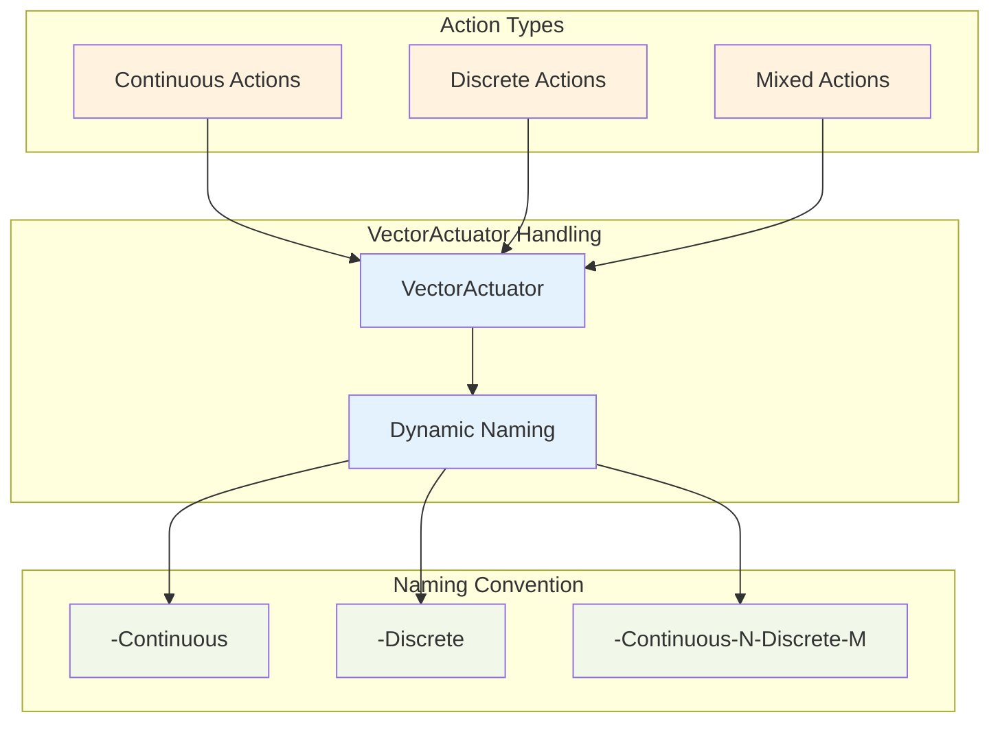

# Action Execution Module

The action_execution module is a critical component of Unity ML-Agents that handles the execution of actions determined by AI policies. It serves as the bridge between high-level action decisions and their concrete implementation in the Unity environment.

## Overview

The action_execution module provides the core infrastructure for translating action decisions from ML policies into executable behaviors within Unity environments. It implements a forwarding pattern that delegates action execution to appropriate receivers while maintaining a clean separation between action specification and implementation.

## Architecture



## Core Components

### VectorActuator

The `VectorActuator` is the primary component responsible for action execution. It implements the `IActuator` and `IBuiltInActuator` interfaces, providing a standardized way to handle both continuous and discrete actions.

**Key Features:**
- **Action Forwarding**: Delegates action execution to registered `IActionReceiver` implementations
- **Heuristic Support**: Integrates with `IHeuristicProvider` for manual/heuristic control
- **Action Buffer Management**: Maintains internal action buffers for state tracking
- **Performance Optimization**: Includes profiling markers for performance monitoring

**Constructor Patterns:**
```csharp
// Single receiver pattern (also implements IHeuristicProvider)
VectorActuator(IActionReceiver actionReceiver, ActionSpec actionSpec, string name)

// Separate receiver and heuristic provider
VectorActuator(IActionReceiver actionReceiver, IHeuristicProvider heuristicProvider, 
               ActionSpec actionSpec, string name)
```

## Component Interactions



## Data Flow



## Integration Points

### With Unity Runtime Core
- **Agent Integration**: VectorActuator is typically instantiated and managed by [unity_runtime_core](unity_runtime_core.md) components
- **Decision Management**: Receives action decisions from [decision_management](decision_management.md) systems
- **Multi-Agent Coordination**: Supports [multi_agent_coordination](multi_agent_coordination.md) through standardized interfaces

### With Action System Components
- **Action Interfaces**: Implements contracts defined in [action_interfaces](action_interfaces.md)
- **Action Specification**: Uses [action_specification](action_specification.md) for action space definition
- **Action Data Structures**: Processes [action_data_structures](action_data_structures.md) for action representation

### With Policy Systems
- **Policy Integration**: Receives actions from [unity_policies](unity_policies.md) implementations
- **Heuristic Policies**: Supports manual control through heuristic providers
- **Remote Policies**: Handles actions from external training systems

## Performance Considerations

### Profiling Integration
The VectorActuator includes built-in profiling markers:
- `VectorActuator.OnActionReceived`: Tracks action execution performance
- `VectorActuator.Heuristic`: Monitors heuristic processing overhead

### Memory Management
- **Action Buffer Reuse**: Maintains internal buffers to minimize allocations
- **Reset Functionality**: Provides `ResetData()` for clean state management
- **Efficient Forwarding**: Minimal overhead in action delegation

## Action Types Support



## Error Handling and Validation

### Action Masking
- **Discrete Action Constraints**: Supports masking of invalid discrete actions
- **Dynamic Masking**: Allows runtime modification of available actions
- **Safety Enforcement**: Prevents execution of masked actions

### State Management
- **Buffer Validation**: Ensures action buffers match expected specifications
- **Reset Handling**: Provides clean state reset between episodes
- **Error Recovery**: Graceful handling of invalid action states

## Usage Patterns

### Basic Implementation
```csharp
// Create action specification
var actionSpec = ActionSpec.MakeContinuous(4); // 4 continuous actions

// Create vector actuator with agent as receiver
var vectorActuator = new VectorActuator(agent, actionSpec, "MovementActuator");

// Register with agent's actuator system
agent.AddActuator(vectorActuator);
```

### Advanced Configuration
```csharp
// Mixed action space
var actionSpec = new ActionSpec(
    numContinuousActions: 2,
    discreteBranchSizes: new int[] { 3, 2 } // Two discrete branches
);

// Separate receiver and heuristic provider
var vectorActuator = new VectorActuator(
    actionReceiver: customReceiver,
    heuristicProvider: customHeuristic,
    actionSpec: actionSpec,
    name: "ComplexActuator"
);
```

## Best Practices

### Performance Optimization
1. **Minimize Action Processing**: Keep action receiver implementations lightweight
2. **Efficient Heuristics**: Optimize heuristic providers for real-time performance
3. **Proper Profiling**: Use built-in profiling markers to identify bottlenecks

### Architecture Guidelines
1. **Single Responsibility**: Each VectorActuator should handle one logical action domain
2. **Interface Segregation**: Separate action receiving from heuristic provision when possible
3. **State Management**: Always implement proper reset and cleanup logic

### Integration Considerations
1. **Action Space Consistency**: Ensure action specifications match policy expectations
2. **Masking Strategy**: Implement comprehensive action masking for discrete actions
3. **Error Handling**: Provide robust error handling for invalid action states

## Related Documentation

- [action_interfaces](action_interfaces.md) - Core interfaces implemented by this module
- [action_specification](action_specification.md) - Action space definition and management
- [action_data_structures](action_data_structures.md) - Data structures for action representation
- [unity_runtime_core](unity_runtime_core.md) - Runtime system integration
- [unity_policies](unity_policies.md) - Policy system integration
- [unity_actuators](unity_actuators.md) - Parent module overview

## Future Considerations

### Extensibility
- **Custom Actuator Types**: Framework supports extension for specialized actuator implementations
- **Action Preprocessing**: Potential for action transformation layers
- **Performance Monitoring**: Enhanced profiling and metrics collection

### Integration Enhancements
- **Batch Processing**: Support for batched action execution
- **Async Operations**: Potential for asynchronous action processing
- **Advanced Masking**: More sophisticated action constraint systems