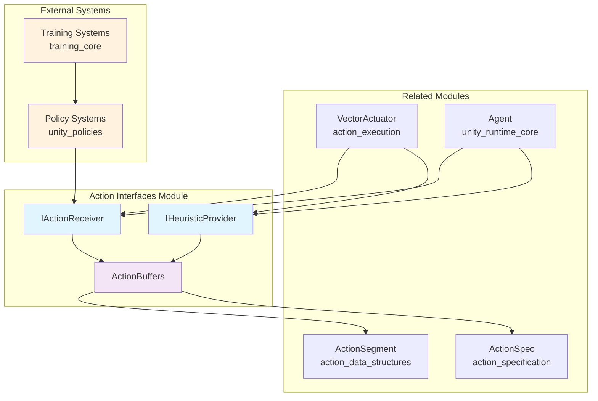
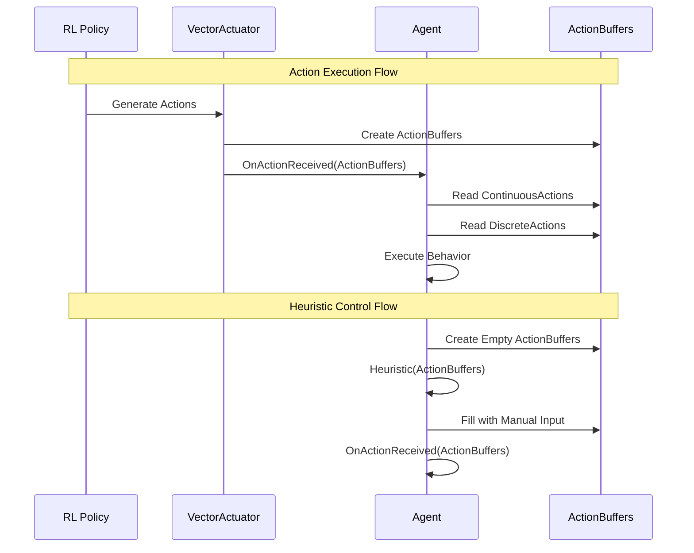
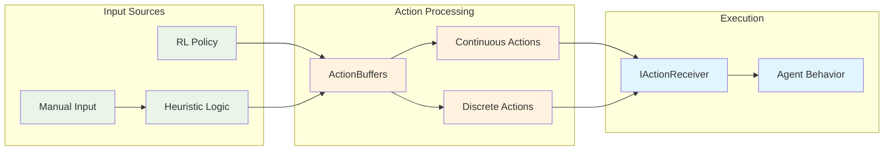

# Action Interfaces Module

The action_interfaces module provides the core interface contracts for action handling in Unity ML-Agents, defining how agents receive and process actions from reinforcement learning policies and how heuristic behaviors can be implemented.

## Overview

This module establishes the fundamental contracts for action processing in the ML-Agents framework through two primary interfaces:
- **IActionReceiver**: Defines how objects receive and execute actions from RL policies
- **IHeuristicProvider**: Enables manual/heuristic control for testing and demonstration purposes

The module also provides the **ActionBuffers** structure that serves as the primary data container for action information, supporting both continuous and discrete action types.

## Architecture



## Core Components

### IActionReceiver Interface

The `IActionReceiver` interface defines the contract for objects that can receive and execute actions from reinforcement learning policies.

**Key Methods:**
- `OnActionReceived(ActionBuffers actionBuffers)`: Executes actions based on the provided action buffers
- `WriteDiscreteActionMask(IDiscreteActionMask actionMask)`: Defines action masking for discrete actions

**Implementation Pattern:**
```csharp
public class MyAgent : IActionReceiver
{
    public void OnActionReceived(ActionBuffers actionBuffers)
    {
        // Process continuous actions
        float moveX = actionBuffers.ContinuousActions[0];
        float moveZ = actionBuffers.ContinuousActions[1];
        
        // Process discrete actions
        int jumpAction = actionBuffers.DiscreteActions[0];
    }
    
    public void WriteDiscreteActionMask(IDiscreteActionMask actionMask)
    {
        // Mask invalid actions based on current state
        if (cannotJump)
            actionMask.SetActionEnabled(0, 1, false);
    }
}
```

### IHeuristicProvider Interface

The `IHeuristicProvider` interface enables manual control and heuristic behavior implementation for agents.

**Key Methods:**
- `Heuristic(in ActionBuffers actionBuffersOut)`: Fills action buffers with heuristic/manual input

**Implementation Pattern:**
```csharp
public class MyAgent : IHeuristicProvider
{
    public void Heuristic(in ActionBuffers actionBuffersOut)
    {
        // Map keyboard input to continuous actions
        actionBuffersOut.ContinuousActions[0] = Input.GetAxis("Horizontal");
        actionBuffersOut.ContinuousActions[1] = Input.GetAxis("Vertical");
        
        // Map key press to discrete actions
        actionBuffersOut.DiscreteActions[0] = Input.GetKey(KeyCode.Space) ? 1 : 0;
    }
}
```

### ActionBuffers Structure

The `ActionBuffers` structure serves as the primary data container for action information, supporting both continuous and discrete actions.

**Key Properties:**
- `ContinuousActions`: ActionSegment<float> for continuous action values
- `DiscreteActions`: ActionSegment<int> for discrete action indices

**Key Features:**
- Type-safe action handling with separate continuous and discrete segments
- Multiple construction methods for different use cases
- Backward compatibility support for legacy float array formats
- Built-in validation and utility methods

## Component Interactions



## Data Flow



## Integration with Other Modules

### Unity Runtime Core Integration
- **Agent Integration**: Agents implement both `IActionReceiver` and `IHeuristicProvider` interfaces
- **Decision Management**: Works with [decision_management](decision_management.md) for action timing
- **Multi-Agent Coordination**: Supports [multi_agent_coordination](multi_agent_coordination.md) scenarios

### Unity Actuators Integration
- **Action Specification**: Uses [action_specification](action_specification.md) for defining action spaces
- **Action Data Structures**: Built on [action_data_structures](action_data_structures.md) ActionSegment types
- **Action Execution**: Implemented by [action_execution](action_execution.md) VectorActuator

### Policy System Integration
- **Policy Execution**: Interfaces with [unity_policies](unity_policies.md) for action generation
- **Training Integration**: Supports [training_core](training_core.md) and [training_algorithms](training_algorithms.md)

## Usage Patterns

### Basic Agent Implementation
```csharp
public class BasicAgent : MonoBehaviour, IActionReceiver, IHeuristicProvider
{
    public void OnActionReceived(ActionBuffers actionBuffers)
    {
        // Execute actions from RL policy or heuristic
        Vector3 movement = new Vector3(
            actionBuffers.ContinuousActions[0],
            0,
            actionBuffers.ContinuousActions[1]
        );
        transform.Translate(movement * Time.deltaTime);
    }
    
    public void Heuristic(in ActionBuffers actionBuffersOut)
    {
        // Provide manual control for testing
        actionBuffersOut.ContinuousActions[0] = Input.GetAxis("Horizontal");
        actionBuffersOut.ContinuousActions[1] = Input.GetAxis("Vertical");
    }
    
    public void WriteDiscreteActionMask(IDiscreteActionMask actionMask)
    {
        // Implement action masking logic
    }
}
```

### Action Masking Implementation
```csharp
public void WriteDiscreteActionMask(IDiscreteActionMask actionMask)
{
    // Mask actions based on current state
    if (isGrounded)
    {
        // Enable jump action
        actionMask.SetActionEnabled(0, 1, true);
    }
    else
    {
        // Disable jump action when in air
        actionMask.SetActionEnabled(0, 1, false);
    }
}
```

## Key Design Principles

1. **Separation of Concerns**: Clear separation between action reception and heuristic provision
2. **Type Safety**: Strongly typed action handling with separate continuous and discrete types
3. **Flexibility**: Support for both RL policies and manual control through unified interfaces
4. **Performance**: Efficient action buffer management with minimal allocations
5. **Extensibility**: Interface-based design allows for custom implementations

## Best Practices

1. **Consistent Action Ordering**: Maintain consistent action indices across OnActionReceived and Heuristic methods
2. **Action Masking**: Implement proper action masking to prevent invalid actions
3. **State Validation**: Validate agent state before executing actions
4. **Performance Optimization**: Minimize allocations in action processing methods
5. **Testing Support**: Always implement heuristic methods for manual testing

## Dependencies

- **ActionSegment**: From [action_data_structures](action_data_structures.md) for type-safe action storage
- **ActionSpec**: From [action_specification](action_specification.md) for action space definition
- **IDiscreteActionMask**: For discrete action masking functionality
- **Unity Engine**: For core Unity functionality and input handling

This module serves as the foundation for all action handling in Unity ML-Agents, providing the essential contracts that enable seamless integration between RL policies, manual control, and agent behaviors.