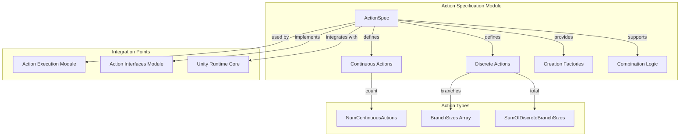
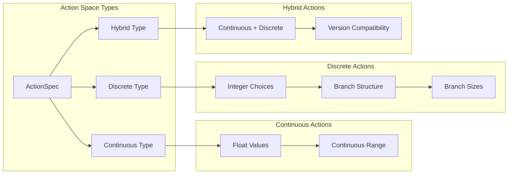
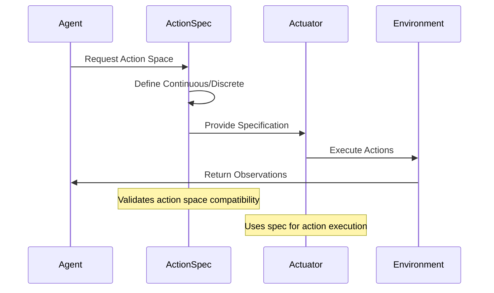
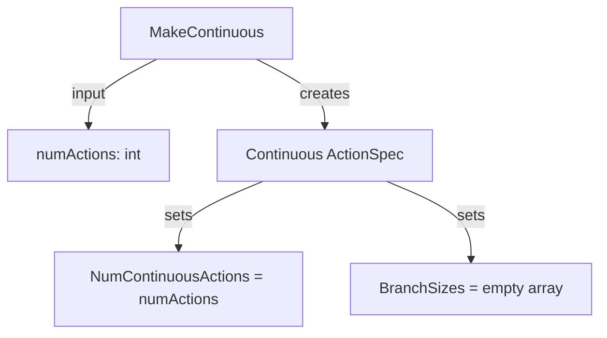
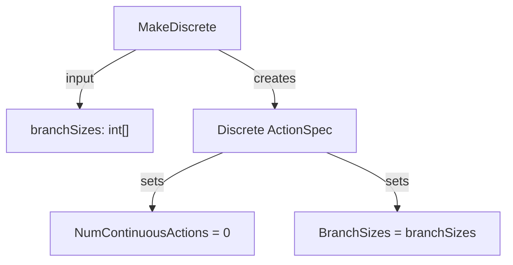
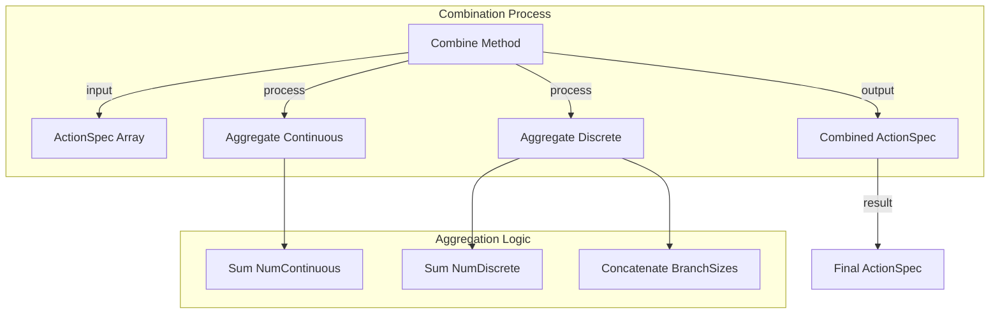
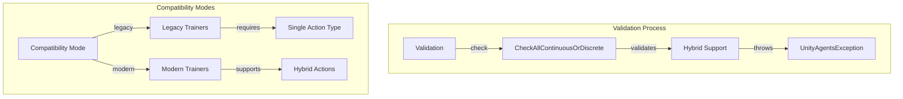

# Action Specification Module

The action_specification module defines the fundamental structure and specification of actions within Unity ML-Agents, providing the core data structure that describes the action space available to agents.

## Overview

The action_specification module is a critical component of the Unity ML-Agents actuator system, responsible for defining and managing action space specifications. It provides the `ActionSpec` structure that describes both continuous and discrete action spaces, enabling agents to understand what actions they can perform and how those actions are structured.

## Core Components

### ActionSpec
The primary component that defines the structure of actions available to agents, supporting both continuous and discrete action spaces with flexible configuration options.

## Architecture

## Component Details

### ActionSpec Structure

The `ActionSpec` is a serializable struct that encapsulates the complete specification of an agent's action space:

#### Key Properties
- **NumContinuousActions**: Defines the number of continuous actions available
- **BranchSizes**: Array defining discrete action branches and their sizes
- **NumDiscreteActions**: Computed property returning the number of discrete action branches
- **SumOfDiscreteBranchSizes**: Total number of discrete actions across all branches

#### Action Space Types

## Data Flow

## Factory Methods

The ActionSpec provides static factory methods for creating different types of action specifications:

### Continuous Action Creation

### Discrete Action Creation

## Action Space Combination

The module supports combining multiple ActionSpec instances:

## Integration with Other Modules

### Unity Actuators Integration
- **[action_execution](action_execution.md)**: ActionSpec defines the action space that VectorActuator executes
- **[action_interfaces](action_interfaces.md)**: Provides specification structure for IActionReceiver implementations
- **[action_data_structures](action_data_structures.md)**: ActionSegment uses ActionSpec to understand action layout

### Unity Runtime Core Integration
- **[agent_core](agent_core.md)**: AgentVectorActuator uses ActionSpec to define agent capabilities
- **[decision_management](decision_management.md)**: DecisionRequester considers ActionSpec for decision timing

## Validation and Compatibility

## Usage Patterns

### Basic Action Space Definition
1. **Continuous Actions**: Use `MakeContinuous(n)` for n-dimensional continuous control
2. **Discrete Actions**: Use `MakeDiscrete(sizes...)` for categorical choices
3. **Custom Construction**: Use constructor for specific configurations

### Multi-Actuator Scenarios
1. **Combination**: Use `Combine()` to merge multiple ActionSpecs
2. **Validation**: Ensure compatibility with target training infrastructure
3. **Integration**: Coordinate with actuator implementations

## Error Handling

The module includes validation for:
- **Hybrid Action Compatibility**: Prevents unsupported mixed action types for legacy trainers
- **Array Bounds**: Ensures proper branch size array handling
- **Null Safety**: Handles null branch size arrays gracefully

## Performance Considerations

- **Struct Design**: Value type for efficient memory usage
- **Array Reuse**: Minimizes allocations through careful array management
- **Lazy Evaluation**: Computed properties calculated on demand
- **Serialization**: Unity-compatible serialization for inspector integration

## Future Extensions

The ActionSpec design supports:
- **New Action Types**: Extensible for future action space types
- **Enhanced Validation**: Additional compatibility checks
- **Optimization**: Performance improvements for large action spaces
- **Metadata**: Additional action space metadata support

This module serves as the foundation for all action-related operations in Unity ML-Agents, providing a robust and flexible specification system that supports diverse agent behaviors and training scenarios.